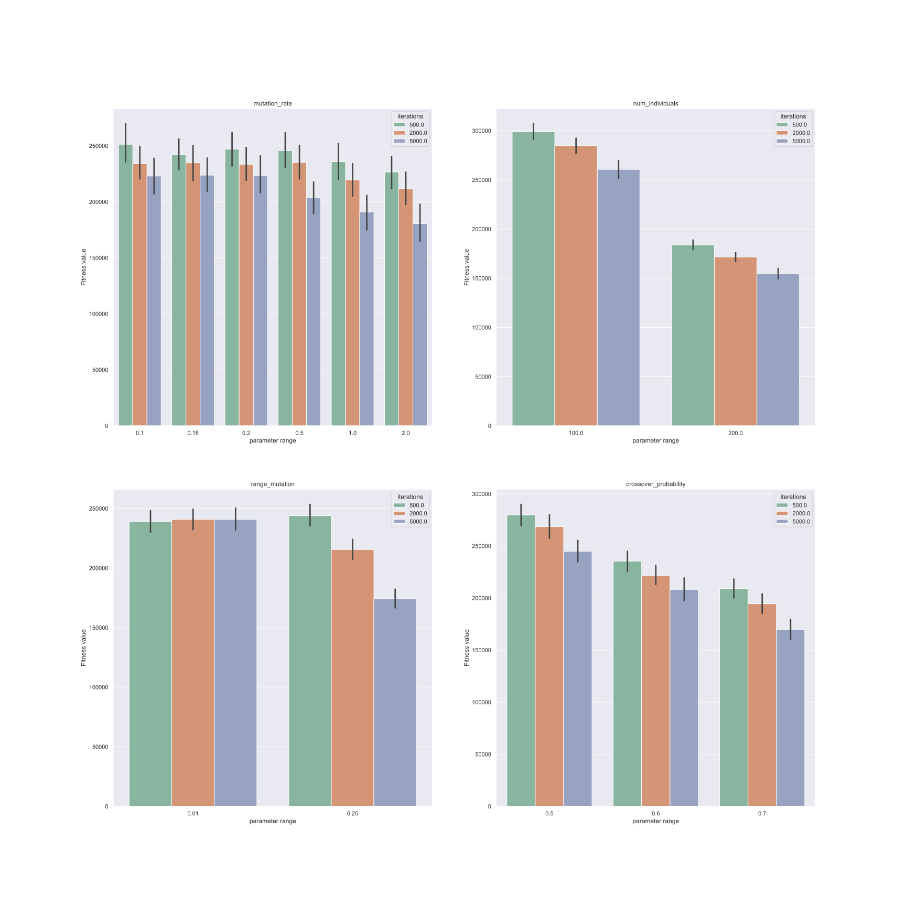
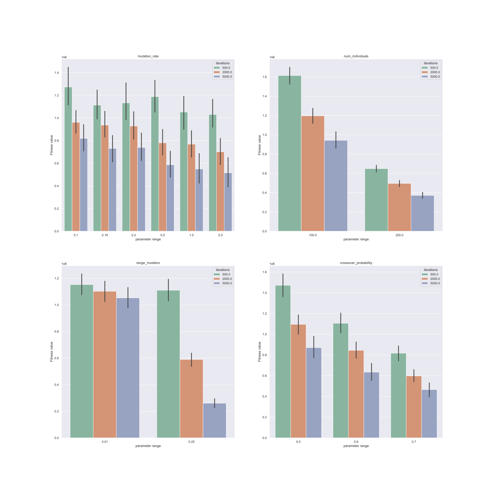
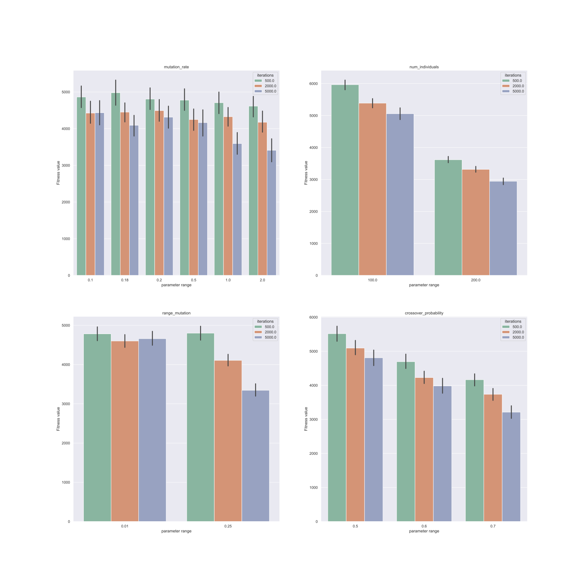
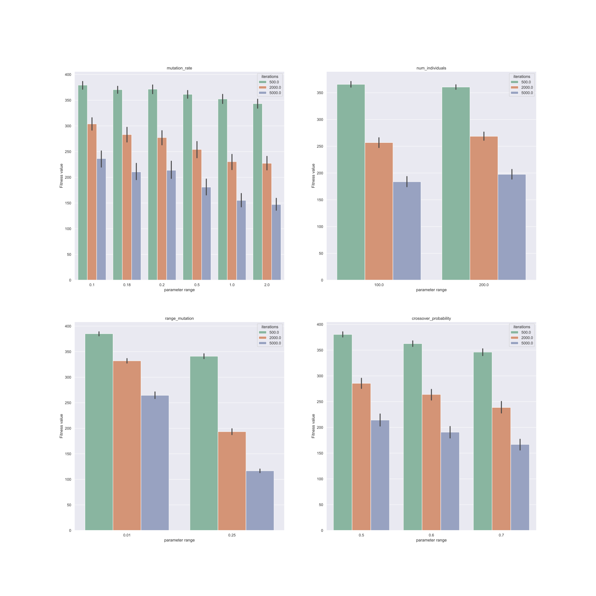

I see that you don't seem to have instructions for the 20 parameters I sent you yesterday. I tried these parameters myself.
The number of iterations was supposed to be one million, but one million is too much, so I tried 500, 2000,and 5000.

if you have some particular parameter combination want me to run, tell me anytime.

- In general, functions 16, 18 perform very well, even with 500 iterations, and some parameter combinations find 100% of the minimum values.
- Function 17 performed second only to 16 and 18, probably around 60% to 70%.
- The functions 21, 22, 23 can find the minimum value under 2000 iterations, but the fluctuations are relatively large and the probability is in the interval of 10% to 80%.

As for why the other functions didn't find the minimum value? I compared the actual data for 500, 2000, and 5000 iterations specifically.

- The solution of function 15 is already very close to the minimum value, the minimum value is 0.0003, but there are already a lot of data like 0.002183999, 0.000832593, which is very close.
- The solution of functions 1, 4, 6, 8, 9,10, and 11did not drop significantly with the number of iterations.
- Functions 7, 12, 2, 13 have a slight decrease with the number of iterations, not very significant ,but there is still some distance from the minimum value except for functions 12 and 13.
- Function 3 , 5 has a significant decrease as the number of iterations increase, but there is still some distance from the minimum value.
- The decrease of function 14 is a moderate decrease with the number of iterations
- Function 19 is a bit strange, for example, I can see a parameter run 10 times, and all 10 times the same result is
  -0.300478907
  -0.300478907
  -0.300478907
  -0.300478907
  -0.300478901
  -0.300478898
  -0.300478907
  -0.300478907
  -0.300478906
  -0.300478907
  But I see that the minimum value of function 19 written on reference2 of appendix A is -3.86, so I am currently skeptical and I checked the function I wrote.
- Function 20 can find the minimum value, and the probability is very high, the minimum value is -3.32, but why is not shown on the percentage, because the problem of precision, reference2 of appendix A only retains two decimal places, but I take the precision is 4 decimal places, so it needs -3.3200 to be considered to find, I currently have not seen data like-3.33 , so -3.32 is the minima.
  -3.320478535
  -3.320359705
  -3.32067686
  -3.201052156
  -3.202053834
  -3.321518479
  -3.320354969
  -3.320340258
  -3.202820763
  -3.201841797

Conclusion:

Based on my current observations of the data and functions, I think the SSGA algorithm performs poorly when it comes to power computation, especially when the domian is very wide. The functions 16 and 18 that perform particularly well also have power computation, but the domains of these two functions are very narrow.

Speaking of power computation, for example, a function with a domain between -100 and 100 is initialized with a uniform random probability, then the best one is selected to produce the offspring, crossover is selected as a linear combination, so that the offspring is already very good, because it will be most likely to inherit the better genes from the parents, compared to other forms of crossover.

The key is the mutation operation, the mutation range is [0.01, 0.25] (see combination in the following), this range is too small to produce any particularly good new genes if a function contains power computation, because the influence of this range on the domain is too small. Not to mention that the probability of mutation is low. So when it comes to power computation, the SSGA algorithm performs poorly.

I think this is the reason.

Prove:

**In order to prove my hypothesis that the reason for the poor performance of SSGA when power computation is encountered is that the mutation range is too small and the mutation rate is too small, it is difficult for the whole population to produce good genes and the evolution will be very slow.**
Typical functions containing power computation are 1, 3, 5, 6, 9, etc.

For example, for function 1, domain is -100 to 100 and dimension is 50. As the number of iterations increases, the decrease of num_individuals and crossove_probability is obvious, which is in line with our expectation.
There are two values of range_mutation, 0.01 and 0.25, and 0.25 shows a significant decrease in solution at 5000 iterations, indicating that this has a significant impact on power computation.
Although mutation rate has 6 values, overall, mutation rate is relatively low, in other words, the probability of generating new genes is relatively low, which is slow for the evolution of power computation, and the overall trend is downward.

**Other functions containing power computation basically have this problem, and the evolution is slow because the difference between the range of the domain and the range of the mutation is too disparate.**

## combination

|      | iterations | mutation_rate | num_individuals | range_mutation | crossover_probability |
| ---- | ---------- | ------------- | --------------- | -------------- | --------------------- |
| 163  | 1000000    | 1             | 200             | 0.01           | 0.6                   |
| 199  | 1000000    | 2             | 200             | 0.01           | 0.6                   |
| 198  | 1000000    | 2             | 200             | 0.01           | 0.5                   |
| 23   | 1000000    | 0.1           | 200             | 0.25           | 0.7                   |
| 22   | 1000000    | 0.1           | 200             | 0.25           | 0.6                   |
| 59   | 1000000    | 0.18          | 200             | 0.25           | 0.7                   |
| 95   | 1000000    | 0.2           | 200             | 0.25           | 0.7                   |
| 146  | 1000000    | 1             | 100             | 0.01           | 0.7                   |
| 164  | 1000000    | 1             | 200             | 0.01           | 0.7                   |
| 162  | 1000000    | 1             | 200             | 0.01           | 0.5                   |
| 145  | 1000000    | 1             | 100             | 0.01           | 0.6                   |
| 182  | 1000000    | 2             | 100             | 0.01           | 0.7                   |
| 144  | 1000000    | 1             | 100             | 0.01           | 0.5                   |
| 180  | 1000000    | 2             | 100             | 0.01           | 0.5                   |
| 181  | 1000000    | 2             | 100             | 0.01           | 0.6                   |
| 5    | 1000000    | 0.1           | 100             | 0.25           | 0.7                   |
| 41   | 1000000    | 0.18          | 100             | 0.25           | 0.7                   |
| 21   | 1000000    | 0.1           | 200             | 0.25           | 0.5                   |
| 110  | 1000000    | 0.5           | 100             | 0.01           | 0.7                   |
| 128  | 1000000    | 0.5           | 200             | 0.01           | 0.7                   |

## 500

| Function | combination163 | combination199 | combination198 | combination23 | combination22 | combination59 | combination95 | combination146 | combination164 | combination162 | combination145 | combination182 | combination144 | combination180 | combination181 | combination5 | combination41 | combination21 | combination110 | combination128 |
| -------- | -------------- | -------------- | -------------- | ------------- | ------------- | ------------- | ------------- | -------------- | -------------- | -------------- | -------------- | -------------- | -------------- | -------------- | -------------- | ------------ | ------------- | ------------- | -------------- | -------------- |
| F1       | 0%             | 0%             | 0%             | 0%            | 0%            | 0%            | 0%            | 0%             | 0%             | 0%             | 0%             | 0%             | 0%             | 0%             | 0%             | 0%           | 0%            | 0%            | 0%             | 0%             |
| F10      | 0%             | 0%             | 0%             | 0%            | 0%            | 0%            | 0%            | 0%             | 0%             | 0%             | 0%             | 0%             | 0%             | 0%             | 0%             | 0%           | 0%            | 0%            | 0%             | 0%             |
| F11      | 0%             | 0%             | 0%             | 0%            | 0%            | 0%            | 0%            | 0%             | 0%             | 0%             | 0%             | 0%             | 0%             | 0%             | 0%             | 0%           | 0%            | 0%            | 0%             | 0%             |
| F12      | 0%             | 0%             | 0%             | 0%            | 0%            | 0%            | 0%            | 0%             | 0%             | 0%             | 0%             | 0%             | 0%             | 0%             | 0%             | 0%           | 0%            | 0%            | 0%             | 0%             |
| F13      | 0%             | 0%             | 0%             | 0%            | 0%            | 0%            | 0%            | 0%             | 0%             | 0%             | 0%             | 0%             | 0%             | 0%             | 0%             | 0%           | 0%            | 0%            | 0%             | 0%             |
| F14      | 0%             | 0%             | 0%             | 0%            | 0%            | 0%            | 0%            | 0%             | 0%             | 0%             | 0%             | 0%             | 0%             | 0%             | 0%             | 0%           | 0%            | 0%            | 0%             | 0%             |
| F15      | 0%             | 0%             | 0%             | 0%            | 0%            | 0%            | 0%            | 0%             | 0%             | 0%             | 0%             | 0%             | 0%             | 0%             | 0%             | 0%           | 0%            | 0%            | 0%             | 0%             |
| F16      | 90%            | 30%            | 40%            | 90%           | 70%           | 100%          | 100%          | 100%           | 100%           | 10%            | 100%           | 90%            | 100%           | 100%           | 90%            | 80%          | 100%          | 20%           | 100%           | 100%           |
| F17      | 40%            | 30%            | 60%            | 40%           | 40%           | 20%           | 50%           | 50%            | 50%            | 40%            | 30%            | 60%            | 20%            | 70%            | 70%            | 70%          | 50%           | 30%           | 30%            | 30%            |
| F18      | 20%            | 0%             | 0%             | 50%           | 10%           | 40%           | 40%           | 100%           | 20%            | 0%             | 50%            | 0%             | 50%            | 0%             | 10%            | 30%          | 50%           | 0%            | 100%           | 90%            |
| F19      | 0%             | 0%             | 0%             | 0%            | 0%            | 0%            | 0%            | 0%             | 0%             | 0%             | 0%             | 0%             | 0%             | 0%             | 0%             | 0%           | 0%            | 0%            | 0%             | 0%             |
| F2       | 0%             | 0%             | 0%             | 0%            | 0%            | 0%            | 0%            | 0%             | 0%             | 0%             | 0%             | 0%             | 0%             | 0%             | 0%             | 0%           | 0%            | 0%            | 0%             | 0%             |
| F20      | 0%             | 0%             | 0%             | 0%            | 0%            | 0%            | 0%            | 10%            | 0%             | 0%             | 0%             | 10%            | 0%             | 0%             | 0%             | 0%           | 0%            | 0%            | 0%             | 0%             |
| F21      | 0%             | 0%             | 0%             | 0%            | 0%            | 0%            | 0%            | 0%             | 0%             | 0%             | 0%             | 0%             | 0%             | 0%             | 0%             | 0%           | 0%            | 0%            | 0%             | 0%             |
| F22      | 0%             | 0%             | 0%             | 0%            | 0%            | 0%            | 0%            | 0%             | 0%             | 0%             | 0%             | 0%             | 0%             | 0%             | 0%             | 0%           | 0%            | 0%            | 0%             | 0%             |
| F23      | 0%             | 0%             | 0%             | 0%            | 0%            | 0%            | 0%            | 0%             | 0%             | 0%             | 0%             | 0%             | 0%             | 0%             | 0%             | 0%           | 0%            | 0%            | 0%             | 0%             |
| F3       | 0%             | 0%             | 0%             | 0%            | 0%            | 0%            | 0%            | 0%             | 0%             | 0%             | 0%             | 0%             | 0%             | 0%             | 0%             | 0%           | 0%            | 0%            | 0%             | 0%             |
| F4       | 0%             | 0%             | 0%             | 0%            | 0%            | 0%            | 0%            | 0%             | 0%             | 0%             | 0%             | 0%             | 0%             | 0%             | 0%             | 0%           | 0%            | 0%            | 0%             | 0%             |
| F5       | 0%             | 0%             | 0%             | 0%            | 0%            | 0%            | 0%            | 0%             | 0%             | 0%             | 0%             | 0%             | 0%             | 0%             | 0%             | 0%           | 0%            | 0%            | 0%             | 0%             |
| F6       | 0%             | 0%             | 0%             | 0%            | 0%            | 0%            | 0%            | 0%             | 0%             | 0%             | 0%             | 0%             | 0%             | 0%             | 0%             | 0%           | 0%            | 0%            | 0%             | 0%             |
| F7       | 0%             | 0%             | 0%             | 0%            | 0%            | 0%            | 0%            | 0%             | 0%             | 0%             | 0%             | 0%             | 0%             | 0%             | 0%             | 0%           | 0%            | 0%            | 0%             | 0%             |
| F8       | 0%             | 0%             | 0%             | 0%            | 0%            | 0%            | 0%            | 0%             | 0%             | 0%             | 0%             | 0%             | 0%             | 0%             | 0%             | 0%           | 0%            | 0%            | 0%             | 0%             |
| F9       | 0%             | 0%             | 0%             | 0%            | 0%            | 0%            | 0%            | 0%             | 0%             | 0%             | 0%             | 0%             | 0%             | 0%             | 0%             | 0%           | 0%            | 0%            | 0%             | 0%             |

## 2000

| Function | combination163 | combination199 | combination198 | combination23 | combination22 | combination59 | combination95 | combination146 | combination164 | combination162 | combination145 | combination182 | combination144 | combination180 | combination181 | combination5 | combination41 | combination21 | combination110 | combination128 |
| -------- | -------------- | -------------- | -------------- | ------------- | ------------- | ------------- | ------------- | -------------- | -------------- | -------------- | -------------- | -------------- | -------------- | -------------- | -------------- | ------------ | ------------- | ------------- | -------------- | -------------- |
| F1       | 0%             | 0%             | 0%             | 0%            | 0%            | 0%            | 0%            | 0%             | 0%             | 0%             | 0%             | 0%             | 0%             | 0%             | 0%             | 0%           | 0%            | 0%            | 0%             | 0%             |
| F10      | 0%             | 0%             | 0%             | 0%            | 0%            | 0%            | 0%            | 0%             | 0%             | 0%             | 0%             | 0%             | 0%             | 0%             | 0%             | 0%           | 0%            | 0%            | 0%             | 0%             |
| F11      | 0%             | 0%             | 0%             | 0%            | 0%            | 0%            | 0%            | 0%             | 0%             | 0%             | 0%             | 0%             | 0%             | 0%             | 0%             | 0%           | 0%            | 0%            | 0%             | 0%             |
| F12      | 0%             | 0%             | 0%             | 0%            | 0%            | 0%            | 0%            | 0%             | 0%             | 0%             | 0%             | 0%             | 0%             | 0%             | 0%             | 0%           | 0%            | 0%            | 0%             | 0%             |
| F13      | 0%             | 0%             | 0%             | 0%            | 0%            | 0%            | 0%            | 0%             | 0%             | 0%             | 0%             | 0%             | 0%             | 0%             | 0%             | 0%           | 0%            | 0%            | 0%             | 0%             |
| F14      | 0%             | 0%             | 0%             | 0%            | 0%            | 0%            | 0%            | 0%             | 0%             | 0%             | 0%             | 0%             | 0%             | 0%             | 0%             | 0%           | 0%            | 0%            | 0%             | 0%             |
| F15      | 0%             | 0%             | 0%             | 0%            | 0%            | 0%            | 0%            | 0%             | 0%             | 10%            | 0%             | 0%             | 0%             | 0%             | 0%             | 0%           | 0%            | 0%            | 0%             | 0%             |
| F16      | 100%           | 100%           | 100%           | 100%          | 100%          | 100%          | 100%          | 100%           | 100%           | 100%           | 100%           | 100%           | 100%           | 100%           | 100%           | 80%          | 90%           | 100%          | 100%           | 100%           |
| F17      | 70%            | 60%            | 70%            | 40%           | 50%           | 70%           | 50%           | 60%            | 20%            | 10%            | 80%            | 60%            | 50%            | 30%            | 40%            | 40%          | 80%           | 40%           | 50%            | 50%            |
| F18      | 100%           | 10%            | 10%            | 80%           | 90%           | 90%           | 90%           | 100%           | 100%           | 100%           | 100%           | 10%            | 100%           | 0%             | 20%            | 70%          | 70%           | 80%           | 90%            | 100%           |
| F19      | 0%             | 0%             | 0%             | 0%            | 0%            | 0%            | 0%            | 0%             | 0%             | 0%             | 0%             | 0%             | 0%             | 0%             | 0%             | 0%           | 0%            | 0%            | 0%             | 0%             |
| F2       | 0%             | 0%             | 0%             | 0%            | 0%            | 0%            | 0%            | 0%             | 0%             | 0%             | 0%             | 0%             | 0%             | 0%             | 0%             | 0%           | 0%            | 0%            | 0%             | 0%             |
| F20      | 0%             | 0%             | 0%             | 0%            | 0%            | 0%            | 10%           | 10%            | 0%             | 0%             | 0%             | 10%            | 0%             | 0%             | 10%            | 0%           | 0%            | 0%            | 0%             | 10%            |
| F21      | 40%            | 30%            | 10%            | 0%            | 0%            | 0%            | 10%           | 70%            | 40%            | 20%            | 60%            | 50%            | 40%            | 10%            | 20%            | 0%           | 0%            | 0%            | 30%            | 10%            |
| F22      | 50%            | 10%            | 10%            | 0%            | 0%            | 0%            | 10%           | 10%            | 30%            | 30%            | 50%            | 50%            | 20%            | 30%            | 20%            | 0%           | 0%            | 0%            | 20%            | 80%            |
| F23      | 50%            | 30%            | 0%             | 0%            | 0%            | 0%            | 0%            | 10%            | 10%            | 60%            | 10%            | 20%            | 20%            | 30%            | 20%            | 0%           | 0%            | 0%            | 40%            | 40%            |
| F3       | 0%             | 0%             | 0%             | 0%            | 0%            | 0%            | 0%            | 0%             | 0%             | 0%             | 0%             | 0%             | 0%             | 0%             | 0%             | 0%           | 0%            | 0%            | 0%             | 0%             |
| F4       | 0%             | 0%             | 0%             | 0%            | 0%            | 0%            | 0%            | 0%             | 0%             | 0%             | 0%             | 0%             | 0%             | 0%             | 0%             | 0%           | 0%            | 0%            | 0%             | 0%             |
| F5       | 0%             | 0%             | 0%             | 0%            | 0%            | 0%            | 0%            | 0%             | 0%             | 0%             | 0%             | 0%             | 0%             | 0%             | 0%             | 0%           | 0%            | 0%            | 0%             | 0%             |
| F6       | 0%             | 0%             | 0%             | 0%            | 0%            | 0%            | 0%            | 0%             | 0%             | 0%             | 0%             | 0%             | 0%             | 0%             | 0%             | 0%           | 0%            | 0%            | 0%             | 0%             |
| F7       | 0%             | 0%             | 0%             | 0%            | 0%            | 0%            | 0%            | 0%             | 0%             | 0%             | 0%             | 0%             | 0%             | 0%             | 0%             | 0%           | 0%            | 0%            | 0%             | 0%             |
| F8       | 0%             | 0%             | 0%             | 0%            | 0%            | 0%            | 0%            | 0%             | 0%             | 0%             | 0%             | 0%             | 0%             | 0%             | 0%             | 0%           | 0%            | 0%            | 0%             | 0%             |
| F9       | 0%             | 0%             | 0%             | 0%            | 0%            | 0%            | 0%            | 0%             | 0%             | 0%             | 0%             | 0%             | 0%             | 0%             | 0%             | 0%           | 0%            | 0%            | 0%             | 0%             |

## 5000

| Function | combination163 | combination199 | combination198 | combination23 | combination22 | combination59 | combination95 | combination146 | combination164 | combination162 | combination145 | combination182 | combination144 | combination180 | combination181 | combination5 | combination41 | combination21 | combination110 | combination128 |
| -------- | -------------- | -------------- | -------------- | ------------- | ------------- | ------------- | ------------- | -------------- | -------------- | -------------- | -------------- | -------------- | -------------- | -------------- | -------------- | ------------ | ------------- | ------------- | -------------- | -------------- |
| F1       | 0%             | 0%             | 0%             | 0%            | 0%            | 0%            | 0%            | 0%             | 0%             | 0%             | 0%             | 0%             | 0%             | 0%             | 0%             | 0%           | 0%            | 0%            | 0%             | 0%             |
| F10      | 0%             | 0%             | 0%             | 0%            | 0%            | 0%            | 0%            | 0%             | 0%             | 0%             | 0%             | 0%             | 0%             | 0%             | 0%             | 0%           | 0%            | 0%            | 0%             | 0%             |
| F11      | 0%             | 0%             | 0%             | 0%            | 0%            | 0%            | 0%            | 0%             | 0%             | 0%             | 0%             | 0%             | 0%             | 0%             | 0%             | 0%           | 0%            | 0%            | 0%             | 0%             |
| F12      | 0%             | 0%             | 0%             | 0%            | 0%            | 0%            | 0%            | 0%             | 0%             | 0%             | 0%             | 0%             | 0%             | 0%             | 0%             | 0%           | 0%            | 0%            | 0%             | 0%             |
| F13      | 0%             | 0%             | 0%             | 0%            | 0%            | 0%            | 0%            | 0%             | 0%             | 0%             | 0%             | 0%             | 0%             | 0%             | 0%             | 0%           | 0%            | 0%            | 0%             | 0%             |
| F14      | 0%             | 0%             | 0%             | 0%            | 0%            | 0%            | 0%            | 0%             | 0%             | 0%             | 0%             | 0%             | 0%             | 0%             | 0%             | 0%           | 0%            | 0%            | 0%             | 0%             |
| F15      | 0%             | 0%             | 0%             | 0%            | 0%            | 0%            | 0%            | 0%             | 0%             | 0%             | 0%             | 0%             | 0%             | 0%             | 0%             | 0%           | 0%            | 0%            | 0%             | 0%             |
| F16      | 100%           | 100%           | 100%           | 100%          | 90%           | 100%          | 100%          | 100%           | 100%           | 100%           | 90%            | 100%           | 100%           | 100%           | 100%           | 90%          | 90%           | 100%          | 100%           | 100%           |
| F17      | 20%            | 60%            | 40%            | 60%           | 40%           | 70%           | 70%           | 30%            | 60%            | 40%            | 40%            | 50%            | 60%            | 50%            | 60%            | 60%          | 40%           | 40%           | 40%            | 30%            |
| F18      | 100%           | 30%            | 0%             | 90%           | 100%          | 90%           | 90%           | 100%           | 100%           | 100%           | 100%           | 10%            | 100%           | 20%            | 30%            | 70%          | 40%           | 90%           | 90%            | 100%           |
| F19      | 0%             | 0%             | 0%             | 0%            | 0%            | 0%            | 0%            | 0%             | 0%             | 0%             | 0%             | 0%             | 0%             | 0%             | 0%             | 0%           | 0%            | 0%            | 0%             | 0%             |
| F2       | 0%             | 0%             | 0%             | 0%            | 0%            | 0%            | 0%            | 0%             | 0%             | 0%             | 0%             | 0%             | 0%             | 0%             | 0%             | 0%           | 0%            | 0%            | 0%             | 0%             |
| F20      | 0%             | 0%             | 0%             | 0%            | 0%            | 0%            | 0%            | 10%            | 0%             | 0%             | 10%            | 0%             | 10%            | 0%             | 10%            | 0%           | 0%            | 0%            | 0%             | 10%            |
| F21      | 30%            | 0%             | 0%             | 0%            | 0%            | 0%            | 0%            | 30%            | 60%            | 40%            | 40%            | 40%            | 30%            | 30%            | 20%            | 0%           | 0%            | 0%            | 40%            | 0%             |
| F22      | 40%            | 40%            | 0%             | 0%            | 0%            | 0%            | 0%            | 50%            | 40%            | 0%             | 50%            | 0%             | 10%            | 30%            | 20%            | 0%           | 0%            | 0%            | 10%            | 70%            |
| F23      | 30%            | 0%             | 0%             | 0%            | 0%            | 0%            | 0%            | 10%            | 20%            | 50%            | 60%            | 30%            | 30%            | 10%            | 20%            | 0%           | 0%            | 0%            | 20%            | 10%            |
| F3       | 0%             | 0%             | 0%             | 0%            | 0%            | 0%            | 0%            | 0%             | 0%             | 0%             | 0%             | 0%             | 0%             | 0%             | 0%             | 0%           | 0%            | 0%            | 0%             | 0%             |
| F4       | 0%             | 0%             | 0%             | 0%            | 0%            | 0%            | 0%            | 0%             | 0%             | 0%             | 0%             | 0%             | 0%             | 0%             | 0%             | 0%           | 0%            | 0%            | 0%             | 0%             |
| F5       | 0%             | 0%             | 0%             | 0%            | 0%            | 0%            | 0%            | 0%             | 0%             | 0%             | 0%             | 0%             | 0%             | 0%             | 0%             | 0%           | 0%            | 0%            | 0%             | 0%             |
| F6       | 0%             | 0%             | 0%             | 0%            | 0%            | 0%            | 0%            | 0%             | 0%             | 0%             | 0%             | 0%             | 0%             | 0%             | 0%             | 0%           | 0%            | 0%            | 0%             | 0%             |
| F7       | 0%             | 0%             | 0%             | 0%            | 0%            | 0%            | 0%            | 0%             | 0%             | 0%             | 0%             | 0%             | 0%             | 0%             | 0%             | 0%           | 0%            | 0%            | 0%             | 0%             |
| F8       | 0%             | 0%             | 0%             | 0%            | 0%            | 0%            | 0%            | 0%             | 0%             | 0%             | 0%             | 0%             | 0%             | 0%             | 0%             | 0%           | 0%            | 0%            | 0%             | 0%             |
| F9       | 0%             | 0%             | 0%             | 0%            | 0%            | 0%            | 0%            | 0%             | 0%             | 0%             | 0%             | 0%             | 0%             | 0%             | 0%             | 0%           | 0%            | 0%            | 0%             | 0%             |