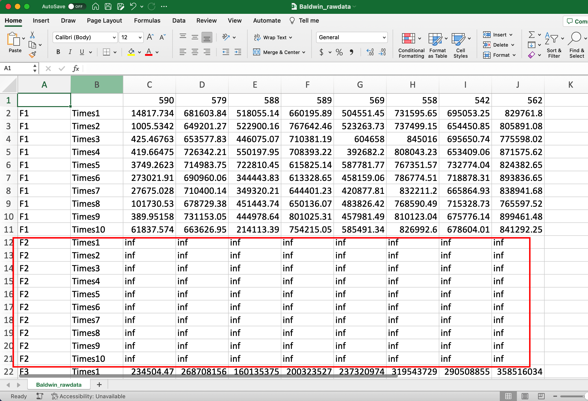
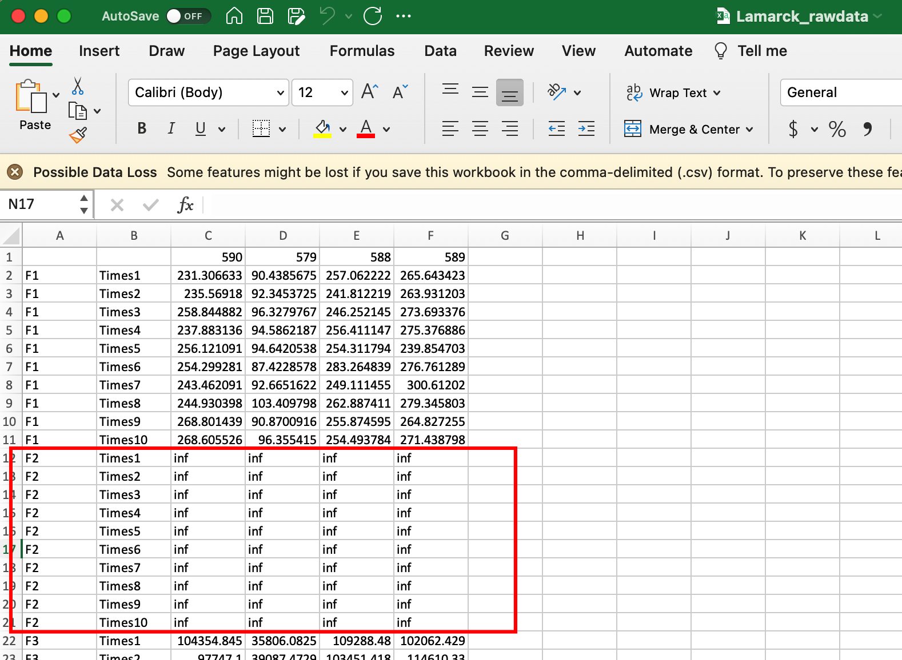

8 parameter combinations, 10 times run, dim = 400, budget = dim*1000. 

It takes me 8 days to complete the runs for Baldwin and half for Lamarck. The time is truly expensive. The program is the same as previous, but the dim is improved from 50 to 400, this is a huge cost.

so if budget = dim*10000, then the time cost would be more expensive.

# no feasible solutions for F2

budget = dim*1000, dim=400. 

# compare with the last time

Last time, budget = 50,000. This is budget = 400,000.

And this time:

Some decreases exist in the y axis(sum of abs distance from global minimum), but they are not very obvious.
