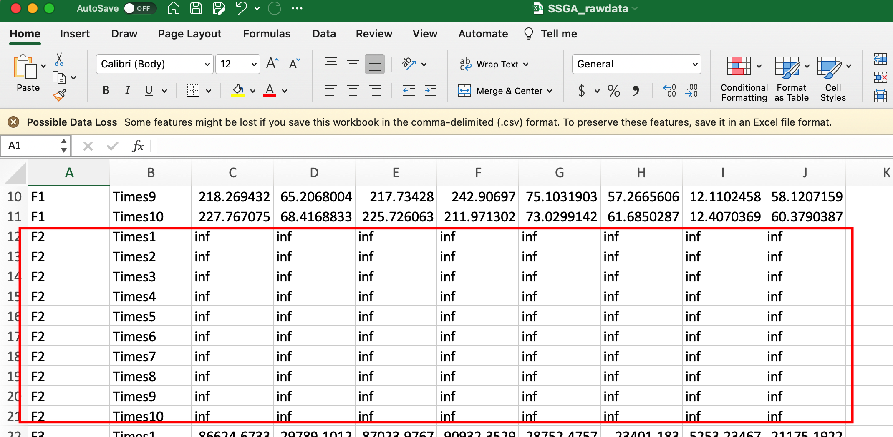
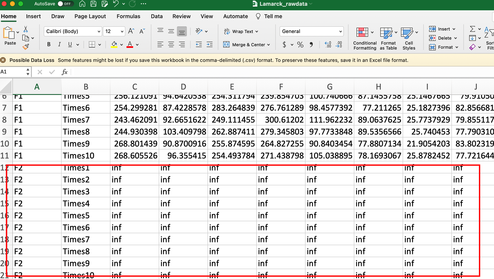

8 parameter combinations, 10 times run, dim = 400, budget = dim*1000. 

It takes me half a month  to complete the runs. The time cost is truly expensive. The program is the same as previous, but the dim is improved from 50 to 400, this leads to the increase of calculation, and finally resulting in more time cost.

so if budget = dim*10000, then the time cost would be more expensive.

# no feasible solutions for F2

budget = dim*1000, dim=400. 

# compare with the last time

Last time, budget = 50,000. Different colors of bars represent different algorithms. 

- The overall performance, SSGA and Lamarck are comparable, both of them performs better than Baldwin does.
- Sometimes Lamark is better(take F4 as an example), sometimes SSGA is better(take F9 for example.)

This time, budget = 400,000. Different colors of bars represent different algorithms. 

- Given more budget, the final solutions are lower than the last time.
- The performance is quite clear, SSGA > Lamarck > Baldwin 

The following pciture shows the difference between SSGA and Lamarck clearly. (I did max min normalization for all the solutions produced by SSGA and Lamarck.) Obviously, SSGA performs better.

