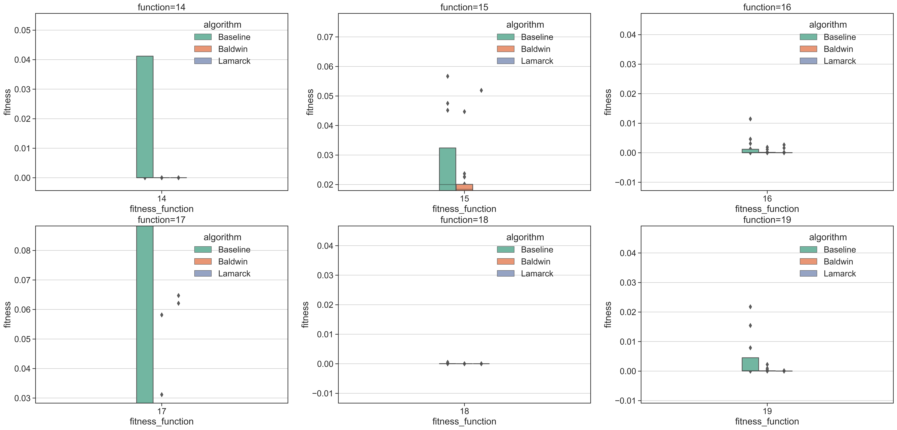

dear professor,

GOOD NEWS! I tested 10 multimodal functions which are [14,15,16,17,18,19,20,21,22,23]

and they results are very good, as we expected.

The red line is global minima. The above plots use rawdata, and the differences are not easy to see.

So i did a max min scaler on the solutions.

and see the following pictures.

Clearly, Baldwin and Lamarck are better than Baseline except for F18 and F20, where they three play equal.