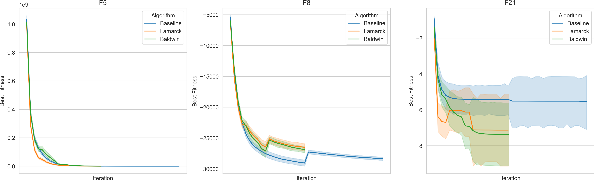

# Experiment19

I chose 3 functions from each group to make this experiment. The functions are:
F5, F8, and F21. I saved the all the genotypes, penotypes, fitness of the population, and the best fitness value every 50 generations.

For the following pictures, only the best fitness value is used. I think it is enough to show the trend of the fitness value.

# first 100

# first 250

# first 500

# first 2000

# Conclusion

1. Baldwin and Lmarckian are faster than baseline at first on F5(unimodal), F8(multimodal), and F21(multimodal with fixed dimensions). Especially, Lamarckian algorithm is the fastest at first.
2. The learning is not always good. Sometimes it is a waste of evaluations. Because of the learning, Baldwin and Lamarckian algorithms run out of evaluations before baseline. They stopped almost half way compared to baseline.
3. Baldwin and Lamarckian algorithms have higher chances to jump out of local optima as one can see the bandwith of the fitness value is wider and lower than baseline on F21(multimodal with fixed dimensions).