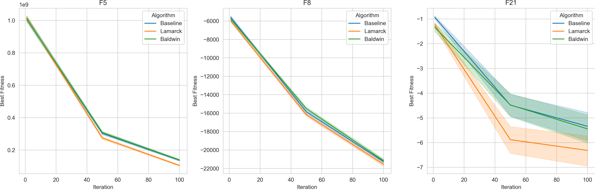
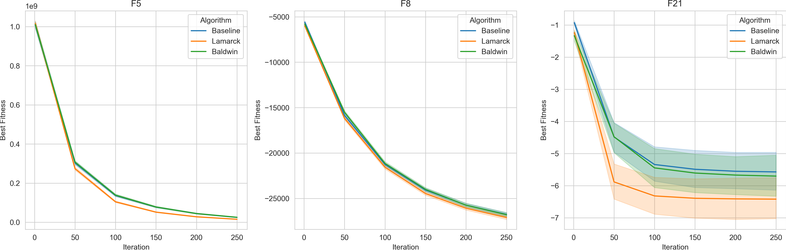
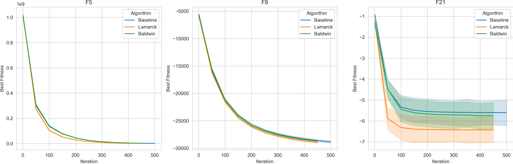

# Experiment20

Functions: F5(unimodal), F8(multimodal), and F21(multimodal with fixed dimensions).

Parameter combinations: 1

Runs per parameter combination: 100

Budget: Dim*100

Other parameters:

    ```
    num_generations = 1000000
    mutation_rate = 0.03
    num_individuals = 200
    crossover_rate = 0.7
    mutation_type = Normal
    crossover_type = Probabilistic_crossover
    local_search_rate = 0.5
    local_search_type = Uniform
    search_radius = 0.05
    threshold = 0.0001
    dimensions = 100
    gg = 0.05
    selection_method = sorted_selection_part
    length_of_local_search = 1
    redo_local_search_rate = 0
    ```


# 100 iterations


# 250 iterations


# 500 iterations


# 1000 iterations


# Conclusion

1. Lamarckian algorithm is the fastest at first, followed by Baldwinian algorithm, and then the baseline algorithm.
2. The learning is not always beneficial. For example, in F5 and F8, the learning is a waste of evaluations as one can see that the memetic algorithms run out of evaluations before the baseline algorithm. They almost stopped at half way compared to the baseline algorithm.
3. On multimodel functions with fixed dimensions such as F21, the learning is beneficial. The memetic algorithms have higher chances to escape from local optima and find the global optima. One can see that the bands of the memetic algorithms are wider and lower than the baseline algorithm.