[TOC]

We obtained the best 20 parameter combinations in Experiemnt4. So I will start at Experiment4.

# Experiment4

All the parameter combinations for Experiment4 are listed as following:

```markdown
Sequence for iterations : [1000000]
Sequence for mutation_rate : [0.1, 0.18, 0.2, 0.5, 1.0, 2.0, 5.0, 10.0]
Sequence for num_individuals : [100, 200]
Sequence for range_mutation : [0.01, 0.25, 0.55, 0.9, 2.0, 5.0]
Sequence for crossover_probability : [0.5, 0.6, 0.7]
```

Best 20/200 parameter combinations(==not properly chosen==):

|      | iterations | mutation_rate | num_individuals | range_mutation | crossover_probability |
| ---- | ---------- | ------------- | --------------- | -------------- | --------------------- |
| 1    | 1000000    | 1             | 200             | 0.01           | 0.6                   |
| 2    | 1000000    | 2             | 200             | 0.01           | 0.6                   |
| 3    | 1000000    | 2             | 200             | 0.01           | 0.5                   |
| 4    | 1000000    | 0.1           | 200             | 0.25           | 0.7                   |
| 5    | 1000000    | 0.1           | 200             | 0.25           | 0.6                   |
| 6    | 1000000    | 0.18          | 200             | 0.25           | 0.7                   |
| 7    | 1000000    | 0.2           | 200             | 0.25           | 0.7                   |
| 8    | 1000000    | 1             | 100             | 0.01           | 0.7                   |
| 9    | 1000000    | 1             | 200             | 0.01           | 0.7                   |
| 10   | 1000000    | 1             | 200             | 0.01           | 0.5                   |
| 11   | 1000000    | 1             | 100             | 0.01           | 0.6                   |
| 12   | 1000000    | 2             | 100             | 0.01           | 0.7                   |
| 13   | 1000000    | 1             | 100             | 0.01           | 0.5                   |
| 14   | 1000000    | 2             | 100             | 0.01           | 0.5                   |
| 15   | 1000000    | 2             | 100             | 0.01           | 0.6                   |
| 16   | 1000000    | 0.1           | 100             | 0.25           | 0.7                   |
| 17   | 1000000    | 0.18          | 100             | 0.25           | 0.7                   |
| 18   | 1000000    | 0.1           | 200             | 0.25           | 0.5                   |
| 19   | 1000000    | 0.5           | 100             | 0.01           | 0.7                   |
| 20   | 1000000    | 0.5           | 200             | 0.01           | 0.7                   |

`Uniform mutation`: [-range_mutation, range_mutation]

`Normal mutation`: mean=0; STD = 2* range_mutation

# Experiment5

we run best 20 parameter combinations for SSGA with dimension=50, using best 20 parameter combinations in Experiment4, and strategy that "choosing best of genotype and phenotype as final phenotype" is not applied.

## SSGA using uniform mutation and probabilistic crossover

- best 20 parameter combinations used are obtained  in Experiment4.
- and strategy that "choosing best of genotype and phenotype as final phenotype" is not applied.

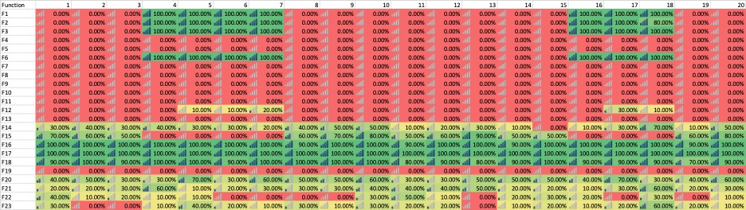

## SSGA using normal mutation and probabilistic crossover

- best 20 parameter combinations used are obtained  in Experiment4.
- and strategy that "choosing best of genotype and phenotype as final phenotype" is not applied.

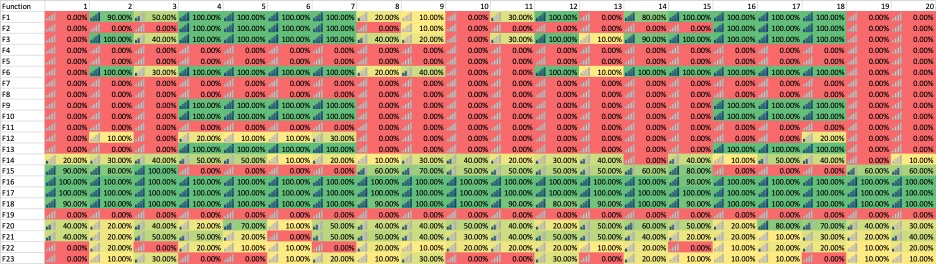

## SSGA using uniform mutation and single point crossover

- best 20 parameter combinations used are obtained  in Experiment4.
- and strategy that "choosing best of genotype and phenotype as final phenotype" is not applied.

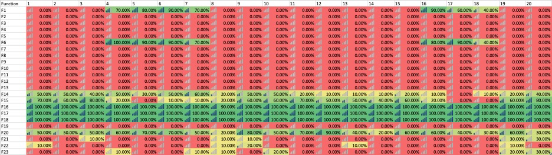

## SSGA using normal mutation and single point crossover

- best 20 parameter combinations used are obtained  in Experiment4.
- and strategy that "choosing best of genotype and phenotype as final phenotype" is not applied.

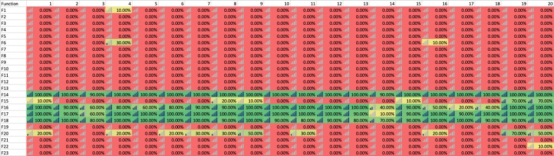

## SSGA using uniform mutation and linear combination crossover

- best 20 parameter combinations used are obtained  in Experiment4.
- and strategy that "choosing best of genotype and phenotype as final phenotype" is not applied.

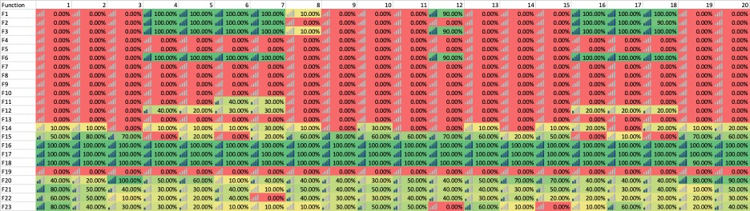

## SSGA using normal mutation and linear combination crossover

- best 20 parameter combinations used are obtained  in Experiment4.
- and strategy that "choosing best of genotype and phenotype as final phenotype" is not applied.

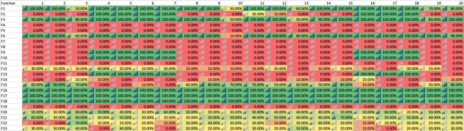

# Experiment6

## probabilistic crossover

- Lamarck using local search: `normal` and probabilistic crossover
- SSGA using `normal` mutation and probabilistic crossover
- best 20 parameter combinations used are obtained  in Experiment4.
- and strategy that "choosing best of genotype and phenotype as final phenotype" is not applied.


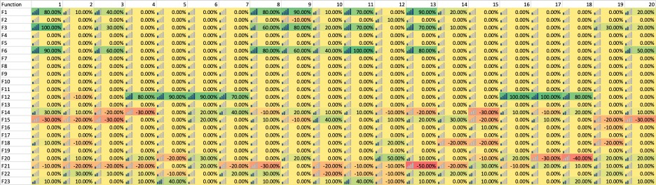

- Baldwinusing local search: `normal` and probabilistic crossover
- SSGA using `normal` mutation and probabilistic crossover
- best 20 parameter combinations used are obtained  in Experiment4.
- and strategy that "choosing best of genotype and phenotype as final phenotype" is not applied.


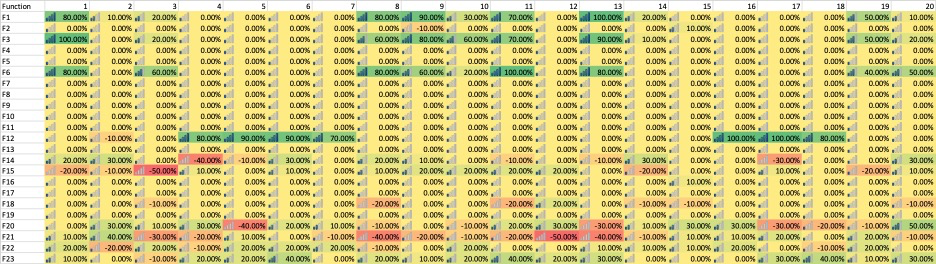

## single point crossover

- Lamarck using local search: `normal` and single point crossover
- SSGA using `normal` mutation and single point crossover
- best 20 parameter combinations used are obtained  in Experiment4.
- and strategy that "choosing best of genotype and phenotype as final phenotype" is not applied.

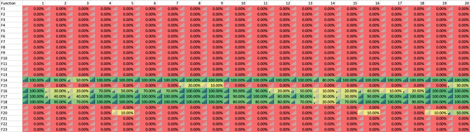

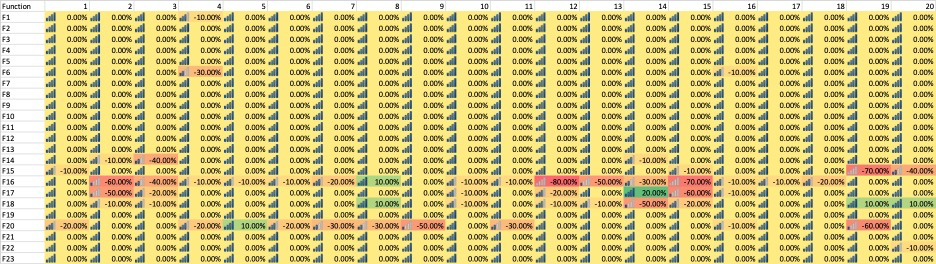

- Baldwin using local search: `normal` and single point crossover
- SSGA using `normal` mutation and single point crossover
- best 20 parameter combinations used are obtained  in Experiment4.
- and strategy that "choosing best of genotype and phenotype as final phenotype" is not applied.

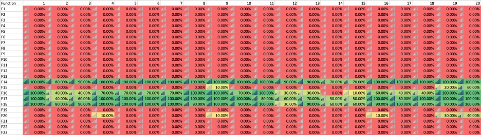

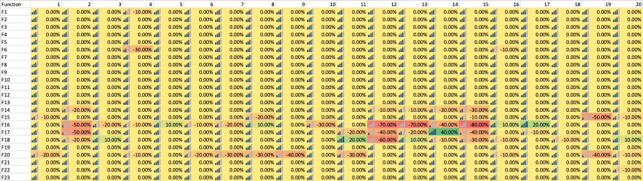

## linear combination crossover

- Lamarck using local search: `normal` and linear combination crossover
- SSGA using `normal` mutation and linear combination crossover
- best 20 parameter combinations used are obtained  in Experiment4.
- and strategy that "choosing best of genotype and phenotype as final phenotype" is not applied.

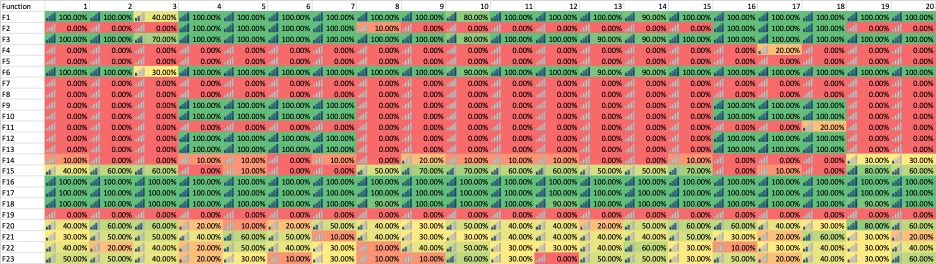

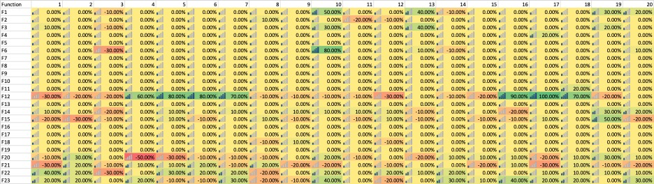

- Baldwin using local search: `normal` and linear combination crossover
- SSGA using `normal` mutation and linear combination crossover
- best 20 parameter combinations used are obtained in Experiment4.
- and strategy that "choosing best of genotype and phenotype as final phenotype" is not applied.

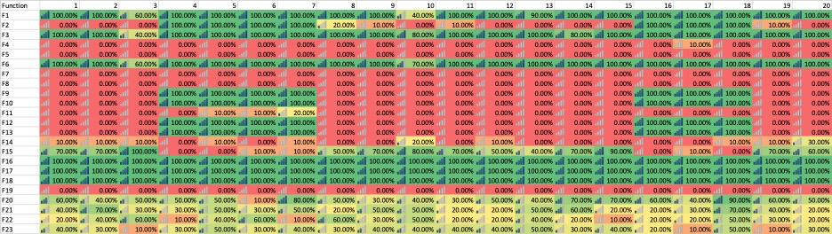


# Experiment7

## normal local search

### probabilistic crossover

- SSGA using normal mutation and probabilistic crossover
- best 20 parameter combinations used are obtained in Experiment4.

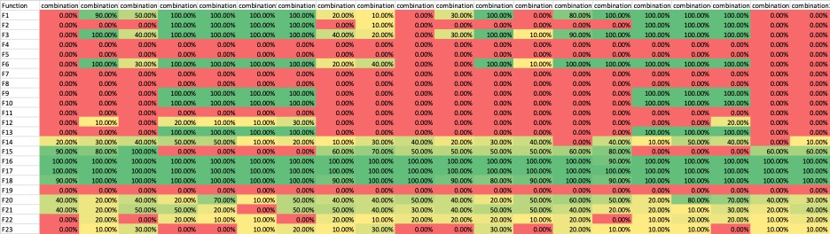

- Lamarck using normal mutation,  probabilistic crossover,  normal local search
- and strategy that "choosing best of genotype and phenotype as final phenotype" ==is applied==.
- number of Phenotypes =1
- best 20 parameter combinations used are obtained in Experiment4.

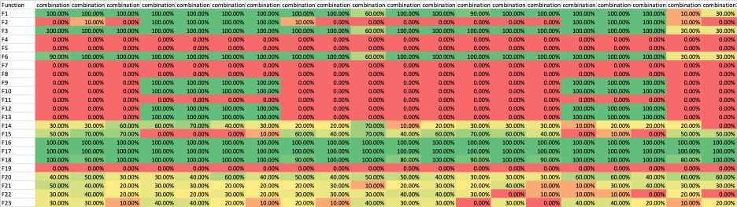

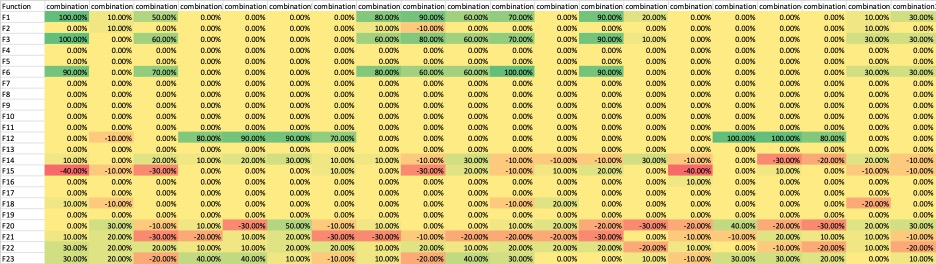

- Lamarck using normal mutation,  probabilistic crossover,  normal local search
- and strategy that "choosing best of genotype and phenotype as final phenotype" ==is applied==.
- number of Phenotypes =3
- best 20 parameter combinations used are obtained in Experiment4.

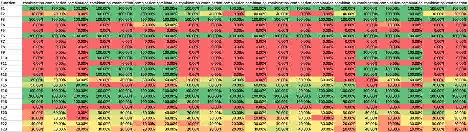

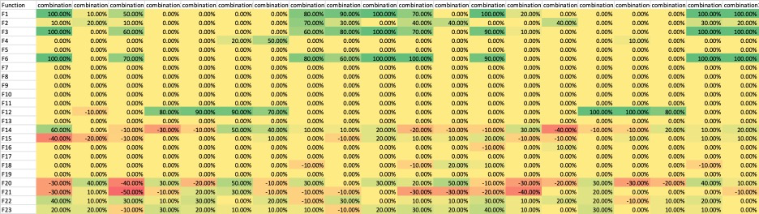

### single point crossover

- SSGA using normal mutation and single point crossover
- best 20 parameter combinations used are obtained in Experiment4.

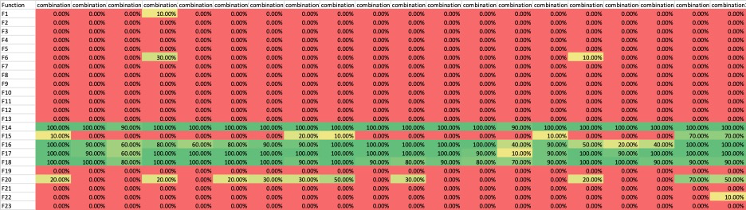

- Lamarck using normal mutation,  single point crossover,  normal local search
- and strategy that "choosing best of genotype and phenotype as final phenotype" ==is applied==.
- number of Phenotypes =1
- best 20 parameter combinations used are obtained in Experiment4.

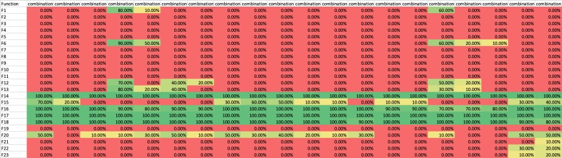

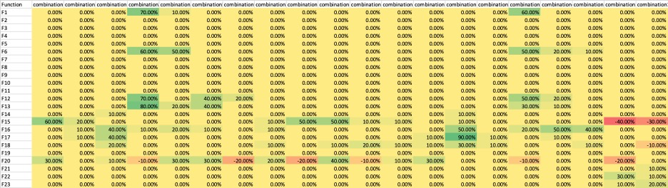

- Lamarck using normal mutation,  single point crossover,  normal local search
- and strategy that "choosing best of genotype and phenotype as final phenotype" ==is applied==.
- number of Phenotypes =3
- best 20 parameter combinations used are obtained in Experiment4.

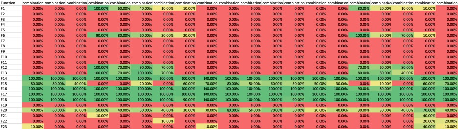

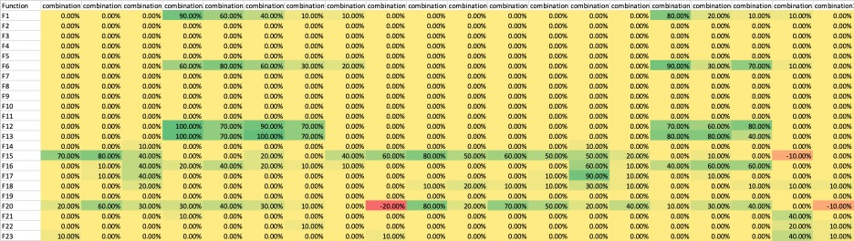

### linear combination crossover

- SSGA using normal mutation and linear combination crossover
- best 20 parameter combinations used are obtained in Experiment4.

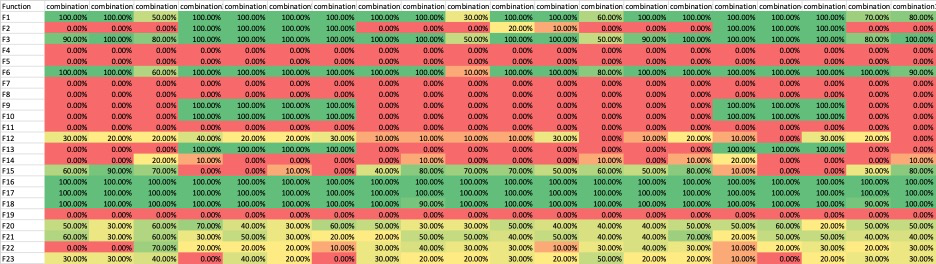

- Lamarck using normal mutation,  linear combination crossover,  normal local search
- and strategy that "choosing best of genotype and phenotype as final phenotype" ==is applied==.
- number of Phenotypes =1
- best 20 parameter combinations used are obtained in Experiment4.

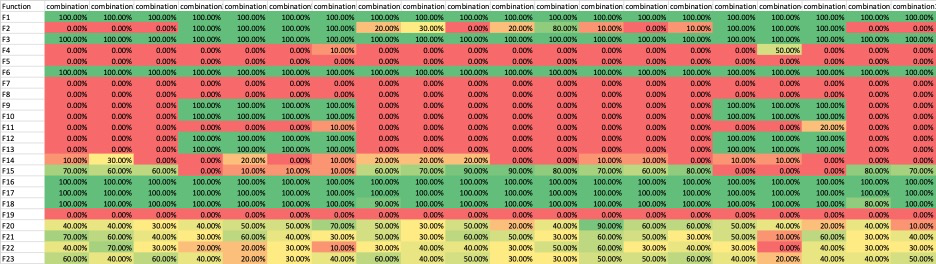

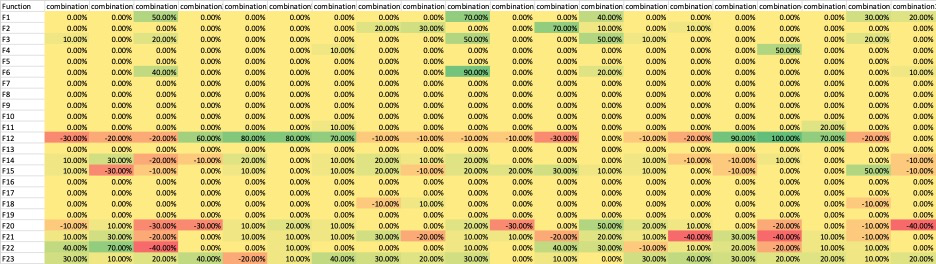

- Lamarck using normal mutation,  linear combination crossover,  normal local search
- and strategy that "choosing best of genotype and phenotype as final phenotype" ==is applied==.
- number of Phenotypes =3
- best 20 parameter combinations used are obtained in Experiment4.

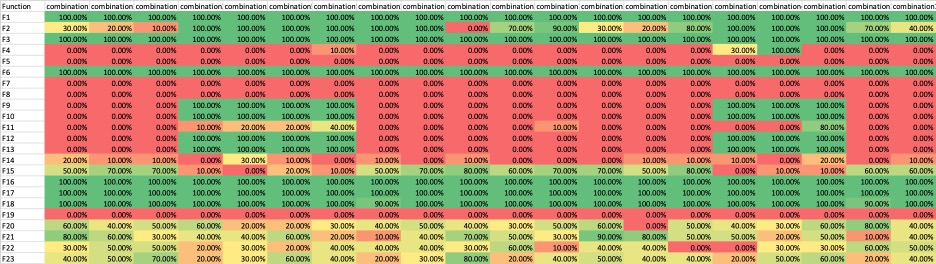

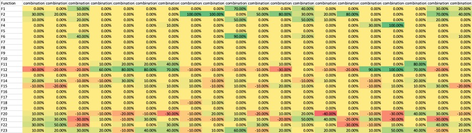

## uniform local search

### probabilistic crossover

- SSGA using uniform mutation and probabilistic crossover
- best 20 parameter combinations used are obtained in Experiment4.

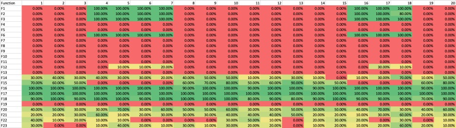

- Lamarck using normal mutation,  probabilistic crossover,  normal local search
- and strategy that "choosing best of genotype and phenotype as final phenotype" ==is applied==.
- number of Phenotypes =3
- best 20 parameter combinations used are obtained in Experiment4.

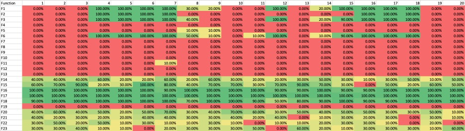

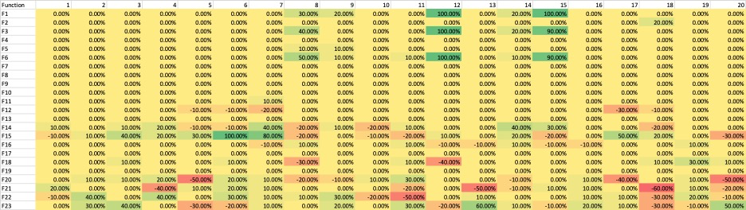

### single point crossover

- SSGA using uniform mutation and single point crossover
- best 20 parameter combinations used are obtained in Experiment4.

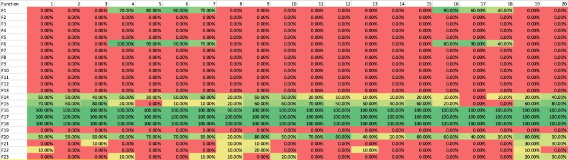

- Lamarck using normal mutation,  single point crossover,  normal local search
- and strategy that "choosing best of genotype and phenotype as final phenotype" ==is applied==.
- number of Phenotypes =3
- best 20 parameter combinations used are obtained in Experiment4.

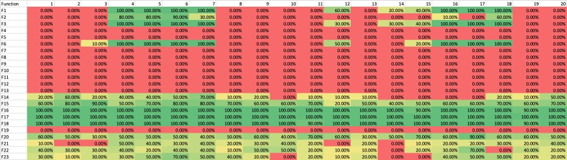

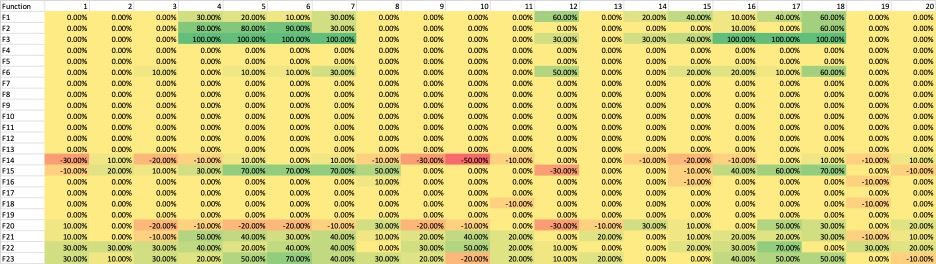

# Experiment8

## new best 20

we select new best 20 parameter combinations.

|      | iterations | mutation_rate | num_individuals | range_mutation | crossover_probability | Mutation_type | Crossover_type          |
| ---- | ---------- | ------------- | --------------- | -------------- | --------------------- | ------------- | ----------------------- |
| 1    | 1000000    | 2             | 100             | 0.9            | 0.5                   | Normal        | Probabilistic_crossover |
| 2    | 1000000    | 2             | 100             | 2              | 0.5                   | Normal        | Probabilistic_crossover |
| 3    | 1000000    | 1             | 200             | 5              | 0.6                   | Normal        | Probabilistic_crossover |
| 4    | 1000000    | 2             | 100             | 0.55           | 0.6                   | Normal        | Probabilistic_crossover |
| 5    | 1000000    | 2             | 100             | 0.55           | 0.7                   | Normal        | Probabilistic_crossover |
| 6    | 1000000    | 2             | 100             | 0.9            | 0.6                   | Normal        | Probabilistic_crossover |
| 7    | 1000000    | 1             | 200             | 2              | 0.6                   | Normal        | Probabilistic_crossover |
| 8    | 1000000    | 2             | 100             | 0.55           | 0.5                   | Normal        | Probabilistic_crossover |
| 9    | 1000000    | 1             | 200             | 0.55           | 0.5                   | Normal        | Probabilistic_crossover |
| 10   | 1000000    | 1             | 100             | 2              | 0.6                   | Normal        | Probabilistic_crossover |
| 11   | 1000000    | 2             | 100             | 0.9            | 0.7                   | Normal        | Probabilistic_crossover |
| 12   | 1000000    | 1             | 200             | 0.9            | 0.5                   | Normal        | Probabilistic_crossover |
| 13   | 1000000    | 2             | 100             | 2              | 0.6                   | Normal        | Probabilistic_crossover |
| 14   | 1000000    | 0.5           | 200             | 5              | 0.5                   | Normal        | Probabilistic_crossover |
| 15   | 1000000    | 1             | 200             | 0.55           | 0.6                   | Normal        | Probabilistic_crossover |
| 16   | 1000000    | 1             | 100             | 5              | 0.7                   | Normal        | Probabilistic_crossover |
| 17   | 1000000    | 1             | 200             | 2              | 0.5                   | Normal        | Probabilistic_crossover |
| 18   | 1000000    | 1             | 200             | 0.9            | 0.6                   | Normal        | Probabilistic_crossover |
| 19   | 1000000    | 1             | 100             | 0.55           | 0.6                   | Normal        | Probabilistic_crossover |
| 20   | 1000000    | 1             | 100             | 0.9            | 0.6                   | Normal        | Probabilistic_crossover |

## SSGA

- SSGA using new best 20 parameter combinations obtained in Experiment8

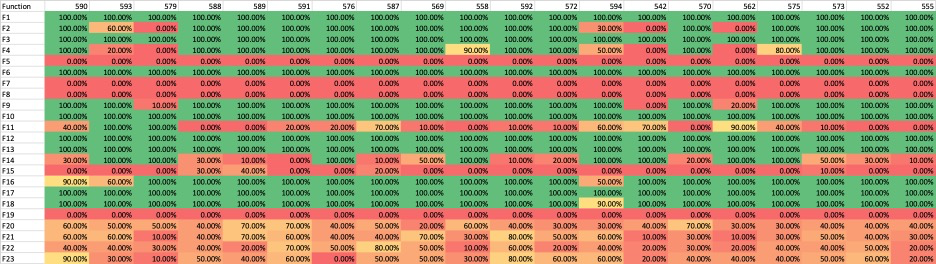

## Lamarck1

- Lamarck using new best 20 parameter combinations obtained in Experiment8
- Local search rate = mutation rate
- local searh type = mutation type
- STD = 2 * range_mutation
- number of phenotypes = 1
- and strategy that "choosing best of genotype and phenotype as final phenotype" ==is applied==.

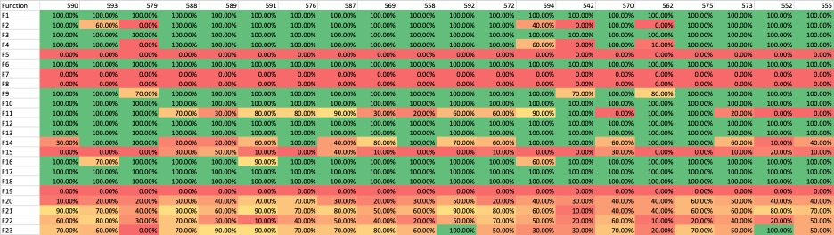

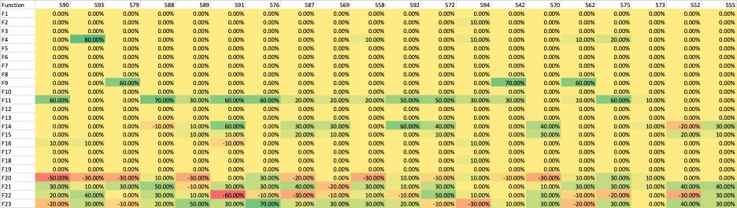

## Lamarck5

- Lamarck using new best 20 parameter combinations obtained in Experiment8
- Local search rate = mutation rate
- local searh type = mutation type
- STD = 2 * range_mutation
- number of phenotypes = 5
- and strategy that "choosing best of genotype and phenotype as final phenotype" ==is applied==.


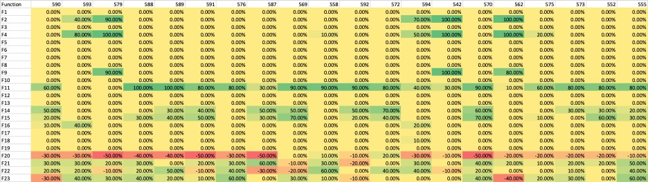

## Lamarck10

- Lamarck using new best 20 parameter combinations obtained in Experiment8
- Local search rate = mutation rate
- local searh type = mutation type
- STD = 2 * range_mutation
- number of phenotypes = 10
- and strategy that "choosing best of genotype and phenotype as final phenotype" ==is applied==.

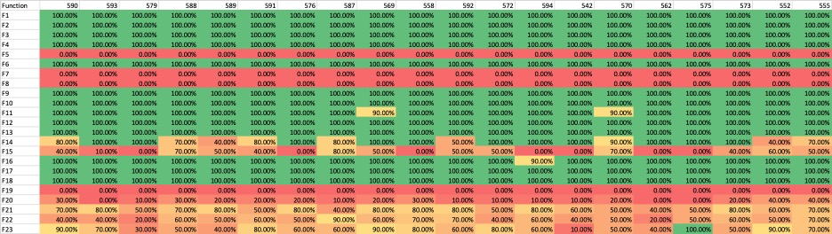

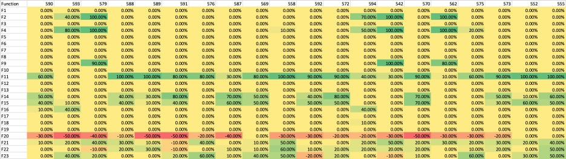

## Baldwin1

- Baldwin using new best 20 parameter combinations obtained in Experiment8
- Local search rate = mutation rate
- local searh type = mutation type
- STD = 2 * range_mutation
- number of phenotypes = 1
- and strategy that "choosing best of genotype and phenotype as final phenotype" ==is applied==.

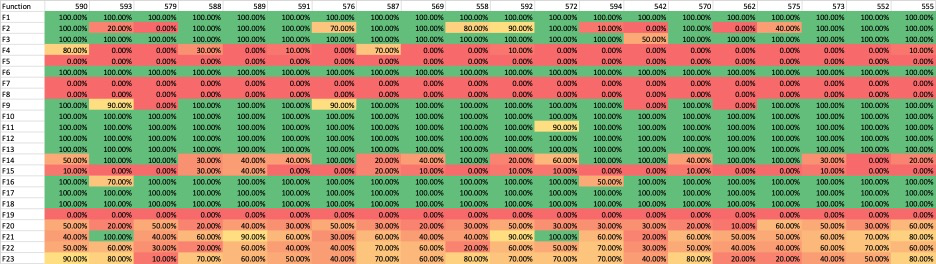

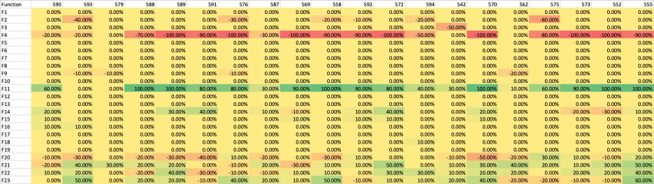

## Baldwin5

- Baldwin using new best 20 parameter combinations obtained in Experiment8
- Local search rate = mutation rate
- local searh type = mutation type
- STD = 2 * range_mutation
- number of phenotypes = 5
- and strategy that "choosing best of genotype and phenotype as final phenotype" ==is applied==.

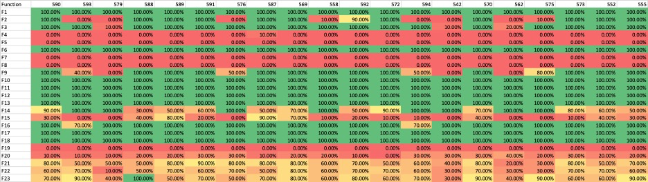

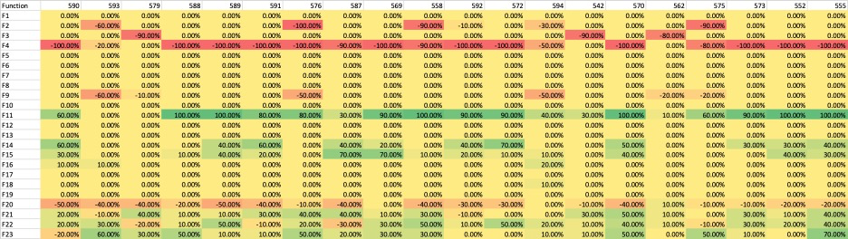

## Baldwin10

- Baldwin using new best 20 parameter combinations obtained in Experiment8
- Local search rate = mutation rate
- local searh type = mutation type
- STD = 2 * range_mutation
- number of phenotypes = 10
- and strategy that "choosing best of genotype and phenotype as final phenotype" ==is applied==.

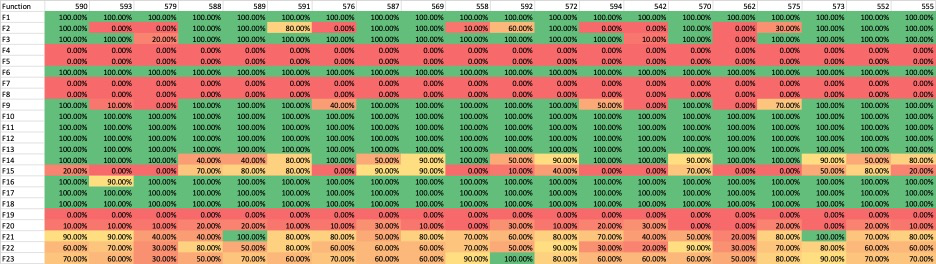

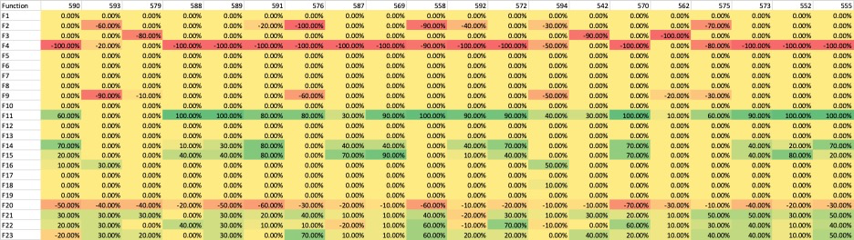

# Experiment9

## Parameter combination

R is introduced in Experiment9.

R=0.01, other parameters are the same as Experiment8, ==range_mutation is deleted== because we have R now, new column R is added.

|      | iterations | mutation_rate | num_individuals | crossover_probability | Mutation_type | Crossover_type          | R    |
| ---- | ---------- | ------------- | --------------- | --------------------- | ------------- | ----------------------- | ---- |
| 1    | 1000000    | 2             | 100             | 0.5                   | Normal        | Probabilistic_crossover | 0.01 |
| 2    | 1000000    | 2             | 100             | 0.5                   | Normal        | Probabilistic_crossover | 0.01 |
| 3    | 1000000    | 1             | 200             | 0.6                   | Normal        | Probabilistic_crossover | 0.01 |
| 4    | 1000000    | 2             | 100             | 0.6                   | Normal        | Probabilistic_crossover | 0.01 |
| 5    | 1000000    | 2             | 100             | 0.7                   | Normal        | Probabilistic_crossover | 0.01 |
| 6    | 1000000    | 2             | 100             | 0.6                   | Normal        | Probabilistic_crossover | 0.01 |
| 7    | 1000000    | 1             | 200             | 0.6                   | Normal        | Probabilistic_crossover | 0.01 |
| 8    | 1000000    | 2             | 100             | 0.5                   | Normal        | Probabilistic_crossover | 0.01 |
| 9    | 1000000    | 1             | 200             | 0.5                   | Normal        | Probabilistic_crossover | 0.01 |
| 10   | 1000000    | 1             | 100             | 0.6                   | Normal        | Probabilistic_crossover | 0.01 |
| 11   | 1000000    | 2             | 100             | 0.7                   | Normal        | Probabilistic_crossover | 0.01 |
| 12   | 1000000    | 1             | 200             | 0.5                   | Normal        | Probabilistic_crossover | 0.01 |
| 13   | 1000000    | 2             | 100             | 0.6                   | Normal        | Probabilistic_crossover | 0.01 |
| 14   | 1000000    | 0.5           | 200             | 0.5                   | Normal        | Probabilistic_crossover | 0.01 |
| 15   | 1000000    | 1             | 200             | 0.6                   | Normal        | Probabilistic_crossover | 0.01 |
| 16   | 1000000    | 1             | 100             | 0.7                   | Normal        | Probabilistic_crossover | 0.01 |
| 17   | 1000000    | 1             | 200             | 0.5                   | Normal        | Probabilistic_crossover | 0.01 |
| 18   | 1000000    | 1             | 200             | 0.6                   | Normal        | Probabilistic_crossover | 0.01 |
| 19   | 1000000    | 1             | 100             | 0.6                   | Normal        | Probabilistic_crossover | 0.01 |
| 20   | 1000000    | 1             | 100             | 0.6                   | Normal        | Probabilistic_crossover | 0.01 |

## SSGA

- R=0.01
- and strategy that "choosing best of genotype and phenotype as final phenotype" ==is applied==.

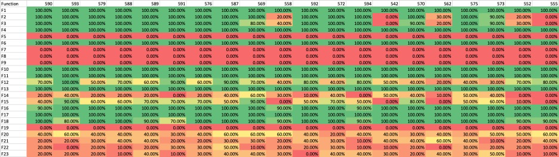

## Baldwin(L=1)

- K=100%
- L=1
- local search = gradient search
- others are the same as SSGA

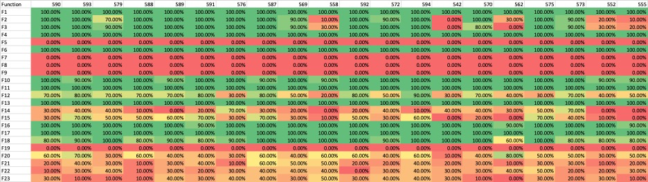

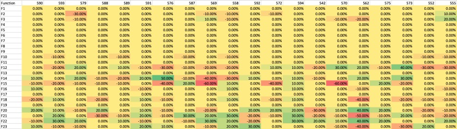

## ⭐️Baldwin(L=5）

- local search type = gradient search
- L=5
- K=100%

## ⭐️Lamarck(L=5）

- local search type = gradient search
- L=5
- K=100%

# Experiment10

## Parameter combination

|      | iterations | mutation_rate | num_individuals | crossover_probability | Mutation_type | Crossover_type          | R    |
| ---- | ---------- | ------------- | --------------- | --------------------- | ------------- | ----------------------- | ---- |
| 1    | 1000000    | 2             | 100             | 0.5                   | Normal        | Probabilistic_crossover | 0.1  |
| 2    | 1000000    | 2             | 100             | 0.5                   | Normal        | Probabilistic_crossover | 0.1  |
| 3    | 1000000    | 1             | 200             | 0.6                   | Normal        | Probabilistic_crossover | 0.1  |
| 4    | 1000000    | 2             | 100             | 0.6                   | Normal        | Probabilistic_crossover | 0.1  |
| 5    | 1000000    | 2             | 100             | 0.7                   | Normal        | Probabilistic_crossover | 0.1  |
| 6    | 1000000    | 2             | 100             | 0.6                   | Normal        | Probabilistic_crossover | 0.1  |
| 7    | 1000000    | 1             | 200             | 0.6                   | Normal        | Probabilistic_crossover | 0.1  |
| 8    | 1000000    | 2             | 100             | 0.5                   | Normal        | Probabilistic_crossover | 0.1  |
| 9    | 1000000    | 1             | 200             | 0.5                   | Normal        | Probabilistic_crossover | 0.1  |
| 10   | 1000000    | 1             | 100             | 0.6                   | Normal        | Probabilistic_crossover | 0.1  |
| 11   | 1000000    | 2             | 100             | 0.7                   | Normal        | Probabilistic_crossover | 0.1  |
| 12   | 1000000    | 1             | 200             | 0.5                   | Normal        | Probabilistic_crossover | 0.1  |
| 13   | 1000000    | 2             | 100             | 0.6                   | Normal        | Probabilistic_crossover | 0.1  |
| 14   | 1000000    | 0.5           | 200             | 0.5                   | Normal        | Probabilistic_crossover | 0.1  |
| 15   | 1000000    | 1             | 200             | 0.6                   | Normal        | Probabilistic_crossover | 0.1  |
| 16   | 1000000    | 1             | 100             | 0.7                   | Normal        | Probabilistic_crossover | 0.1  |
| 17   | 1000000    | 1             | 200             | 0.5                   | Normal        | Probabilistic_crossover | 0.1  |
| 18   | 1000000    | 1             | 200             | 0.6                   | Normal        | Probabilistic_crossover | 0.1  |
| 19   | 1000000    | 1             | 100             | 0.6                   | Normal        | Probabilistic_crossover | 0.1  |
| 20   | 1000000    | 1             | 100             | 0.6                   | Normal        | Probabilistic_crossover | 0.1  |

## SSGA

- R=0.1

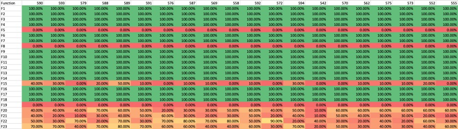

## Lamarck

- local search rate = 0.5
- local search type = uniform
- L=1

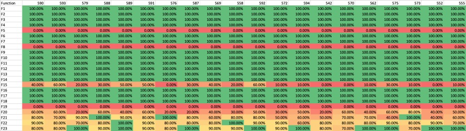

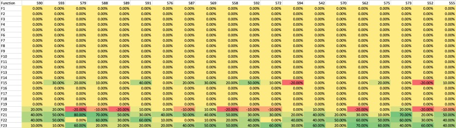

## ⭐️F15 and F20

- local search rate = 0.5
- local search type = uniform
- L=1

## ⭐️Baldwin

- local search rate = 0.5
- local search type = uniform
- L=1