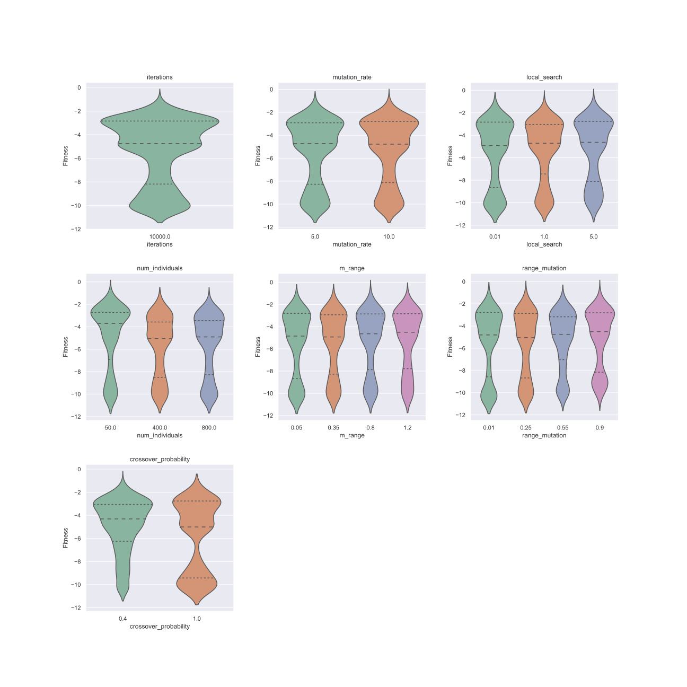

[TOC]

# Steady-state Genetic Algorithms and Extensions of Baldwin effect and Lamarckian evolution

## Abstract

The summer project is concerned with the staedy-state genetic algorithm(SSGA) for finding the global minimums of the test function group CEC-BC- 2017 [1]. Each test function has different number of dimensions, domanin and global niminum. All the test functions used in this summer project are presented in Table 1.  The main goal is to examine the importance of the proposed local search procedures of  Baldwin effect and Lamarckian evolution based on SSGA in finding global minimums to CEC-BC- 2017. 

**Keywords**: Baldwin effect , Evolutionary algorithm ,Genetic algorithm,Lamarckian evolution, Steady state, CEC-BC- 2017

## Introduction

### CEC-BC- 2017

Table 1
$$
F 1=\sum_{i=1}^{50} x_i^2
$$

$$
F 2=\sum_{i=1}^{50}\left|x_i\right|+\prod_{i=1}^{50}\left|x_i\right|
$$

$$
F 3=\sum_{i=1}^{50}\left(\sum_{i=1}^{50}\left(x_i\right)^2\right)
$$

$$
F 4=\max \left|x_i\right|
$$

$$
F 5=\sum_{i=1}^{49}\left(100\left(x_{i+1}-x_i^2\right)^2+\left(x_i-1\right)^2\right)
$$

$$
F 6=\sum_{i=1}^{50}\left(x_i+0.5\right)^2
$$

$$
F 7=\sum_{i=1}^{50}\left(i x_i^4+\operatorname{rand}[0,1]\right)
$$

$$
F 8=\sum_{i=1}^{50}\left(-x_i \sin \left(\sqrt{\left|x_i\right|}\right)\right)
$$

$$
F 9=\sum_{i=1}^{50}\left(x_i^2-10 \cos \left(2 \pi x_i\right)+10\right)
$$

$$
F 10=-20 \exp \left(-0.2 \sqrt{0.02 \sum_{i=1}^{50} x_i^2}\right)-\exp \left(0.02 \sum_{i=1}^{50} \cos 2 \pi x_i\right)+20+e
$$

$$
F 11=\frac{1}{4000} \sum_{i=1}^{50} x_i^2-\prod_{i=1}^{50} \cos \frac{x_i}{\sqrt{i}}+1
$$

$$
F 12=\frac{\pi}{50}\left(10 \sin^2 \left(\pi y_1\right)+\sum_{i=1}^{49}\left(y_i-1\right)^2\left(1+10 \sin ^2 \left(\pi y_{i+1}\right)+\left(y_{50}-1\right)^2\right)+\sum_{i=1}^{50} u\left(x_i, 10,100,4\right)\right.
$$

$$
F 13=0.1\left(\sin ^2\left(3 \pi x_1\right)+\sum_{i=1}^{49}\left(x_i-1\right)^2\left(1+\sin ^2\left(3 \pi x_i+1\right)\right)+\left(x_{50}-1\right)^2\left(1+\sin ^2\left(2 \pi x_{50}\right)\right)\right)+\sum_{i=1}^{50} u\left(x_i, 5,100,4\right)
$$

$$
a = [[-32, -16, 0, 16, 32, -32, -16, 0, 16, 32, -32, -16, 0, 16, 32, -32, -16, 0, 16, 32, -32, -16, 0, 16, 32],\\
         [-32, -32, -32, -32, -32, -16, -16, -16, -16, -16, 0, 0, 0, 0, 0, 16, 16, 16, 16, 16, 32, 32, 32, 32, 32]]\\
F 14=\left(\frac{1}{500}+\sum_{j=1}^{25} \frac{1}{j+\sum_{i=1}^2\left(x_i-a_{i j}\right)^6}\right)^{-1}
$$

$$
a = [.1957, .1947, .1735, .16, .0844, .0627, .0456, .0342, .0323, .0235, .0246]\\
b = [.25, .5, 1, 2, 4, 6, 8, 10, 12, 14, 16]\\
b=1./b\\
F 15=\sum_{i=1}^{11}\left(a_i-\frac{x_1\left(b_i^2+b_i x_2\right)}{b_i^2+b_i x_3+x_4}\right)^2
$$

$$
F 16=4 x_1^2-2.1 x_1^4+\frac{1}{3} x_1^6+x_1 x_2-4 x_2^2+4 x_2^4
$$

$$
F 17=\left(x_2-\frac{5.1}{4 \pi^2} x_1^2+\frac{5}{\pi} x_1-6\right)^2+10\left(1-\frac{1}{8 \pi}\right) \cos \left(x_1\right)+10
$$

$$
\begin{aligned}
&F 18=\left[1+\left(x_1+x_2+1\right)^2\left(19-14 x_1+3 x_1^2-14 x_2+6 x_1 x_2+3 x_2^2\right)\right] \times\left[30+\left(2 x_1-3 x_2\right)^2 \times\right. \\
&\left.\times\left(18-32 x_1+12 x_1^2+48 x_2-36 x_1 x_2+27 x_2^2\right)\right]
\end{aligned}
$$

$$
a = [[3, 10, 30], [.1, 10, 35], [3, 10, 30], [.1, 10, 35]]\\
c = [1, 1.2, 3, 3.2]\\
p = [[.3689, .117, .2673], [.4699, .4387, .747], [.1091, .8732, .5547], [.03815, .5743, .8828]]\\
F 19=-\sum_{i=1}^4\left(c_i \exp \left(-\sum_{j=1}^3 a_{i j}\left(x_j-p_{i j}\right)^2\right)\right.
$$

$$
a = [[10, 3, 17, 3.5, 1.7, 8], [.05, 10, 17, .1, 8, 14], [3, 3.5, 1.7, 10, 17, 8], [17, 8, .05, 10, .1, 14]]\\
c = [1, 1.2, 3, 3.2]\\
p = [[.1312, .1696, .5569, .0124, .8283, .5886], [.2329, .4135, .8307, .3736, .1004, .9991],\\
    [.2348, .1415, .3522, .2883, .3047, .6650], [.4047, .8828, .8732, .5743, .1091, .0381]]\\
F 20=-\sum_{i=1}^4\left(c_i \exp \left(-\sum_{j=1}^6 a_{i j}\left(x_j-p_{i j}\right)^2\right)\right.
$$

$$
a = [[4, 4, 4, 4], [1, 1, 1, 1], [8, 8, 8, 8], [6, 6, 6, 6], [3, 7, 3, 7]]\\
c = [.1, .2, .2, .4, .4]\\
F 21=-\sum_{i=1}^5\left(\left(X-a_i\right)\left(X-a_i\right)^T+c_i\right)^{-1}
$$

$$
a = [[4, 4, 4, 4], [1, 1, 1, 1], [8, 8, 8, 8], [6, 6, 6, 6], [3, 7, 3, 7], [2, 9, 2, 9], [5, 5, 3, 3]]\\
c = [.1, .2, .2, .4, .4, .6, .3]\\
F 22=-\sum_{i=1}^7\left(\left(X-a_i\right)\left(X-a_i\right)^T+c_i\right)^{-1}
$$

$$
a = [[4, 4, 4, 4], [1, 1, 1, 1], [8, 8, 8, 8], [6, 6, 6, 6], [3, 7, 3, 7], [2, 9, 2, 9], [5, 5, 3, 3], [8, 1, 8, 1],[6, 2, 6, 2], [7, 3.6, 7, 3.6]]\\
c = [.1, .2, .2, .4, .4, .6, .3, .7, .5, .5]\\
F 23=-\sum_{i=1}^{10}\left(\left(X-a_i\right)\left(X-a_i\right)^T+c_i\right)^{-1}
$$

$$
U(x, a, k, m)=k\left((x-a)^m\right)(x>a)+k\left((-x-a)^m\right)(x<(-a))+0(-a<x<a)
$$

### Genetic algorithms

A genetic algorithm is inspired by Charles Darwin’s theory of natural evolution. It reflects the process of natural selection where the fittest individuals are selected for reproduction in order to produce offspring of the next generation. [3]

The process of natural selection starts with the selection of fittest individuals from a population. They produce offspring which inherit the characteristics of the parents and will be added to the next generation. If parents have better fitness, their offspring will be better than parents and have a better chance at surviving. This process keeps on iterating and at the end, a generation with the fittest individuals will be found.[3]

Genetic algorithms can be applied to optimisation problems. We generate a set of solutions for each one of the test function group CEC-BC- 2017[1] and choose the best solution from them to produce new solution and finally obtain the global minimum after many iterations.

Figure 1 shows a schematic representation of a genetic algorithm.

### Steady-state Genetic Algorithm

 In every generation of Steady-state Genetic Algorithm, few are selected (good - with high fitness) chromosomes for creating a new offspring. Then some (bad - with low fitness) chromosomes are removed and the new offspring is placed in their place. The rest of population survives to new generation.[4]

In this summer project, the worst solution is removed and the only one new solution is added in each iteration.

The diagram for a  general Steady-state Genetic Algorithm is shown in Figure 2.

### Crossover

#### singe-point-crossover

A point on both parents' chromosomes is picked randomly, and designated a 'crossover point'. Bits to the right of that point are swapped between the two parent chromosomes. This results in two offspring, each carrying some genetic information from both parents.[5]

Figure 3 shows the process of single-point-crossover.

#### Probabilistic crossover

Given a fixed crossover probability, for each gene, a random probability between 0 and 1 is generated. If the random probability is smaller than the crossover probability, then the gene at the corresponding position of the best individual is assigned to the offspring, and vice versa the gene at the corresponding position of the randomly selected individual is assigned to the offspring.

Let $P$ be a fixed crossover probability, let $x$ be a random probability, let $offspring_{i}$ be a position $i$ in the chromosome of offspring , $bestparent_{i}$ represents the corresponding gene of the best individual, $randomparent_{i}$ represents the corresponding gene of the random individual.

 $offspring_{i}$ =  $bestparent_{i}$ ($x <P$) + $randomparent_{i}$($x>P$)

#### Linear combination crossover

Given a fixed crossover probability $P$,let $offspring_{i}$ be a position $i$ in the chromosome of offspring, $bestparent_{i}$ represents the corresponding gene of the best individual, $randomparent_{i}$ represents the corresponding gene of the random individual.

 $offspring_{i}$ =  $bestparent_{i}$ * $P$ + $randomparent_{i}$* $1-P$ 

### Mutation

#### uniform mutation

Given a fixed mutation rate $P$ , a random probability $x$ and a fixed mutation range $W$,let $offspring_{i}$ be a position $i$ in the chromosome of offspring, let $result_{i}$ be a position $i$ in the result of crossover operation, 

$offspring_{i}$ = $result_{i}$ $(x>P)$ +( $result_{i}$ + a **uniform distributed** random value generated from $[-W,W]$) $(x<P)$

#### normal mutation

The probability density for the Gaussian distribution is
$$
p(x)=\frac{1}{\sqrt{2 \pi \sigma^2}} e^{-\frac{(x-\mu)^2}{2 \sigma^2}}
$$
where $\mu$ is the mean and $\sigma$ the standard deviation. The square of the standard deviation, $\sigma^2$, is called the variance.

Given a fixed mutation rate $P$ , a random probability $x$ and a fixed mutation range $W$,let $offspring_{i}$ be a position $i$ in the chromosome of offspring,  let $result_{i}$ be a position $i$ in the result of crossover operation, 

$offspring_{i}$ = $result_{i}$ $(x>P)$ +($result_{i}$ + (a **normal distributed** random value generated by giving  $\mu=0$  and $\sigma=2*W$) - $W$) $(x<P)$

### Baldwin effect and Lamarckian evolution

#### Genotype and Phenotype

Each individual has its own chromosome. Each chromosome has two representations. One is genotype: the set of genes representing the chromosome. The other one is phenotype: the actual physical representation of the chromosome.[6]  In SSGA of this study, genotype and phenotype of each individual are the same.  In Baldwin and Lamarck algorithms, genotype and phenotype of each individual are different.

#### Local Search Procedures

Both of genotype and phenotype are solutions to a chosen test function. Phenotype is generated based on genotype by completing a local search procedure.

Given a genotype, a fixed local search rate $P$, a random probability $x$  and a fixed local search range $W$. Let $genotype_{i}$ be a position $i$ in the genotype. Let $phenotype_{i}$ be a position $i$ in the phenotype.

Uniform local search is 

$phenotype_{i}$ = $genotype_{i}$ $(x>P)$+ ($genotype_{i}$ +a **uniform distributed** random value generated from $[-W,W]$ ) $(x<P)$

Normal local search is 

$phenotype_{i}$ = $genotype_{i}$ $(x>P)$+ ($genotype_{i}$ +a **normal distributed** random value generated by giving  $\mu=0$  and $\sigma=2*W$ in Formula 25) - $W$) $(x<P)$

#### Baldwin effect

In Baldwin algorithm of this study, offsprings are generated based on genotype of the parents selected among the population.

#### Lamarckian evolution

In Lamarck algorithm of this study, offsprings are generated based on phenotype of the parents selected among the population.

## Evolutionary Algorithms

### SSGA

### Baldwin algorithm vs Lamarck algorithm

## Exploration on parameters

We want to find the global minimums of the test function group CEC-BC- 2017 by using evolutionary algorithms and examine the importance of local search parts in Baldwin and Lamarck compared to SSGA.

### Experiment1

At first, we did some exploration on parameters of the Baldwin and Lamarck algorithms.

Table 2 shows the name of each parameter and the sequence for exploration.

Table 2:

| Name of parameter                      | Sequence for parameter  |
| :------------------------------------- | ----------------------- |
| iterations                             | [500, 1000, 2000, 3000] |
| mutation_rate                          | [0.1, 0.5, 1.0, 2.0]    |
| local_search(local_search_rate)        | [0.1, 0.5, 1.0, 2.0]    |
| num_individuals(number of individuals) | [50, 100, 150]          |
| m_range(local_search_range)            | [0.5, 1.0, 2.0, 5.0]    |
| range_mutation(mutation_range)         | [0.5, 1.0, 2.0, 5.0]    |

3072 parameter combinations in total.

23 test functions in total.

For each combination, we give it 10 times run. 

#### Percentage Table

The percentage table shows the ability for each function to find the global minimum given a parameter combination.

It should be 23 rows * 3072 columns. one can find the complete percentage table at the link:

https://github.com/JIAOJIAOMEI/Evolution_algorithm/tree/main/Larmack%20and%20Baldwin/Previous%20runs%20before%20one%20million/First%20run%20for%20all%20the%20funtions/Data/Percentage_table

Percentage table for the results generated by Baldwin algorithm using single point crossover and uniform mutation:

(it shows the first 10 parameter combination, not the best 10)

|      | 1    | 2    | 3    | 4    | 5    | 6    | 7    | 8    | 9    | 10   |
| ---- | ---- | ---- | ---- | ---- | ---- | ---- | ---- | ---- | ---- | ---- |
| F1   | 0%   | 0%   | 0%   | 0%   | 0%   | 0%   | 0%   | 0%   | 0%   | 0%   |
| F2   | 0%   | 0%   | 0%   | 0%   | 0%   | 0%   | 0%   | 0%   | 0%   | 0%   |
| F3   | 0%   | 0%   | 0%   | 0%   | 0%   | 0%   | 0%   | 0%   | 0%   | 0%   |
| F4   | 0%   | 0%   | 0%   | 0%   | 0%   | 0%   | 0%   | 0%   | 0%   | 0%   |
| F5   | 0%   | 0%   | 0%   | 0%   | 0%   | 0%   | 0%   | 0%   | 0%   | 0%   |
| F6   | 0%   | 0%   | 0%   | 0%   | 0%   | 0%   | 0%   | 0%   | 0%   | 0%   |
| F7   | 0%   | 0%   | 0%   | 0%   | 0%   | 0%   | 0%   | 0%   | 0%   | 0%   |
| F8   | 0%   | 0%   | 0%   | 0%   | 0%   | 0%   | 0%   | 0%   | 0%   | 0%   |
| F9   | 100% | 100% | 100% | 100% | 100% | 100% | 100% | 100% | 100% | 100% |
| F10  | 0%   | 0%   | 0%   | 0%   | 0%   | 0%   | 0%   | 0%   | 0%   | 0%   |
| F11  | 0%   | 0%   | 0%   | 0%   | 0%   | 0%   | 0%   | 0%   | 0%   | 0%   |
| F12  | 0%   | 0%   | 0%   | 0%   | 0%   | 0%   | 0%   | 0%   | 0%   | 0%   |
| F13  | 0%   | 0%   | 0%   | 0%   | 0%   | 0%   | 0%   | 0%   | 0%   | 0%   |
| F14  | 20%  | 0%   | 20%  | 0%   | 10%  | 0%   | 10%  | 30%  | 10%  | 0%   |
| F15  | 0%   | 0%   | 0%   | 0%   | 0%   | 0%   | 0%   | 0%   | 0%   | 0%   |
| F16  | 40%  | 30%  | 30%  | 60%  | 30%  | 20%  | 20%  | 0%   | 0%   | 0%   |
| F17  | 0%   | 0%   | 10%  | 10%  | 10%  | 0%   | 0%   | 0%   | 10%  | 0%   |
| F18  | 10%  | 10%  | 10%  | 0%   | 30%  | 0%   | 10%  | 0%   | 0%   | 0%   |
| F19  | 0%   | 0%   | 10%  | 0%   | 0%   | 0%   | 0%   | 0%   | 10%  | 10%  |
| F20  | 0%   | 0%   | 0%   | 0%   | 0%   | 0%   | 0%   | 0%   | 0%   | 0%   |
| F21  | 40%  | 10%  | 30%  | 10%  | 10%  | 30%  | 40%  | 30%  | 10%  | 10%  |
| F22  | 20%  | 20%  | 20%  | 0%   | 40%  | 0%   | 10%  | 10%  | 20%  | 30%  |
| F23  | 20%  | 10%  | 20%  | 0%   | 0%   | 30%  | 10%  | 20%  | 10%  | 10%  |

Percentage table for the results generated by Lamarck algorithm using single point crossover and uniform mutation:

|      | 1    | 2    | 3    | 4    | 5    | 6    | 7    | 8    | 9    | 10   |
| ---- | ---- | ---- | ---- | ---- | ---- | ---- | ---- | ---- | ---- | ---- |
| F1   | 0%   | 0%   | 0%   | 0%   | 0%   | 0%   | 0%   | 0%   | 0%   | 0%   |
| F2   | 0%   | 0%   | 0%   | 0%   | 0%   | 0%   | 0%   | 0%   | 0%   | 0%   |
| F3   | 0%   | 0%   | 0%   | 0%   | 0%   | 0%   | 0%   | 0%   | 0%   | 0%   |
| F4   | 0%   | 0%   | 0%   | 0%   | 0%   | 0%   | 0%   | 0%   | 0%   | 0%   |
| F5   | 0%   | 0%   | 0%   | 0%   | 0%   | 0%   | 0%   | 0%   | 0%   | 0%   |
| F6   | 0%   | 0%   | 0%   | 0%   | 0%   | 0%   | 0%   | 0%   | 0%   | 0%   |
| F7   | 0%   | 0%   | 0%   | 0%   | 0%   | 0%   | 0%   | 0%   | 0%   | 0%   |
| F8   | 0%   | 0%   | 0%   | 0%   | 0%   | 0%   | 0%   | 0%   | 0%   | 0%   |
| F9   | 100% | 100% | 100% | 100% | 100% | 100% | 100% | 100% | 100% | 100% |
| F10  | 0%   | 0%   | 0%   | 0%   | 0%   | 0%   | 0%   | 0%   | 0%   | 0%   |
| F11  | 0%   | 0%   | 0%   | 0%   | 0%   | 0%   | 0%   | 0%   | 0%   | 0%   |
| F12  | 0%   | 0%   | 0%   | 0%   | 0%   | 0%   | 0%   | 0%   | 0%   | 0%   |
| F13  | 0%   | 0%   | 0%   | 0%   | 0%   | 0%   | 0%   | 0%   | 0%   | 0%   |
| F14  | 0%   | 10%  | 10%  | 10%  | 0%   | 0%   | 10%  | 10%  | 10%  | 10%  |
| F15  | 0%   | 0%   | 0%   | 0%   | 0%   | 0%   | 0%   | 0%   | 0%   | 0%   |
| F16  | 10%  | 10%  | 30%  | 10%  | 0%   | 30%  | 20%  | 0%   | 0%   | 10%  |
| F17  | 20%  | 0%   | 0%   | 0%   | 0%   | 10%  | 0%   | 0%   | 0%   | 0%   |
| F18  | 10%  | 30%  | 40%  | 10%  | 10%  | 0%   | 0%   | 0%   | 30%  | 10%  |
| F19  | 10%  | 0%   | 0%   | 0%   | 0%   | 0%   | 0%   | 0%   | 0%   | 0%   |
| F20  | 0%   | 0%   | 0%   | 0%   | 0%   | 0%   | 0%   | 0%   | 0%   | 0%   |
| F21  | 30%  | 30%  | 50%  | 0%   | 20%  | 20%  | 10%  | 0%   | 10%  | 20%  |
| F22  | 30%  | 20%  | 40%  | 10%  | 40%  | 10%  | 30%  | 40%  | 30%  | 20%  |
| F23  | 30%  | 0%   | 10%  | 10%  | 30%  | 0%   | 20%  | 20%  | 30%  | 30%  |

#### Violin plots

For data visualization, a violin plot for each parameter of each function is generated. 

23 pictures in total. they all can be accessed at the link:

https://github.com/JIAOJIAOMEI/Evolution_algorithm/tree/main/Larmack%20and%20Baldwin/Previous%20runs%20before%20one%20million/First%20run%20for%20all%20the%20funtions/Plot/pictures

Violin_F1.png shows how can each paramter influence the fitness value if test function f1 is chosen.

Violin_F5.png shows how can each paramter influence the fitness value if test function f5 is chosen.

#### Conclusion of Experiment 1.

- As the number of iterations or number of individuals increases, the minimum value that can be found is smaller and smaller, with a clearer downward trend.
- For the other four parameters, as the value of the parameter increases, it can be seen the overall solutions that can be found decreases.
- For some functions, however, the downward trend is small or barely noticeable.

#### Issues with Experiment 1.

The code for this experiment did not perform domain checking on the new individuals after each generation, which resulted in some functions finding a minimum value smaller than the given global minimum. This directly makes the results of the percentage table not very accurate and the probability of successfully finding the minimum value is on the high side. 

However, the comclusion of this experiment is plausible even without domain checking.

The reason is that the probability of a new gene arising in the population is very low, and the new gene will only appear in the population when there is a mutation. The probability of variation and the range of variation given by us are very low, so the probability of genes not within the domain appearing is also very low.

Another reason is that our goal is to find the minimum value, and each time we choose the minimum value to generate offspring, as the number of iterations increases, the solution gets smaller and smaller, i.e. it gets closer to the middle of the domain, if the domain is [-100, 100], then the minimum value is probably at 0. But an invalid gene is not in the domain, i.e. it exceeds the upper and lower limits of the domain. Logically, it is also difficult for these algorithms to produce invalid genes.

### Experiment2

| Name of parameter                      | Sequence for parameter                          |
| :------------------------------------- | ----------------------------------------------- |
| iterations                             | [50, 600, 1500, 3000, 6500, 10000]              |
| mutation_rate                          | [0.001, 0.02, 0.04, 0.06, 0.08, 0.1, 0.18, 0.2] |
| local_search(local_search_rate)        | [0.04, 2.0]                                     |
| num_individuals(number of individuals) | [50, 100, 150, 200, 250, 300, 350, 400]         |
| m_range(local_search_range)            | [5, 75]                                         |
| range_mutation(mutation_range)         | [20, 80]                                        |
| crossover_probability                  | [0.5, 0.9]                                      |

Considering the large number of calculations, only the F1 for Baldwin algorithm was run this time by using single point crossover and uniform mutation.

Each paramter combination, 10 times run. The max, min, std and mean value are calculated based on this 10 runs for each combination.

6144 paramter combinations in total.

Of all the solutions, the min value is 49.726447. and the corresponding paramter combination is **[10000.0,0.08,2.0,50.0,5.0,20.0,0.9]**.

Of all the solutions, the max value is 137571.325437,and the corresponding paramter combination is **[50.0,0.06,2.0,50.0,5.0,80.0,0.5]**

#### Conclusion of Experiment 2.

- As the number of iterations increases, the solutions become significantly smaller and smaller.
- Performance of crossover probability: 0.9>0.5
- The other parameters do not show up as obvious changes.

### Experiment3

| Name of parameter                      | Sequence for parameter  |
| :------------------------------------- | ----------------------- |
| iterations                             | [10000]                 |
| mutation_rate                          | [5.0, 10.0]             |
| local_search(local_search_rate)        | [0.01, 1.0, 5.0]        |
| num_individuals(number of individuals) | [50, 400, 800]          |
| m_range(local_search_range)            | [0.05, 0.35, 0.8, 1.2]  |
| range_mutation(mutation_range)         | [0.01, 0.25, 0.55, 0.9] |
| crossover_probability                  | [0.4, 1.0]              |

This time I tried F1 with Baldwin and F22 with Lamarck  using single point crossover and uniform mutation:

Of all the solutions, the min value of F1  is 3.406007(minima is 0). and the corresponding paramter combination is **[10000.0,10.0,0.01,50.0,1.2,0.9,1.0]**.

Of all the solutions, the min value of F22  is -10.402907(minima is -10.4028),the corresponding paramter combination is **[10000.0,10.0,1.0,800.0,0.05,0.01,1.0]**.

#### Conclusion of Experiment 3.

- With 10,000 iterations, it is possible to find the minimum value.
- Given the sequence for mutation range in this experiment, the effect on F1 and similar functions is relatively good, with solutions showing a clear downward trend.

### Experiment4: SSGA in 10 dimensions

| Name of parameter                      | Sequence for parameter                     |
| :------------------------------------- | ------------------------------------------ |
| iterations                             | [1000000]                                  |
| mutation_rate                          | [0.1, 0.18, 0.2, 0.5, 1.0, 2.0, 5.0, 10.0] |
| num_individuals(number of individuals) | [100, 200]                                 |
| range_mutation(mutation_range)         | [0.01, 0.25, 0.55, 0.9, 2.0, 5.0]          |
| crossover_probability                  | [0.5, 0.6, 0.7]                            |

In this experiment, if the dimension of a test function is more than 10, then it changed to 10 dimensions.

For SSGA, there are 6 combinations of different mutation_types and crossover_types:

1. "Linear_combination_crossover_normal" 
2. "Linear_combination_crossover_uniform"
3. "Probabilistic_crossover_normal"
4. "Probabilistic_crossover_uniform"
5. "singe_point_crossover_normal"
6. "singe_point_crossover_uniform"

Considering the time cost, only 6 functions were run, namely F1, F3, F6, F12, F18,F22.

#### Bar plots

All the plots of this experiment can be accessed at the link:

https://github.com/JIAOJIAOMEI/Evolution_algorithm/tree/main/Baseline/Results/Plots

- One million iterations

- For the mutation rate parameter, as the value of mutation rate rises, f1 f3 f6 f12 and f18 have a tendency to fall first and then rise, basically reaching a minimum at about 0.5 and then start to rise. So I think the best value for the mutation rate is not to exceed 0.5.
- For the parameter num_individuals, since there are only 100 and 200, but basically it is observed that the performance of 200 is much better than 100, showing a decreasing trend.
- For the mutation range parameter, most of the functions still show a decreasing and then increasing trend, with the inflection point at 0.9.
- Finally, the crossover probabilities are all downward trending.

#### Best 20 combinations exploration

The data analysis diagram is differentiated according to each parameter combination, with the horizontal coordinate representing the actual calculated solution and the vertical coordinate representing the number.

In general, the performance of singe_point_crossover_uniform is very bad, and there is a big gap between it and the other ones.

However, given the combinations 111,129,145, 146, 147, 163, 164, 165, 181, 182, 183, 199 and 200, even the poor performing singe_point_crossover_uniform can find the minimum value. There are other parameters that perform well, but not as significantly.

For the 6 functions, I calculate the sum of the solutions generated by 6 combinations of 2 mutation_types and 3 crossover_types for each combination, then rank the sum value in ascending order and then choose the first 20 which is also the best 20 since that we are finding the minimums.

Best 20 parameter combinations in experiment4:

| iterations | mutation_rate | num_individuals | range_mutation | crossover_probability |      |
| ---------- | ------------- | --------------- | -------------- | --------------------- | ---- |
| 1000000    | 1             | 200             | 0.01           | 0.6                   |      |
| 1000000    | 2             | 200             | 0.01           | 0.6                   |      |
| 1000000    | 2             | 200             | 0.01           | 0.5                   |      |
| 1000000    | 0.1           | 200             | 0.25           | 0.7                   |      |
| 1000000    | 0.1           | 200             | 0.25           | 0.6                   |      |
| 1000000    | 0.18          | 200             | 0.25           | 0.7                   |      |
| 1000000    | 0.2           | 200             | 0.25           | 0.7                   |      |
| 1000000    | 1             | 100             | 0.01           | 0.7                   |      |
| 1000000    | 1             | 200             | 0.01           | 0.7                   |      |
| 1000000    | 1             | 200             | 0.01           | 0.5                   |      |
| 1000000    | 1             | 100             | 0.01           | 0.6                   |      |
| 1000000    | 2             | 100             | 0.01           | 0.7                   |      |
| 1000000    | 1             | 100             | 0.01           | 0.5                   |      |
| 1000000    | 2             | 100             | 0.01           | 0.5                   |      |
| 1000000    | 2             | 100             | 0.01           | 0.6                   |      |
| 1000000    | 0.1           | 100             | 0.25           | 0.7                   |      |
| 1000000    | 0.18          | 100             | 0.25           | 0.7                   |      |
| 1000000    | 0.1           | 200             | 0.25           | 0.5                   |      |
| 1000000    | 0.5           | 100             | 0.01           | 0.7                   |      |
| 1000000    | 0.5           | 200             | 0.01           | 0.7                   |      |

#### Percentage Table

All the percentage table of this experiment can be accessed at the link:

https://github.com/JIAOJIAOMEI/Evolution_algorithm/tree/main/Baseline/Results/percent_table_one_million_SSGA_10d

generally speaking,

1. regarding mutation_type, normal distribution is obviously better than uniform distribution.
2. regarding crossover_type. Linear_combination_crossover > Probabilistic_crossover > singe_point_crossover

### Experiment5: SSGA in 50 dimensions

The best 20  parameter combinations obtained in experiment4.

23 functions.

For SSGA, there are 6 combinations of different mutation_types and crossover_types:

1. "Linear_combination_crossover_normal" 
2. "Linear_combination_crossover_uniform"
3. "Probabilistic_crossover_normal"
4. "Probabilistic_crossover_uniform"
5. "singe_point_crossover_normal"
6. "singe_point_crossover_uniform"

#### Percentage Table

##### Linear_combination_crossover_normal

| Function | 1    | 2    | 3    | 4    | 5    | 6    | 7    | 8    | 9    | 10   | 11   | 12   | 13   | 14   | 15   | 16   | 17   | 18   | 19   | 20   |
| :------- | ---- | ---- | ---- | ---- | ---- | ---- | ---- | ---- | ---- | ---- | ---- | ---- | ---- | ---- | ---- | ---- | ---- | ---- | ---- | ---- |
| F1       | 100% | 100% | 50%  | 100% | 100% | 100% | 100% | 100% | 100% | 30%  | 100% | 100% | 60%  | 100% | 100% | 100% | 100% | 100% | 70%  | 80%  |
| F2       | 0%   | 0%   | 0%   | 100% | 100% | 100% | 100% | 0%   | 0%   | 0%   | 20%  | 10%  | 0%   | 0%   | 0%   | 100% | 100% | 100% | 0%   | 0%   |
| F3       | 90%  | 100% | 80%  | 100% | 100% | 100% | 100% | 100% | 100% | 50%  | 100% | 100% | 50%  | 90%  | 100% | 100% | 100% | 100% | 80%  | 100% |
| F4       | 0%   | 0%   | 0%   | 0%   | 0%   | 0%   | 0%   | 0%   | 0%   | 0%   | 0%   | 0%   | 0%   | 0%   | 0%   | 0%   | 0%   | 0%   | 0%   | 0%   |
| F5       | 0%   | 0%   | 0%   | 0%   | 0%   | 0%   | 0%   | 0%   | 0%   | 0%   | 0%   | 0%   | 0%   | 0%   | 0%   | 0%   | 0%   | 0%   | 0%   | 0%   |
| F6       | 100% | 100% | 60%  | 100% | 100% | 100% | 100% | 100% | 100% | 10%  | 100% | 100% | 80%  | 100% | 100% | 100% | 100% | 100% | 100% | 90%  |
| F7       | 0%   | 0%   | 0%   | 0%   | 0%   | 0%   | 0%   | 0%   | 0%   | 0%   | 0%   | 0%   | 0%   | 0%   | 0%   | 0%   | 0%   | 0%   | 0%   | 0%   |
| F8       | 0%   | 0%   | 0%   | 0%   | 0%   | 0%   | 0%   | 0%   | 0%   | 0%   | 0%   | 0%   | 0%   | 0%   | 0%   | 0%   | 0%   | 0%   | 0%   | 0%   |
| F9       | 0%   | 0%   | 0%   | 100% | 100% | 100% | 100% | 0%   | 0%   | 0%   | 0%   | 0%   | 0%   | 0%   | 0%   | 100% | 100% | 100% | 0%   | 0%   |
| F10      | 0%   | 0%   | 0%   | 100% | 100% | 100% | 100% | 0%   | 0%   | 0%   | 0%   | 0%   | 0%   | 0%   | 0%   | 100% | 100% | 100% | 0%   | 0%   |
| F11      | 0%   | 0%   | 0%   | 0%   | 0%   | 0%   | 0%   | 0%   | 0%   | 0%   | 0%   | 0%   | 0%   | 0%   | 0%   | 0%   | 0%   | 0%   | 0%   | 0%   |
| F12      | 30%  | 20%  | 20%  | 40%  | 20%  | 20%  | 30%  | 10%  | 10%  | 10%  | 10%  | 30%  | 0%   | 10%  | 20%  | 10%  | 0%   | 30%  | 20%  | 0%   |
| F13      | 0%   | 0%   | 0%   | 100% | 100% | 100% | 100% | 0%   | 0%   | 0%   | 0%   | 0%   | 0%   | 0%   | 0%   | 100% | 100% | 100% | 0%   | 0%   |
| F14      | 0%   | 0%   | 20%  | 10%  | 0%   | 0%   | 0%   | 0%   | 10%  | 0%   | 0%   | 0%   | 10%  | 0%   | 10%  | 20%  | 0%   | 0%   | 0%   | 10%  |
| F15      | 60%  | 90%  | 70%  | 0%   | 0%   | 10%  | 0%   | 40%  | 80%  | 70%  | 70%  | 50%  | 60%  | 50%  | 80%  | 10%  | 0%   | 0%   | 30%  | 80%  |
| F16      | 100% | 100% | 100% | 100% | 100% | 100% | 100% | 100% | 100% | 100% | 100% | 100% | 100% | 100% | 100% | 100% | 100% | 100% | 100% | 100% |
| F17      | 100% | 100% | 100% | 100% | 100% | 100% | 100% | 100% | 100% | 100% | 100% | 100% | 100% | 100% | 100% | 100% | 100% | 100% | 100% | 100% |
| F18      | 100% | 100% | 100% | 100% | 100% | 100% | 100% | 100% | 90%  | 100% | 100% | 100% | 100% | 100% | 100% | 100% | 100% | 100% | 90%  | 100% |
| F19      | 0%   | 0%   | 0%   | 0%   | 0%   | 0%   | 0%   | 0%   | 0%   | 0%   | 0%   | 0%   | 0%   | 0%   | 0%   | 0%   | 0%   | 0%   | 0%   | 0%   |
| F20      | 50%  | 30%  | 60%  | 70%  | 40%  | 30%  | 60%  | 50%  | 30%  | 30%  | 50%  | 40%  | 40%  | 40%  | 50%  | 50%  | 60%  | 20%  | 50%  | 50%  |
| F21      | 60%  | 30%  | 60%  | 30%  | 50%  | 30%  | 20%  | 20%  | 50%  | 50%  | 40%  | 50%  | 40%  | 40%  | 70%  | 20%  | 50%  | 50%  | 40%  | 40%  |
| F22      | 0%   | 0%   | 70%  | 20%  | 20%  | 20%  | 10%  | 30%  | 40%  | 30%  | 30%  | 10%  | 30%  | 40%  | 30%  | 10%  | 20%  | 30%  | 20%  | 30%  |
| F23      | 30%  | 30%  | 40%  | 0%   | 40%  | 20%  | 0%   | 30%  | 20%  | 20%  | 30%  | 20%  | 50%  | 20%  | 20%  | 10%  | 0%   | 20%  | 30%  | 30%  |

##### Linear_combination_crossover_uniform

| Function | 1    | 2    | 3    | 4    | 5    | 6    | 7    | 8    | 9    | 10   | 11   | 12   | 13   | 14   | 15   | 16   | 17   | 18   | 19   | 20   |
| -------- | ---- | ---- | ---- | ---- | ---- | ---- | ---- | ---- | ---- | ---- | ---- | ---- | ---- | ---- | ---- | ---- | ---- | ---- | ---- | ---- |
| F1       | 0%   | 0%   | 0%   | 100% | 100% | 100% | 100% | 10%  | 0%   | 0%   | 0%   | 90%  | 0%   | 0%   | 0%   | 100% | 100% | 100% | 0%   | 0%   |
| F2       | 0%   | 0%   | 0%   | 100% | 100% | 100% | 100% | 0%   | 0%   | 0%   | 0%   | 0%   | 0%   | 0%   | 0%   | 100% | 100% | 90%  | 0%   | 0%   |
| F3       | 0%   | 0%   | 0%   | 100% | 100% | 100% | 100% | 10%  | 0%   | 0%   | 0%   | 90%  | 0%   | 0%   | 0%   | 100% | 100% | 100% | 0%   | 0%   |
| F4       | 0%   | 0%   | 0%   | 0%   | 0%   | 0%   | 0%   | 0%   | 0%   | 0%   | 0%   | 0%   | 0%   | 0%   | 0%   | 0%   | 0%   | 0%   | 0%   | 0%   |
| F5       | 0%   | 0%   | 0%   | 0%   | 0%   | 0%   | 0%   | 0%   | 0%   | 0%   | 0%   | 0%   | 0%   | 0%   | 0%   | 0%   | 0%   | 0%   | 0%   | 0%   |
| F6       | 0%   | 0%   | 0%   | 100% | 100% | 100% | 100% | 0%   | 0%   | 0%   | 0%   | 90%  | 0%   | 0%   | 0%   | 100% | 100% | 100% | 0%   | 0%   |
| F7       | 0%   | 0%   | 0%   | 0%   | 0%   | 0%   | 0%   | 0%   | 0%   | 0%   | 0%   | 0%   | 0%   | 0%   | 0%   | 0%   | 0%   | 0%   | 0%   | 0%   |
| F8       | 0%   | 0%   | 0%   | 0%   | 0%   | 0%   | 0%   | 0%   | 0%   | 0%   | 0%   | 0%   | 0%   | 0%   | 0%   | 0%   | 0%   | 0%   | 0%   | 0%   |
| F9       | 0%   | 0%   | 0%   | 0%   | 0%   | 0%   | 0%   | 0%   | 0%   | 0%   | 0%   | 0%   | 0%   | 0%   | 0%   | 0%   | 0%   | 0%   | 0%   | 0%   |
| F10      | 0%   | 0%   | 0%   | 0%   | 0%   | 0%   | 0%   | 0%   | 0%   | 0%   | 0%   | 0%   | 0%   | 0%   | 0%   | 0%   | 0%   | 0%   | 0%   | 0%   |
| F11      | 0%   | 0%   | 0%   | 0%   | 0%   | 40%  | 30%  | 0%   | 0%   | 0%   | 0%   | 0%   | 0%   | 0%   | 0%   | 0%   | 0%   | 0%   | 0%   | 0%   |
| F12      | 0%   | 0%   | 0%   | 40%  | 20%  | 30%  | 30%  | 0%   | 0%   | 0%   | 0%   | 0%   | 0%   | 0%   | 0%   | 20%  | 20%  | 20%  | 0%   | 0%   |
| F13      | 0%   | 0%   | 0%   | 0%   | 0%   | 0%   | 0%   | 0%   | 0%   | 0%   | 0%   | 0%   | 0%   | 0%   | 0%   | 0%   | 0%   | 0%   | 0%   | 0%   |
| F14      | 10%  | 10%  | 0%   | 10%  | 10%  | 10%  | 30%  | 10%  | 0%   | 30%  | 0%   | 0%   | 10%  | 0%   | 10%  | 20%  | 0%   | 20%  | 10%  | 20%  |
| F15      | 50%  | 80%  | 70%  | 0%   | 20%  | 0%   | 20%  | 60%  | 80%  | 60%  | 60%  | 70%  | 60%  | 20%  | 50%  | 0%   | 10%  | 0%   | 70%  | 60%  |
| F16      | 100% | 100% | 100% | 100% | 100% | 100% | 100% | 100% | 100% | 100% | 100% | 100% | 100% | 100% | 100% | 100% | 100% | 100% | 100% | 100% |
| F17      | 100% | 100% | 100% | 100% | 100% | 100% | 100% | 100% | 100% | 100% | 100% | 100% | 100% | 100% | 100% | 100% | 100% | 100% | 100% | 100% |
| F18      | 100% | 100% | 100% | 100% | 100% | 100% | 100% | 100% | 100% | 100% | 100% | 100% | 100% | 100% | 100% | 100% | 100% | 100% | 90%  | 100% |
| F19      | 0%   | 0%   | 0%   | 0%   | 0%   | 0%   | 0%   | 0%   | 0%   | 0%   | 0%   | 0%   | 0%   | 0%   | 0%   | 0%   | 0%   | 0%   | 0%   | 0%   |
| F20      | 40%  | 20%  | 100% | 50%  | 60%  | 10%  | 40%  | 40%  | 40%  | 30%  | 50%  | 40%  | 50%  | 70%  | 70%  | 40%  | 40%  | 40%  | 80%  | 90%  |
| F21      | 80%  | 50%  | 40%  | 30%  | 30%  | 40%  | 10%  | 50%  | 40%  | 50%  | 50%  | 40%  | 40%  | 30%  | 50%  | 40%  | 30%  | 40%  | 10%  | 50%  |
| F22      | 60%  | 50%  | 10%  | 20%  | 20%  | 40%  | 0%   | 40%  | 30%  | 30%  | 40%  | 40%  | 30%  | 40%  | 20%  | 20%  | 20%  | 20%  | 20%  | 30%  |
| F23      | 80%  | 40%  | 30%  | 30%  | 20%  | 10%  | 10%  | 10%  | 30%  | 50%  | 50%  | 0%   | 60%  | 10%  | 0%   | 10%  | 60%  | 30%  | 20%  | 40%  |

##### Probabilistic_crossover_normal

| Function | 1    | 2    | 3    | 4    | 5    | 6    | 7    | 8    | 9    | 10   | 11   | 12   | 13   | 14   | 15   | 16   | 17   | 18   | 19   | 20   |
| -------- | ---- | ---- | ---- | ---- | ---- | ---- | ---- | ---- | ---- | ---- | ---- | ---- | ---- | ---- | ---- | ---- | ---- | ---- | ---- | ---- |
| F1       | 0%   | 90%  | 50%  | 100% | 100% | 100% | 100% | 20%  | 10%  | 0%   | 30%  | 100% | 0%   | 80%  | 100% | 100% | 100% | 100% | 0%   | 0%   |
| F2       | 0%   | 0%   | 0%   | 100% | 100% | 100% | 100% | 0%   | 10%  | 0%   | 0%   | 0%   | 0%   | 0%   | 0%   | 100% | 100% | 100% | 0%   | 0%   |
| F3       | 0%   | 100% | 40%  | 100% | 100% | 100% | 100% | 40%  | 20%  | 0%   | 30%  | 100% | 10%  | 90%  | 100% | 100% | 100% | 100% | 0%   | 0%   |
| F4       | 0%   | 0%   | 0%   | 0%   | 0%   | 0%   | 0%   | 0%   | 0%   | 0%   | 0%   | 0%   | 0%   | 0%   | 0%   | 0%   | 0%   | 0%   | 0%   | 0%   |
| F5       | 0%   | 0%   | 0%   | 0%   | 0%   | 0%   | 0%   | 0%   | 0%   | 0%   | 0%   | 0%   | 0%   | 0%   | 0%   | 0%   | 0%   | 0%   | 0%   | 0%   |
| F6       | 0%   | 100% | 30%  | 100% | 100% | 100% | 100% | 20%  | 40%  | 0%   | 0%   | 100% | 10%  | 100% | 100% | 100% | 100% | 100% | 0%   | 0%   |
| F7       | 0%   | 0%   | 0%   | 0%   | 0%   | 0%   | 0%   | 0%   | 0%   | 0%   | 0%   | 0%   | 0%   | 0%   | 0%   | 0%   | 0%   | 0%   | 0%   | 0%   |
| F8       | 0%   | 0%   | 0%   | 0%   | 0%   | 0%   | 0%   | 0%   | 0%   | 0%   | 0%   | 0%   | 0%   | 0%   | 0%   | 0%   | 0%   | 0%   | 0%   | 0%   |
| F9       | 0%   | 0%   | 0%   | 100% | 100% | 100% | 100% | 0%   | 0%   | 0%   | 0%   | 0%   | 0%   | 0%   | 0%   | 100% | 100% | 100% | 0%   | 0%   |
| F10      | 0%   | 0%   | 0%   | 100% | 100% | 100% | 100% | 0%   | 0%   | 0%   | 0%   | 0%   | 0%   | 0%   | 0%   | 100% | 100% | 100% | 0%   | 0%   |
| F11      | 0%   | 0%   | 0%   | 0%   | 0%   | 0%   | 0%   | 0%   | 0%   | 0%   | 0%   | 0%   | 0%   | 0%   | 0%   | 0%   | 0%   | 0%   | 0%   | 0%   |
| F12      | 0%   | 10%  | 0%   | 20%  | 10%  | 10%  | 30%  | 0%   | 0%   | 0%   | 0%   | 0%   | 0%   | 0%   | 0%   | 0%   | 0%   | 20%  | 0%   | 0%   |
| F13      | 0%   | 0%   | 0%   | 100% | 100% | 100% | 100% | 0%   | 0%   | 0%   | 0%   | 0%   | 0%   | 0%   | 0%   | 100% | 100% | 100% | 0%   | 0%   |
| F14      | 20%  | 30%  | 40%  | 50%  | 50%  | 10%  | 20%  | 10%  | 30%  | 40%  | 20%  | 30%  | 40%  | 0%   | 40%  | 10%  | 50%  | 40%  | 0%   | 10%  |
| F15      | 90%  | 80%  | 100% | 0%   | 0%   | 0%   | 0%   | 60%  | 70%  | 50%  | 50%  | 50%  | 50%  | 60%  | 80%  | 0%   | 0%   | 0%   | 60%  | 60%  |
| F16      | 100% | 100% | 100% | 100% | 100% | 100% | 100% | 100% | 100% | 100% | 100% | 100% | 100% | 100% | 90%  | 100% | 100% | 100% | 100% | 100% |
| F17      | 100% | 100% | 100% | 100% | 100% | 100% | 100% | 100% | 100% | 100% | 100% | 100% | 100% | 100% | 100% | 100% | 100% | 100% | 100% | 100% |
| F18      | 90%  | 100% | 100% | 100% | 100% | 100% | 100% | 90%  | 100% | 100% | 90%  | 80%  | 90%  | 100% | 90%  | 100% | 100% | 100% | 100% | 100% |
| F19      | 0%   | 0%   | 0%   | 0%   | 0%   | 0%   | 0%   | 0%   | 0%   | 0%   | 0%   | 0%   | 0%   | 0%   | 0%   | 0%   | 0%   | 0%   | 0%   | 0%   |
| F20      | 40%  | 20%  | 40%  | 20%  | 70%  | 10%  | 50%  | 40%  | 40%  | 50%  | 40%  | 20%  | 50%  | 60%  | 50%  | 20%  | 80%  | 70%  | 40%  | 30%  |
| F21      | 40%  | 20%  | 50%  | 50%  | 20%  | 0%   | 50%  | 50%  | 40%  | 30%  | 40%  | 50%  | 50%  | 40%  | 20%  | 20%  | 10%  | 30%  | 20%  | 40%  |
| F22      | 0%   | 20%  | 0%   | 20%  | 10%  | 10%  | 0%   | 20%  | 10%  | 20%  | 20%  | 20%  | 10%  | 20%  | 0%   | 10%  | 20%  | 20%  | 10%  | 20%  |
| F23      | 0%   | 10%  | 30%  | 0%   | 0%   | 10%  | 20%  | 10%  | 30%  | 0%   | 0%   | 30%  | 0%   | 20%  | 10%  | 10%  | 10%  | 0%   | 10%  | 10%  |

##### Probabilistic_crossover_uniform

| Function | 1    | 2    | 3    | 4    | 5    | 6    | 7    | 8    | 9    | 10   | 11   | 12   | 13   | 14   | 15   | 16   | 17   | 18   | 19   | 20   |
| -------- | ---- | ---- | ---- | ---- | ---- | ---- | ---- | ---- | ---- | ---- | ---- | ---- | ---- | ---- | ---- | ---- | ---- | ---- | ---- | ---- |
| F1       | 0%   | 0%   | 0%   | 100% | 100% | 100% | 100% | 0%   | 0%   | 0%   | 0%   | 0%   | 0%   | 0%   | 0%   | 100% | 100% | 100% | 0%   | 0%   |
| F2       | 0%   | 0%   | 0%   | 100% | 100% | 100% | 100% | 0%   | 0%   | 0%   | 0%   | 0%   | 0%   | 0%   | 0%   | 100% | 100% | 80%  | 0%   | 0%   |
| F3       | 0%   | 0%   | 0%   | 100% | 100% | 100% | 100% | 0%   | 0%   | 0%   | 0%   | 0%   | 0%   | 0%   | 0%   | 100% | 100% | 100% | 0%   | 0%   |
| F4       | 0%   | 0%   | 0%   | 0%   | 0%   | 0%   | 0%   | 0%   | 0%   | 0%   | 0%   | 0%   | 0%   | 0%   | 0%   | 0%   | 0%   | 0%   | 0%   | 0%   |
| F5       | 0%   | 0%   | 0%   | 0%   | 0%   | 0%   | 0%   | 0%   | 0%   | 0%   | 0%   | 0%   | 0%   | 0%   | 0%   | 0%   | 0%   | 0%   | 0%   | 0%   |
| F6       | 0%   | 0%   | 0%   | 100% | 100% | 100% | 100% | 0%   | 0%   | 0%   | 0%   | 0%   | 0%   | 0%   | 0%   | 100% | 100% | 100% | 0%   | 0%   |
| F7       | 0%   | 0%   | 0%   | 0%   | 0%   | 0%   | 0%   | 0%   | 0%   | 0%   | 0%   | 0%   | 0%   | 0%   | 0%   | 0%   | 0%   | 0%   | 0%   | 0%   |
| F8       | 0%   | 0%   | 0%   | 0%   | 0%   | 0%   | 0%   | 0%   | 0%   | 0%   | 0%   | 0%   | 0%   | 0%   | 0%   | 0%   | 0%   | 0%   | 0%   | 0%   |
| F9       | 0%   | 0%   | 0%   | 0%   | 0%   | 0%   | 0%   | 0%   | 0%   | 0%   | 0%   | 0%   | 0%   | 0%   | 0%   | 0%   | 0%   | 0%   | 0%   | 0%   |
| F10      | 0%   | 0%   | 0%   | 0%   | 0%   | 0%   | 0%   | 0%   | 0%   | 0%   | 0%   | 0%   | 0%   | 0%   | 0%   | 0%   | 0%   | 0%   | 0%   | 0%   |
| F11      | 0%   | 0%   | 0%   | 0%   | 0%   | 0%   | 0%   | 0%   | 0%   | 0%   | 0%   | 0%   | 0%   | 0%   | 0%   | 0%   | 0%   | 0%   | 0%   | 0%   |
| F12      | 0%   | 0%   | 0%   | 0%   | 10%  | 10%  | 20%  | 0%   | 0%   | 0%   | 0%   | 0%   | 0%   | 0%   | 0%   | 0%   | 30%  | 10%  | 0%   | 0%   |
| F13      | 0%   | 0%   | 0%   | 0%   | 0%   | 0%   | 0%   | 0%   | 0%   | 0%   | 0%   | 0%   | 0%   | 0%   | 0%   | 0%   | 0%   | 0%   | 0%   | 0%   |
| F14      | 30%  | 40%  | 30%  | 40%  | 30%  | 30%  | 20%  | 40%  | 50%  | 50%  | 10%  | 20%  | 30%  | 10%  | 0%   | 10%  | 30%  | 70%  | 10%  | 50%  |
| F15      | 70%  | 60%  | 50%  | 0%   | 0%   | 0%   | 0%   | 60%  | 70%  | 80%  | 50%  | 60%  | 90%  | 50%  | 50%  | 0%   | 0%   | 0%   | 60%  | 80%  |
| F16      | 100% | 100% | 100% | 100% | 100% | 100% | 100% | 90%  | 100% | 100% | 90%  | 100% | 100% | 90%  | 100% | 100% | 100% | 100% | 90%  | 100% |
| F17      | 100% | 100% | 100% | 100% | 100% | 100% | 100% | 100% | 100% | 100% | 100% | 100% | 100% | 100% | 100% | 100% | 100% | 100% | 100% | 100% |
| F18      | 90%  | 100% | 90%  | 100% | 100% | 90%  | 100% | 100% | 100% | 100% | 80%  | 90%  | 80%  | 90%  | 100% | 90%  | 90%  | 90%  | 70%  | 90%  |
| F19      | 0%   | 0%   | 0%   | 0%   | 0%   | 0%   | 0%   | 0%   | 0%   | 0%   | 0%   | 0%   | 0%   | 0%   | 0%   | 0%   | 0%   | 0%   | 0%   | 0%   |
| F20      | 40%  | 50%  | 30%  | 30%  | 70%  | 30%  | 60%  | 50%  | 50%  | 60%  | 30%  | 30%  | 50%  | 50%  | 50%  | 40%  | 70%  | 30%  | 40%  | 60%  |
| F21      | 20%  | 20%  | 30%  | 60%  | 10%  | 20%  | 30%  | 30%  | 30%  | 40%  | 40%  | 40%  | 50%  | 20%  | 20%  | 10%  | 30%  | 60%  | 20%  | 30%  |
| F22      | 40%  | 10%  | 20%  | 10%  | 10%  | 0%   | 0%   | 0%   | 0%   | 30%  | 50%  | 10%  | 0%   | 20%  | 30%  | 20%  | 0%   | 30%  | 0%   | 10%  |
| F23      | 30%  | 0%   | 0%   | 10%  | 40%  | 20%  | 10%  | 30%  | 10%  | 30%  | 20%  | 20%  | 0%   | 10%  | 20%  | 10%  | 20%  | 60%  | 20%  | 10%  |

##### singe_point_crossover_normal

| Function | 1    | 2    | 3    | 4    | 5    | 6    | 7    | 8    | 9    | 10   | 11   | 12   | 13   | 14   | 15   | 16   | 17   | 18   | 19   | 20   |
| -------- | ---- | ---- | ---- | ---- | ---- | ---- | ---- | ---- | ---- | ---- | ---- | ---- | ---- | ---- | ---- | ---- | ---- | ---- | ---- | ---- |
| F1       | 0%   | 0%   | 0%   | 10%  | 0%   | 0%   | 0%   | 0%   | 0%   | 0%   | 0%   | 0%   | 0%   | 0%   | 0%   | 0%   | 0%   | 0%   | 0%   | 0%   |
| F2       | 0%   | 0%   | 0%   | 0%   | 0%   | 0%   | 0%   | 0%   | 0%   | 0%   | 0%   | 0%   | 0%   | 0%   | 0%   | 0%   | 0%   | 0%   | 0%   | 0%   |
| F3       | 0%   | 0%   | 0%   | 0%   | 0%   | 0%   | 0%   | 0%   | 0%   | 0%   | 0%   | 0%   | 0%   | 0%   | 0%   | 0%   | 0%   | 0%   | 0%   | 0%   |
| F4       | 0%   | 0%   | 0%   | 0%   | 0%   | 0%   | 0%   | 0%   | 0%   | 0%   | 0%   | 0%   | 0%   | 0%   | 0%   | 0%   | 0%   | 0%   | 0%   | 0%   |
| F5       | 0%   | 0%   | 0%   | 0%   | 0%   | 0%   | 0%   | 0%   | 0%   | 0%   | 0%   | 0%   | 0%   | 0%   | 0%   | 0%   | 0%   | 0%   | 0%   | 0%   |
| F6       | 0%   | 0%   | 0%   | 30%  | 0%   | 0%   | 0%   | 0%   | 0%   | 0%   | 0%   | 0%   | 0%   | 0%   | 0%   | 10%  | 0%   | 0%   | 0%   | 0%   |
| F7       | 0%   | 0%   | 0%   | 0%   | 0%   | 0%   | 0%   | 0%   | 0%   | 0%   | 0%   | 0%   | 0%   | 0%   | 0%   | 0%   | 0%   | 0%   | 0%   | 0%   |
| F8       | 0%   | 0%   | 0%   | 0%   | 0%   | 0%   | 0%   | 0%   | 0%   | 0%   | 0%   | 0%   | 0%   | 0%   | 0%   | 0%   | 0%   | 0%   | 0%   | 0%   |
| F9       | 0%   | 0%   | 0%   | 0%   | 0%   | 0%   | 0%   | 0%   | 0%   | 0%   | 0%   | 0%   | 0%   | 0%   | 0%   | 0%   | 0%   | 0%   | 0%   | 0%   |
| F10      | 0%   | 0%   | 0%   | 0%   | 0%   | 0%   | 0%   | 0%   | 0%   | 0%   | 0%   | 0%   | 0%   | 0%   | 0%   | 0%   | 0%   | 0%   | 0%   | 0%   |
| F11      | 0%   | 0%   | 0%   | 0%   | 0%   | 0%   | 0%   | 0%   | 0%   | 0%   | 0%   | 0%   | 0%   | 0%   | 0%   | 0%   | 0%   | 0%   | 0%   | 0%   |
| F12      | 0%   | 0%   | 0%   | 0%   | 0%   | 0%   | 0%   | 0%   | 0%   | 0%   | 0%   | 0%   | 0%   | 0%   | 0%   | 0%   | 0%   | 0%   | 0%   | 0%   |
| F13      | 0%   | 0%   | 0%   | 0%   | 0%   | 0%   | 0%   | 0%   | 0%   | 0%   | 0%   | 0%   | 0%   | 0%   | 0%   | 0%   | 0%   | 0%   | 0%   | 0%   |
| F14      | 100% | 100% | 90%  | 100% | 100% | 100% | 100% | 100% | 100% | 100% | 100% | 100% | 100% | 90%  | 100% | 100% | 100% | 100% | 100% | 100% |
| F15      | 10%  | 0%   | 0%   | 0%   | 0%   | 0%   | 0%   | 20%  | 10%  | 0%   | 0%   | 0%   | 0%   | 0%   | 10%  | 0%   | 0%   | 0%   | 70%  | 70%  |
| F16      | 100% | 90%  | 60%  | 80%  | 60%  | 80%  | 90%  | 90%  | 100% | 100% | 100% | 100% | 100% | 40%  | 90%  | 50%  | 20%  | 40%  | 100% | 100% |
| F17      | 100% | 90%  | 60%  | 100% | 100% | 100% | 100% | 100% | 100% | 100% | 100% | 100% | 90%  | 10%  | 90%  | 100% | 90%  | 100% | 100% | 100% |
| F18      | 100% | 100% | 80%  | 100% | 100% | 100% | 100% | 90%  | 100% | 90%  | 80%  | 90%  | 80%  | 70%  | 90%  | 100% | 100% | 90%  | 90%  | 90%  |
| F19      | 0%   | 0%   | 0%   | 0%   | 0%   | 0%   | 0%   | 0%   | 0%   | 0%   | 0%   | 0%   | 0%   | 0%   | 0%   | 0%   | 0%   | 0%   | 0%   | 0%   |
| F20      | 20%  | 0%   | 0%   | 20%  | 0%   | 20%  | 30%  | 30%  | 50%  | 0%   | 30%  | 0%   | 0%   | 0%   | 0%   | 20%  | 0%   | 0%   | 70%  | 50%  |
| F21      | 0%   | 0%   | 0%   | 0%   | 0%   | 0%   | 0%   | 0%   | 0%   | 0%   | 0%   | 0%   | 0%   | 0%   | 0%   | 0%   | 0%   | 0%   | 0%   | 0%   |
| F22      | 0%   | 0%   | 0%   | 0%   | 0%   | 0%   | 0%   | 0%   | 0%   | 0%   | 0%   | 0%   | 0%   | 0%   | 0%   | 0%   | 0%   | 0%   | 0%   | 10%  |
| F23      | 0%   | 0%   | 0%   | 0%   | 0%   | 0%   | 0%   | 0%   | 0%   | 0%   | 0%   | 0%   | 0%   | 0%   | 0%   | 0%   | 0%   | 0%   | 0%   | 0%   |

##### singe_point_crossover_uniform

it is still running and it will finish in one day.

#### Issues with Experiment5

##### F19

F19 and F20 are almost identical, F20 is even more complicated than F19.  F20 can find the optimal value (optimal value is -3.32) while F19 cannot find the minima.

I checked the other parameters and there is no problem with the input, and since F20 can find the minimum, f19 should work as well. 

I checked the raw data of F19's solutions, it looks like that F19 has  been converged with all the solutions equal to -0.30048.

But the minimum value written on reference2 of appendix A is -3.86.

##### Bad performance on power computation

I think the SSGA algorithm performs poorly when it comes to power computation, especially when the domian is very wide. The functions 16 and 18 that perform particularly well also have power computation, but the domains of these two functions are very narrow.

As mentioned before, new genes are only generated when doing mutation. The given mutation rate and the range for mutation is low and narrow, so it is hard for some functions with a wide domain to evolve at a satisfying speed.  For example, a function with a domain between -100 and 100 is initialized with a uniform random probability and if you gives mutation range [0.01,0.25], this range is too small to produce any particularly good new genes if a function contains power computation.

###  Experiment6: Baldwin and Lamarck

first number: mutation type 0:uniform 1: normal

second number: crossover type 0:Probabilistic crossover 1:singe-point-crossover 2: Linear combination crossover

third number: local search type 0:uniform 1: normal

2 mutation_type * 3 crossover_type * 2 local_search_type = 12

12 Baldwin + 12 Lamarck = 24 percentage table 

#### Percentage Table

##### Baldwin101_percent_f1_f23_1000000_50d

| Function | 1    | 2    | 3    | 4    | 5    | 6    | 7    | 8    | 9    | 10   | 11   | 12   | 13   | 14   | 15   | 16   | 17   | 18   | 19   | 20   |
| -------- | ---- | ---- | ---- | ---- | ---- | ---- | ---- | ---- | ---- | ---- | ---- | ---- | ---- | ---- | ---- | ---- | ---- | ---- | ---- | ---- |
| F1       | 80%  | 100% | 70%  | 100% | 100% | 100% | 100% | 100% | 100% | 30%  | 100% | 100% | 100% | 100% | 100% | 100% | 100% | 100% | 50%  | 10%  |
| F2       | 0%   | 0%   | 0%   | 100% | 100% | 100% | 100% | 0%   | 0%   | 0%   | 0%   | 0%   | 0%   | 0%   | 10%  | 100% | 100% | 100% | 0%   | 0%   |
| F3       | 100% | 100% | 60%  | 100% | 100% | 100% | 100% | 100% | 100% | 60%  | 100% | 100% | 100% | 100% | 100% | 100% | 100% | 100% | 50%  | 20%  |
| F4       | 0%   | 0%   | 0%   | 0%   | 0%   | 0%   | 0%   | 0%   | 0%   | 0%   | 0%   | 0%   | 0%   | 0%   | 0%   | 0%   | 0%   | 0%   | 0%   | 0%   |
| F5       | 0%   | 0%   | 0%   | 0%   | 0%   | 0%   | 0%   | 0%   | 0%   | 0%   | 0%   | 0%   | 0%   | 0%   | 0%   | 0%   | 0%   | 0%   | 0%   | 0%   |
| F6       | 80%  | 100% | 90%  | 100% | 100% | 100% | 100% | 100% | 100% | 20%  | 100% | 100% | 90%  | 100% | 100% | 100% | 100% | 100% | 40%  | 50%  |
| F7       | 0%   | 0%   | 0%   | 0%   | 0%   | 0%   | 0%   | 0%   | 0%   | 0%   | 0%   | 0%   | 0%   | 0%   | 0%   | 0%   | 0%   | 0%   | 0%   | 0%   |
| F8       | 0%   | 0%   | 0%   | 0%   | 0%   | 0%   | 0%   | 0%   | 0%   | 0%   | 0%   | 0%   | 0%   | 0%   | 0%   | 0%   | 0%   | 0%   | 0%   | 0%   |
| F9       | 0%   | 0%   | 0%   | 100% | 100% | 100% | 100% | 0%   | 0%   | 0%   | 0%   | 0%   | 0%   | 0%   | 0%   | 100% | 100% | 100% | 0%   | 0%   |
| F10      | 0%   | 0%   | 0%   | 100% | 100% | 100% | 100% | 0%   | 0%   | 0%   | 0%   | 0%   | 0%   | 0%   | 0%   | 100% | 100% | 100% | 0%   | 0%   |
| F11      | 0%   | 0%   | 0%   | 0%   | 0%   | 0%   | 0%   | 0%   | 0%   | 0%   | 0%   | 0%   | 0%   | 0%   | 0%   | 0%   | 0%   | 0%   | 0%   | 0%   |
| F12      | 0%   | 0%   | 0%   | 100% | 100% | 100% | 100% | 0%   | 0%   | 0%   | 0%   | 0%   | 0%   | 0%   | 0%   | 100% | 100% | 100% | 0%   | 0%   |
| F13      | 0%   | 0%   | 0%   | 100% | 100% | 100% | 100% | 0%   | 0%   | 0%   | 0%   | 0%   | 0%   | 0%   | 0%   | 100% | 100% | 100% | 0%   | 0%   |
| F14      | 40%  | 60%  | 40%  | 10%  | 40%  | 40%  | 20%  | 30%  | 40%  | 40%  | 10%  | 30%  | 30%  | 30%  | 40%  | 10%  | 20%  | 40%  | 0%   | 40%  |
| F15      | 70%  | 70%  | 50%  | 10%  | 0%   | 10%  | 0%   | 70%  | 90%  | 70%  | 70%  | 70%  | 50%  | 40%  | 80%  | 0%   | 10%  | 0%   | 40%  | 70%  |
| F16      | 100% | 100% | 100% | 100% | 100% | 100% | 100% | 100% | 100% | 100% | 100% | 100% | 100% | 100% | 100% | 100% | 100% | 100% | 100% | 100% |
| F17      | 100% | 100% | 100% | 100% | 100% | 100% | 100% | 100% | 100% | 100% | 100% | 100% | 100% | 100% | 100% | 100% | 100% | 100% | 100% | 100% |
| F18      | 90%  | 100% | 90%  | 100% | 100% | 100% | 100% | 70%  | 100% | 100% | 70%  | 100% | 90%  | 90%  | 80%  | 100% | 100% | 100% | 100% | 90%  |
| F19      | 0%   | 0%   | 0%   | 0%   | 0%   | 0%   | 0%   | 0%   | 0%   | 0%   | 0%   | 0%   | 0%   | 0%   | 0%   | 0%   | 0%   | 0%   | 0%   | 0%   |
| F20      | 40%  | 50%  | 50%  | 50%  | 30%  | 30%  | 60%  | 30%  | 40%  | 40%  | 60%  | 50%  | 20%  | 70%  | 80%  | 50%  | 50%  | 50%  | 30%  | 80%  |
| F21      | 50%  | 60%  | 20%  | 30%  | 30%  | 0%   | 40%  | 10%  | 20%  | 20%  | 20%  | 0%   | 10%  | 30%  | 30%  | 30%  | 30%  | 30%  | 40%  | 30%  |
| F22      | 20%  | 0%   | 20%  | 10%  | 30%  | 30%  | 20%  | 10%  | 10%  | 40%  | 20%  | 20%  | 20%  | 30%  | 10%  | 30%  | 20%  | 10%  | 30%  | 20%  |
| F23      | 10%  | 10%  | 20%  | 20%  | 20%  | 50%  | 20%  | 30%  | 40%  | 20%  | 40%  | 50%  | 30%  | 20%  | 10%  | 10%  | 40%  | 40%  | 20%  | 40%  |

##### Baldwin111_percent_f1_f23_1000000_50d

| Function | 1    | 2    | 3    | 4    | 5    | 6    | 7    | 8    | 9    | 10   | 11   | 12   | 13   | 14   | 15   | 16   | 17   | 18   | 19   | 20   |
| -------- | ---- | ---- | ---- | ---- | ---- | ---- | ---- | ---- | ---- | ---- | ---- | ---- | ---- | ---- | ---- | ---- | ---- | ---- | ---- | ---- |
| F1       | 0%   | 0%   | 0%   | 0%   | 0%   | 0%   | 0%   | 0%   | 0%   | 0%   | 0%   | 0%   | 0%   | 0%   | 0%   | 0%   | 0%   | 0%   | 0%   | 0%   |
| F2       | 0%   | 0%   | 0%   | 0%   | 0%   | 0%   | 0%   | 0%   | 0%   | 0%   | 0%   | 0%   | 0%   | 0%   | 0%   | 0%   | 0%   | 0%   | 0%   | 0%   |
| F3       | 0%   | 0%   | 0%   | 0%   | 0%   | 0%   | 0%   | 0%   | 0%   | 0%   | 0%   | 0%   | 0%   | 0%   | 0%   | 0%   | 0%   | 0%   | 0%   | 0%   |
| F4       | 0%   | 0%   | 0%   | 0%   | 0%   | 0%   | 0%   | 0%   | 0%   | 0%   | 0%   | 0%   | 0%   | 0%   | 0%   | 0%   | 0%   | 0%   | 0%   | 0%   |
| F5       | 0%   | 0%   | 0%   | 0%   | 0%   | 0%   | 0%   | 0%   | 0%   | 0%   | 0%   | 0%   | 0%   | 0%   | 0%   | 0%   | 0%   | 0%   | 0%   | 0%   |
| F6       | 0%   | 0%   | 0%   | 0%   | 0%   | 0%   | 0%   | 0%   | 0%   | 0%   | 0%   | 0%   | 0%   | 0%   | 0%   | 0%   | 0%   | 0%   | 0%   | 0%   |
| F7       | 0%   | 0%   | 0%   | 0%   | 0%   | 0%   | 0%   | 0%   | 0%   | 0%   | 0%   | 0%   | 0%   | 0%   | 0%   | 0%   | 0%   | 0%   | 0%   | 0%   |
| F8       | 0%   | 0%   | 0%   | 0%   | 0%   | 0%   | 0%   | 0%   | 0%   | 0%   | 0%   | 0%   | 0%   | 0%   | 0%   | 0%   | 0%   | 0%   | 0%   | 0%   |
| F9       | 0%   | 0%   | 0%   | 0%   | 0%   | 0%   | 0%   | 0%   | 0%   | 0%   | 0%   | 0%   | 0%   | 0%   | 0%   | 0%   | 0%   | 0%   | 0%   | 0%   |
| F10      | 0%   | 0%   | 0%   | 0%   | 0%   | 0%   | 0%   | 0%   | 0%   | 0%   | 0%   | 0%   | 0%   | 0%   | 0%   | 0%   | 0%   | 0%   | 0%   | 0%   |
| F11      | 0%   | 0%   | 0%   | 0%   | 0%   | 0%   | 0%   | 0%   | 0%   | 0%   | 0%   | 0%   | 0%   | 0%   | 0%   | 0%   | 0%   | 0%   | 0%   | 0%   |
| F12      | 0%   | 0%   | 0%   | 0%   | 0%   | 0%   | 0%   | 0%   | 0%   | 0%   | 0%   | 0%   | 0%   | 0%   | 0%   | 0%   | 0%   | 0%   | 0%   | 0%   |
| F13      | 0%   | 0%   | 0%   | 0%   | 0%   | 0%   | 0%   | 0%   | 0%   | 0%   | 0%   | 0%   | 0%   | 0%   | 0%   | 0%   | 0%   | 0%   | 0%   | 0%   |
| F14      | 100% | 80%  | 90%  | 100% | 100% | 100% | 100% | 100% | 100% | 100% | 100% | 90%  | 90%  | 70%  | 70%  | 100% | 100% | 100% | 100% | 100% |
| F15      | 0%   | 0%   | 0%   | 0%   | 0%   | 0%   | 0%   | 0%   | 10%  | 0%   | 0%   | 0%   | 0%   | 0%   | 0%   | 0%   | 0%   | 0%   | 20%  | 60%  |
| F16      | 100% | 40%  | 40%  | 70%  | 70%  | 70%  | 70%  | 100% | 100% | 70%  | 100% | 30%  | 30%  | 0%   | 10%  | 60%  | 40%  | 40%  | 100% | 100% |
| F17      | 100% | 40%  | 60%  | 100% | 100% | 100% | 100% | 100% | 100% | 100% | 80%  | 60%  | 70%  | 50%  | 50%  | 100% | 80%  | 100% | 100% | 100% |
| F18      | 100% | 80%  | 90%  | 100% | 100% | 100% | 100% | 90%  | 100% | 90%  | 100% | 30%  | 90%  | 60%  | 60%  | 90%  | 100% | 80%  | 90%  | 100% |
| F19      | 0%   | 0%   | 0%   | 0%   | 0%   | 0%   | 0%   | 0%   | 0%   | 0%   | 0%   | 0%   | 0%   | 0%   | 0%   | 0%   | 0%   | 0%   | 0%   | 0%   |
| F20      | 0%   | 0%   | 0%   | 10%  | 0%   | 0%   | 0%   | 0%   | 10%  | 0%   | 0%   | 0%   | 0%   | 0%   | 0%   | 10%  | 0%   | 0%   | 30%  | 40%  |
| F21      | 0%   | 0%   | 0%   | 0%   | 0%   | 0%   | 0%   | 0%   | 0%   | 0%   | 0%   | 0%   | 0%   | 0%   | 0%   | 0%   | 0%   | 0%   | 0%   | 0%   |
| F22      | 0%   | 0%   | 0%   | 0%   | 0%   | 0%   | 0%   | 0%   | 0%   | 0%   | 0%   | 0%   | 0%   | 0%   | 0%   | 0%   | 0%   | 0%   | 0%   | 0%   |
| F23      | 0%   | 0%   | 0%   | 0%   | 0%   | 0%   | 0%   | 0%   | 0%   | 0%   | 0%   | 0%   | 0%   | 0%   | 0%   | 0%   | 0%   | 0%   | 0%   | 0%   |

##### Baldwin121_percent_f1_f23_1000000_50d

| Function | 1    | 2    | 3    | 4    | 5    | 6    | 7    | 8    | 9    | 10   | 11   | 12   | 13   | 14   | 15   | 16   | 17   | 18   | 19   | 20   |
| -------- | ---- | ---- | ---- | ---- | ---- | ---- | ---- | ---- | ---- | ---- | ---- | ---- | ---- | ---- | ---- | ---- | ---- | ---- | ---- | ---- |
| F1       | 100% | 100% | 60%  | 100% | 100% | 100% | 100% | 100% | 100% | 40%  | 100% | 100% | 90%  | 100% | 100% | 100% | 100% | 100% | 100% | 100% |
| F2       | 0%   | 0%   | 0%   | 100% | 100% | 100% | 100% | 20%  | 10%  | 0%   | 10%  | 0%   | 0%   | 0%   | 0%   | 100% | 100% | 100% | 10%  | 0%   |
| F3       | 100% | 100% | 40%  | 100% | 100% | 100% | 100% | 100% | 100% | 80%  | 100% | 100% | 100% | 80%  | 100% | 100% | 100% | 100% | 100% | 100% |
| F4       | 0%   | 0%   | 0%   | 0%   | 0%   | 0%   | 0%   | 0%   | 0%   | 0%   | 0%   | 0%   | 0%   | 0%   | 0%   | 0%   | 10%  | 0%   | 0%   | 0%   |
| F5       | 0%   | 0%   | 0%   | 0%   | 0%   | 0%   | 0%   | 0%   | 0%   | 0%   | 0%   | 0%   | 0%   | 0%   | 0%   | 0%   | 0%   | 0%   | 0%   | 0%   |
| F6       | 100% | 100% | 60%  | 100% | 100% | 100% | 100% | 100% | 100% | 70%  | 100% | 100% | 100% | 100% | 100% | 100% | 100% | 100% | 100% | 100% |
| F7       | 0%   | 0%   | 0%   | 0%   | 0%   | 0%   | 0%   | 0%   | 0%   | 0%   | 0%   | 0%   | 0%   | 0%   | 0%   | 0%   | 0%   | 0%   | 0%   | 0%   |
| F8       | 0%   | 0%   | 0%   | 0%   | 0%   | 0%   | 0%   | 0%   | 0%   | 0%   | 0%   | 0%   | 0%   | 0%   | 0%   | 0%   | 0%   | 0%   | 0%   | 0%   |
| F9       | 0%   | 0%   | 0%   | 100% | 100% | 100% | 100% | 0%   | 0%   | 0%   | 0%   | 0%   | 0%   | 0%   | 0%   | 100% | 100% | 100% | 0%   | 0%   |
| F10      | 0%   | 0%   | 0%   | 100% | 100% | 100% | 100% | 0%   | 0%   | 0%   | 0%   | 0%   | 0%   | 0%   | 0%   | 100% | 100% | 100% | 0%   | 0%   |
| F11      | 0%   | 0%   | 0%   | 0%   | 10%  | 10%  | 20%  | 0%   | 0%   | 0%   | 0%   | 0%   | 0%   | 0%   | 0%   | 0%   | 0%   | 0%   | 0%   | 0%   |
| F12      | 0%   | 0%   | 0%   | 100% | 100% | 100% | 100% | 0%   | 0%   | 0%   | 0%   | 0%   | 0%   | 0%   | 0%   | 100% | 100% | 100% | 0%   | 0%   |
| F13      | 0%   | 0%   | 0%   | 100% | 100% | 100% | 100% | 0%   | 0%   | 0%   | 0%   | 0%   | 0%   | 0%   | 0%   | 100% | 100% | 100% | 0%   | 0%   |
| F14      | 10%  | 10%  | 10%  | 0%   | 10%  | 0%   | 10%  | 0%   | 0%   | 20%  | 0%   | 10%  | 0%   | 0%   | 0%   | 0%   | 0%   | 10%  | 10%  | 30%  |
| F15      | 70%  | 70%  | 100% | 0%   | 0%   | 10%  | 10%  | 50%  | 70%  | 80%  | 70%  | 50%  | 40%  | 70%  | 90%  | 0%   | 10%  | 0%   | 70%  | 60%  |
| F16      | 100% | 100% | 100% | 100% | 100% | 100% | 100% | 100% | 100% | 100% | 100% | 100% | 100% | 100% | 100% | 100% | 100% | 100% | 100% | 100% |
| F17      | 100% | 100% | 100% | 100% | 100% | 100% | 100% | 100% | 100% | 100% | 100% | 100% | 100% | 100% | 100% | 100% | 100% | 100% | 100% | 100% |
| F18      | 100% | 100% | 100% | 100% | 100% | 100% | 100% | 100% | 100% | 100% | 100% | 100% | 100% | 100% | 100% | 100% | 100% | 100% | 100% | 100% |
| F19      | 0%   | 0%   | 0%   | 0%   | 0%   | 0%   | 0%   | 0%   | 0%   | 0%   | 0%   | 0%   | 0%   | 0%   | 0%   | 0%   | 0%   | 0%   | 0%   | 0%   |
| F20      | 60%  | 40%  | 50%  | 50%  | 50%  | 10%  | 80%  | 50%  | 30%  | 40%  | 30%  | 50%  | 40%  | 70%  | 70%  | 60%  | 40%  | 90%  | 60%  | 50%  |
| F21      | 40%  | 70%  | 30%  | 30%  | 50%  | 30%  | 50%  | 20%  | 50%  | 50%  | 20%  | 20%  | 50%  | 60%  | 20%  | 20%  | 30%  | 70%  | 40%  | 20%  |
| F22      | 20%  | 40%  | 60%  | 10%  | 40%  | 60%  | 10%  | 60%  | 30%  | 50%  | 20%  | 20%  | 40%  | 20%  | 10%  | 20%  | 20%  | 50%  | 30%  | 20%  |
| F23      | 40%  | 30%  | 10%  | 30%  | 50%  | 30%  | 40%  | 30%  | 40%  | 40%  | 40%  | 40%  | 50%  | 30%  | 40%  | 20%  | 10%  | 50%  | 10%  | 30%  |

##### Lamarck101_percent_f1_f23_1000000_50d

| Function | 1    | 2    | 3    | 4    | 5    | 6    | 7    | 8    | 9    | 10   | 11   | 12   | 13   | 14   | 15   | 16   | 17   | 18   | 19   | 20   |
| -------- | ---- | ---- | ---- | ---- | ---- | ---- | ---- | ---- | ---- | ---- | ---- | ---- | ---- | ---- | ---- | ---- | ---- | ---- | ---- | ---- |
| F1       | 80%  | 100% | 90%  | 100% | 100% | 100% | 100% | 100% | 100% | 10%  | 100% | 100% | 90%  | 100% | 100% | 100% | 100% | 100% | 0%   | 20%  |
| F2       | 0%   | 0%   | 0%   | 100% | 100% | 100% | 100% | 0%   | 0%   | 0%   | 0%   | 10%  | 0%   | 0%   | 0%   | 100% | 100% | 100% | 0%   | 0%   |
| F3       | 100% | 100% | 70%  | 100% | 100% | 100% | 100% | 100% | 100% | 20%  | 100% | 100% | 80%  | 100% | 100% | 100% | 100% | 100% | 30%  | 20%  |
| F4       | 0%   | 0%   | 0%   | 0%   | 0%   | 0%   | 0%   | 0%   | 0%   | 0%   | 0%   | 0%   | 0%   | 0%   | 0%   | 0%   | 0%   | 0%   | 0%   | 0%   |
| F5       | 0%   | 0%   | 0%   | 0%   | 0%   | 0%   | 0%   | 0%   | 0%   | 0%   | 0%   | 0%   | 0%   | 0%   | 0%   | 0%   | 0%   | 0%   | 0%   | 0%   |
| F6       | 90%  | 100% | 90%  | 100% | 100% | 100% | 100% | 100% | 100% | 40%  | 100% | 100% | 90%  | 100% | 100% | 100% | 100% | 100% | 0%   | 50%  |
| F7       | 0%   | 0%   | 0%   | 0%   | 0%   | 0%   | 0%   | 0%   | 0%   | 0%   | 0%   | 0%   | 0%   | 0%   | 0%   | 0%   | 0%   | 0%   | 0%   | 0%   |
| F8       | 0%   | 0%   | 0%   | 0%   | 0%   | 0%   | 0%   | 0%   | 0%   | 0%   | 0%   | 0%   | 0%   | 0%   | 0%   | 0%   | 0%   | 0%   | 0%   | 0%   |
| F9       | 0%   | 0%   | 0%   | 100% | 100% | 100% | 100% | 0%   | 0%   | 0%   | 0%   | 0%   | 0%   | 0%   | 0%   | 100% | 100% | 100% | 0%   | 0%   |
| F10      | 0%   | 0%   | 0%   | 100% | 100% | 100% | 100% | 0%   | 0%   | 0%   | 0%   | 0%   | 0%   | 0%   | 0%   | 100% | 100% | 100% | 0%   | 0%   |
| F11      | 0%   | 0%   | 0%   | 0%   | 0%   | 0%   | 0%   | 0%   | 0%   | 0%   | 0%   | 0%   | 0%   | 0%   | 0%   | 0%   | 0%   | 0%   | 0%   | 0%   |
| F12      | 0%   | 0%   | 0%   | 100% | 100% | 100% | 100% | 0%   | 0%   | 0%   | 0%   | 0%   | 0%   | 0%   | 0%   | 100% | 100% | 100% | 0%   | 0%   |
| F13      | 0%   | 0%   | 0%   | 100% | 100% | 100% | 100% | 0%   | 0%   | 0%   | 0%   | 0%   | 0%   | 0%   | 0%   | 100% | 100% | 100% | 0%   | 0%   |
| F14      | 50%  | 40%  | 20%  | 20%  | 50%  | 30%  | 60%  | 0%   | 50%  | 50%  | 30%  | 20%  | 20%  | 0%   | 10%  | 20%  | 40%  | 60%  | 0%   | 20%  |
| F15      | 60%  | 60%  | 70%  | 0%   | 0%   | 20%  | 0%   | 70%  | 60%  | 90%  | 50%  | 60%  | 70%  | 90%  | 60%  | 0%   | 10%  | 0%   | 40%  | 30%  |
| F16      | 100% | 100% | 100% | 100% | 100% | 100% | 100% | 100% | 100% | 100% | 100% | 100% | 100% | 100% | 100% | 100% | 100% | 100% | 90%  | 100% |
| F17      | 100% | 100% | 100% | 100% | 100% | 100% | 100% | 100% | 100% | 100% | 100% | 100% | 100% | 100% | 100% | 100% | 100% | 100% | 100% | 100% |
| F18      | 100% | 90%  | 100% | 100% | 100% | 100% | 100% | 90%  | 100% | 100% | 90%  | 100% | 90%  | 80%  | 70%  | 100% | 100% | 100% | 80%  | 100% |
| F19      | 0%   | 0%   | 0%   | 0%   | 0%   | 0%   | 0%   | 0%   | 0%   | 0%   | 0%   | 0%   | 0%   | 0%   | 0%   | 0%   | 0%   | 0%   | 0%   | 0%   |
| F20      | 40%  | 30%  | 40%  | 40%  | 50%  | 40%  | 50%  | 40%  | 60%  | 50%  | 40%  | 70%  | 60%  | 60%  | 40%  | 40%  | 50%  | 30%  | 60%  | 50%  |
| F21      | 30%  | 0%   | 30%  | 30%  | 20%  | 20%  | 30%  | 20%  | 40%  | 10%  | 30%  | 40%  | 0%   | 20%  | 50%  | 10%  | 30%  | 40%  | 30%  | 50%  |
| F22      | 0%   | 50%  | 10%  | 30%  | 0%   | 10%  | 20%  | 50%  | 10%  | 0%   | 10%  | 10%  | 30%  | 40%  | 10%  | 10%  | 20%  | 20%  | 30%  | 20%  |
| F23      | 10%  | 20%  | 30%  | 10%  | 40%  | 10%  | 20%  | 20%  | 30%  | 10%  | 40%  | 20%  | 10%  | 20%  | 20%  | 10%  | 10%  | 20%  | 20%  | 20%  |

##### Lamarck111_percent_f1_f23_1000000_50d

| Function | 1    | 2    | 3    | 4    | 5    | 6    | 7    | 8    | 9    | 10   | 11   | 12   | 13   | 14   | 15   | 16   | 17   | 18   | 19   | 20   |
| -------- | ---- | ---- | ---- | ---- | ---- | ---- | ---- | ---- | ---- | ---- | ---- | ---- | ---- | ---- | ---- | ---- | ---- | ---- | ---- | ---- |
| F1       | 0%   | 0%   | 0%   | 0%   | 0%   | 0%   | 0%   | 0%   | 0%   | 0%   | 0%   | 0%   | 0%   | 0%   | 0%   | 0%   | 0%   | 0%   | 0%   | 0%   |
| F2       | 0%   | 0%   | 0%   | 0%   | 0%   | 0%   | 0%   | 0%   | 0%   | 0%   | 0%   | 0%   | 0%   | 0%   | 0%   | 0%   | 0%   | 0%   | 0%   | 0%   |
| F3       | 0%   | 0%   | 0%   | 0%   | 0%   | 0%   | 0%   | 0%   | 0%   | 0%   | 0%   | 0%   | 0%   | 0%   | 0%   | 0%   | 0%   | 0%   | 0%   | 0%   |
| F4       | 0%   | 0%   | 0%   | 0%   | 0%   | 0%   | 0%   | 0%   | 0%   | 0%   | 0%   | 0%   | 0%   | 0%   | 0%   | 0%   | 0%   | 0%   | 0%   | 0%   |
| F5       | 0%   | 0%   | 0%   | 0%   | 0%   | 0%   | 0%   | 0%   | 0%   | 0%   | 0%   | 0%   | 0%   | 0%   | 0%   | 0%   | 0%   | 0%   | 0%   | 0%   |
| F6       | 0%   | 0%   | 0%   | 0%   | 0%   | 0%   | 0%   | 0%   | 0%   | 0%   | 0%   | 0%   | 0%   | 0%   | 0%   | 0%   | 0%   | 0%   | 0%   | 0%   |
| F7       | 0%   | 0%   | 0%   | 0%   | 0%   | 0%   | 0%   | 0%   | 0%   | 0%   | 0%   | 0%   | 0%   | 0%   | 0%   | 0%   | 0%   | 0%   | 0%   | 0%   |
| F8       | 0%   | 0%   | 0%   | 0%   | 0%   | 0%   | 0%   | 0%   | 0%   | 0%   | 0%   | 0%   | 0%   | 0%   | 0%   | 0%   | 0%   | 0%   | 0%   | 0%   |
| F9       | 0%   | 0%   | 0%   | 0%   | 0%   | 0%   | 0%   | 0%   | 0%   | 0%   | 0%   | 0%   | 0%   | 0%   | 0%   | 0%   | 0%   | 0%   | 0%   | 0%   |
| F10      | 0%   | 0%   | 0%   | 0%   | 0%   | 0%   | 0%   | 0%   | 0%   | 0%   | 0%   | 0%   | 0%   | 0%   | 0%   | 0%   | 0%   | 0%   | 0%   | 0%   |
| F11      | 0%   | 0%   | 0%   | 0%   | 0%   | 0%   | 0%   | 0%   | 0%   | 0%   | 0%   | 0%   | 0%   | 0%   | 0%   | 0%   | 0%   | 0%   | 0%   | 0%   |
| F12      | 0%   | 0%   | 0%   | 0%   | 0%   | 0%   | 0%   | 0%   | 0%   | 0%   | 0%   | 0%   | 0%   | 0%   | 0%   | 0%   | 0%   | 0%   | 0%   | 0%   |
| F13      | 0%   | 0%   | 0%   | 0%   | 0%   | 0%   | 0%   | 0%   | 0%   | 0%   | 0%   | 0%   | 0%   | 0%   | 0%   | 0%   | 0%   | 0%   | 0%   | 0%   |
| F14      | 100% | 90%  | 50%  | 100% | 100% | 100% | 100% | 100% | 100% | 100% | 100% | 100% | 100% | 80%  | 100% | 100% | 100% | 100% | 100% | 100% |
| F15      | 0%   | 0%   | 0%   | 0%   | 0%   | 0%   | 0%   | 20%  | 10%  | 0%   | 0%   | 0%   | 0%   | 0%   | 0%   | 0%   | 0%   | 0%   | 0%   | 30%  |
| F16      | 100% | 30%  | 20%  | 70%  | 50%  | 70%  | 70%  | 100% | 100% | 90%  | 90%  | 20%  | 50%  | 10%  | 20%  | 40%  | 10%  | 20%  | 100% | 100% |
| F17      | 100% | 40%  | 40%  | 100% | 100% | 100% | 100% | 100% | 100% | 90%  | 100% | 80%  | 90%  | 30%  | 30%  | 90%  | 90%  | 100% | 100% | 100% |
| F18      | 100% | 90%  | 70%  | 100% | 100% | 100% | 100% | 100% | 100% | 80%  | 80%  | 80%  | 70%  | 20%  | 70%  | 100% | 100% | 90%  | 100% | 100% |
| F19      | 0%   | 0%   | 0%   | 0%   | 0%   | 0%   | 0%   | 0%   | 0%   | 0%   | 0%   | 0%   | 0%   | 0%   | 0%   | 0%   | 0%   | 0%   | 0%   | 0%   |
| F20      | 0%   | 0%   | 0%   | 0%   | 10%  | 0%   | 0%   | 0%   | 0%   | 0%   | 0%   | 0%   | 0%   | 0%   | 0%   | 10%  | 0%   | 0%   | 10%  | 50%  |
| F21      | 0%   | 0%   | 0%   | 0%   | 0%   | 0%   | 0%   | 0%   | 0%   | 0%   | 0%   | 0%   | 0%   | 0%   | 0%   | 0%   | 0%   | 0%   | 0%   | 0%   |
| F22      | 0%   | 0%   | 0%   | 0%   | 0%   | 0%   | 0%   | 0%   | 0%   | 0%   | 0%   | 0%   | 0%   | 0%   | 0%   | 0%   | 0%   | 0%   | 0%   | 0%   |
| F23      | 0%   | 0%   | 0%   | 0%   | 0%   | 0%   | 0%   | 0%   | 0%   | 0%   | 0%   | 0%   | 0%   | 0%   | 0%   | 0%   | 0%   | 0%   | 0%   | 0%   |

##### Lamarck121_percent_f1_f23_1000000_50d

| Function | 1    | 2    | 3    | 4    | 5    | 6    | 7    | 8    | 9    | 10   | 11   | 12   | 13   | 14   | 15   | 16   | 17   | 18   | 19   | 20   |
| -------- | ---- | ---- | ---- | ---- | ---- | ---- | ---- | ---- | ---- | ---- | ---- | ---- | ---- | ---- | ---- | ---- | ---- | ---- | ---- | ---- |
| F1       | 100% | 100% | 40%  | 100% | 100% | 100% | 100% | 100% | 100% | 80%  | 100% | 100% | 100% | 90%  | 100% | 100% | 100% | 100% | 100% | 100% |
| F2       | 0%   | 0%   | 0%   | 100% | 100% | 100% | 100% | 10%  | 0%   | 0%   | 0%   | 0%   | 0%   | 0%   | 0%   | 100% | 100% | 100% | 0%   | 0%   |
| F3       | 100% | 100% | 70%  | 100% | 100% | 100% | 100% | 100% | 100% | 80%  | 100% | 100% | 90%  | 90%  | 100% | 100% | 100% | 100% | 100% | 100% |
| F4       | 0%   | 0%   | 0%   | 0%   | 0%   | 0%   | 0%   | 0%   | 0%   | 0%   | 0%   | 0%   | 0%   | 0%   | 0%   | 0%   | 20%  | 0%   | 0%   | 0%   |
| F5       | 0%   | 0%   | 0%   | 0%   | 0%   | 0%   | 0%   | 0%   | 0%   | 0%   | 0%   | 0%   | 0%   | 0%   | 0%   | 0%   | 0%   | 0%   | 0%   | 0%   |
| F6       | 100% | 100% | 30%  | 100% | 100% | 100% | 100% | 100% | 100% | 90%  | 100% | 100% | 90%  | 90%  | 100% | 100% | 100% | 100% | 100% | 100% |
| F7       | 0%   | 0%   | 0%   | 0%   | 0%   | 0%   | 0%   | 0%   | 0%   | 0%   | 0%   | 0%   | 0%   | 0%   | 0%   | 0%   | 0%   | 0%   | 0%   | 0%   |
| F8       | 0%   | 0%   | 0%   | 0%   | 0%   | 0%   | 0%   | 0%   | 0%   | 0%   | 0%   | 0%   | 0%   | 0%   | 0%   | 0%   | 0%   | 0%   | 0%   | 0%   |
| F9       | 0%   | 0%   | 0%   | 100% | 100% | 100% | 100% | 0%   | 0%   | 0%   | 0%   | 0%   | 0%   | 0%   | 0%   | 100% | 100% | 100% | 0%   | 0%   |
| F10      | 0%   | 0%   | 0%   | 100% | 100% | 100% | 100% | 0%   | 0%   | 0%   | 0%   | 0%   | 0%   | 0%   | 0%   | 100% | 100% | 100% | 0%   | 0%   |
| F11      | 0%   | 0%   | 0%   | 0%   | 0%   | 0%   | 0%   | 0%   | 0%   | 0%   | 0%   | 0%   | 0%   | 0%   | 0%   | 0%   | 0%   | 20%  | 0%   | 0%   |
| F12      | 0%   | 0%   | 0%   | 100% | 100% | 100% | 100% | 0%   | 0%   | 0%   | 0%   | 0%   | 0%   | 0%   | 0%   | 100% | 100% | 100% | 0%   | 0%   |
| F13      | 0%   | 0%   | 0%   | 100% | 100% | 100% | 100% | 0%   | 0%   | 0%   | 0%   | 0%   | 0%   | 0%   | 0%   | 100% | 100% | 100% | 0%   | 0%   |
| F14      | 10%  | 0%   | 0%   | 10%  | 10%  | 0%   | 10%  | 0%   | 20%  | 10%  | 10%  | 10%  | 0%   | 0%   | 10%  | 0%   | 0%   | 0%   | 30%  | 30%  |
| F15      | 40%  | 60%  | 60%  | 0%   | 10%  | 0%   | 0%   | 50%  | 70%  | 70%  | 60%  | 60%  | 50%  | 50%  | 70%  | 0%   | 10%  | 0%   | 80%  | 60%  |
| F16      | 100% | 100% | 100% | 100% | 100% | 100% | 100% | 100% | 100% | 100% | 100% | 100% | 100% | 100% | 100% | 100% | 100% | 100% | 100% | 100% |
| F17      | 100% | 100% | 100% | 100% | 100% | 100% | 100% | 100% | 100% | 100% | 100% | 100% | 100% | 100% | 100% | 100% | 100% | 100% | 100% | 100% |
| F18      | 100% | 100% | 100% | 100% | 100% | 100% | 100% | 90%  | 100% | 100% | 100% | 90%  | 100% | 100% | 100% | 100% | 100% | 100% | 90%  | 100% |
| F19      | 0%   | 0%   | 0%   | 0%   | 0%   | 0%   | 0%   | 0%   | 0%   | 0%   | 0%   | 0%   | 0%   | 0%   | 0%   | 0%   | 0%   | 0%   | 0%   | 0%   |
| F20      | 40%  | 60%  | 60%  | 20%  | 10%  | 20%  | 50%  | 40%  | 30%  | 50%  | 40%  | 40%  | 20%  | 50%  | 60%  | 60%  | 40%  | 30%  | 80%  | 60%  |
| F21      | 30%  | 50%  | 50%  | 40%  | 60%  | 50%  | 10%  | 40%  | 30%  | 30%  | 40%  | 40%  | 40%  | 40%  | 50%  | 30%  | 20%  | 60%  | 30%  | 20%  |
| F22      | 40%  | 20%  | 40%  | 20%  | 50%  | 40%  | 30%  | 10%  | 40%  | 50%  | 30%  | 30%  | 40%  | 60%  | 30%  | 10%  | 30%  | 40%  | 30%  | 40%  |
| F23      | 50%  | 50%  | 40%  | 20%  | 30%  | 10%  | 30%  | 10%  | 10%  | 60%  | 30%  | 0%   | 50%  | 50%  | 30%  | 50%  | 20%  | 40%  | 30%  | 60%  |

#### Conclusion of Experiment6

Based on the current data we have, my opinion is that the performance of lamarck is similar to that of SSGA, and the performance of Baldwin is slightly inferior to that of SSGA.

In SSGA, each individual genotype and phenotype are the same, so in the whole group, whether it is based on genotype or phenotype to generate new individuals, new individuals are generated based on the best one in the whole group in each iteration.

However, in Baldwin, the genotype and phenotype of each individual are different, Baldwin selected the best individual based on the phenotype, and then produced offspring based on the genotype of this best individual. The point is,  the genotype of the best individual selected according to the phenotype may not be the best genotype among all individuals.  In this case, the individual used to produce the offspring in each iteration of baldwin may not be the best in the whole group. Therefore, the performance of baldwin is a little bit worse than SSGA.

In Lamarck, although the genotype and phenotype are different, Lamarck selects the best individual according to the phenotype, and then produces offspring according to the phenotype of this best individual, new individuals are generated based on the best one in the whole group in each iteration, so the performance of Lamarck and SSGA should be more or less the same. But this conclusion only holds in specific cases, i.e., the local search part is not very helpful in finding the optimal value and does not give a relatively good drop in lamarck.

## References

[1] N. Awad, M. Ali, J. Liang, B. Qu, P. Suganthan, and P. Definitions, “Evaluation criteria for the cec 2017 special session and competition on single objective real-parameter numerical optimization,” *Tech. Rep.*, 2016.

[2]Bereta, M. Baldwin effect and Lamarckian evolution in a memetic algorithm for Euclidean Steiner tree problem. *Memetic Comp.* **11**, 35–52 (2019). https://doi.org/10.1007/s12293-018-0256-7

[3]Mallawaarachchi, V. (2020, March 1). *Introduction to genetic algorithms - including example code*. Medium. Retrieved August 30, 2022, from https://towardsdatascience.com/introduction-to-genetic-algorithms-including-example-code-e396e98d8bf3 

[4]Wikimedia Foundation. (2022, February 3). *Selection (genetic algorithm)*. Wikipedia. Retrieved August 30, 2022, from https://en.wikipedia.org/wiki/Selection_(genetic_algorithm) 

[5]Wikimedia Foundation. (2022, May 3). *Crossover (genetic algorithm)*. Wikipedia. Retrieved August 30, 2022, from https://en.wikipedia.org/wiki/Crossover_(genetic_algorithm) 

[6]Medium. 2022. *Introduction to Optimization with Genetic Algorithm*. [online] Available at: <https://towardsdatascience.com/introduction-to-optimization-with-genetic-algorithm-2f5001d9964b> [Accessed 30 August 2022].

