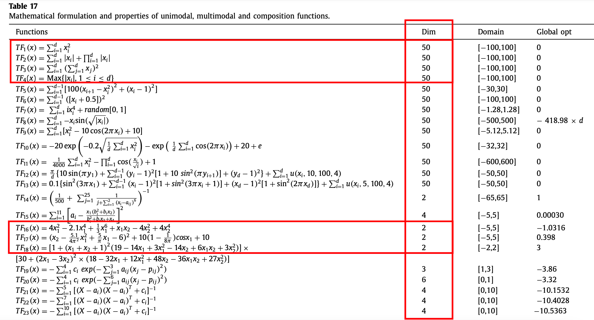
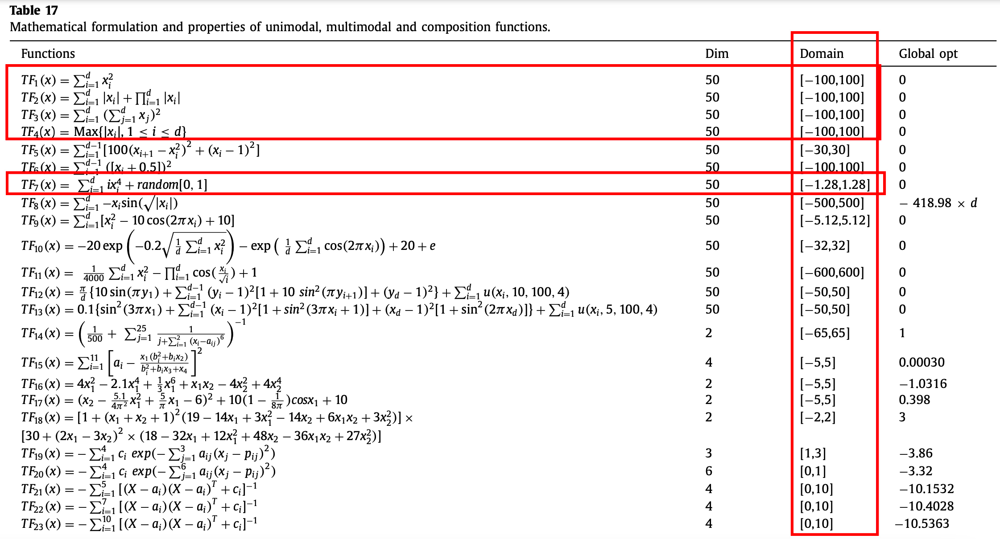

## The original:

```markdown
Sequence for iterations : [500, 1000, 2000, 3000]
Sequence for mutation_rate : [0.1, 0.5, 1.0, 2.0]
Sequence for local_search : [0.1, 0.5, 1.0, 2.0]
Sequence for num_individuals : [50, 100, 150]
Sequence for m_range : [0.5, 1.0, 2.0, 5.0]
Sequence for range_mutation : [0.5, 1.0, 2.0, 5.0]
```

## The expected parameters:

```markdown
Sequence for iterations : [200, 400, 600, 800, 1500, 3000, 4500, 6500, 9000]
Sequence for mutation_rate : [0.1, 0.15, 0.20, 0.30,0.40, 0.60, 0.80, 1.0, 2.0, 3.0, 4.0, 8.0, 12.0, 15.0]
Sequence for local_search : [0.1, 0.15, 0.20, 0.30, 0.40, 0.60, 0.80, 1.0, 1.2, 2.0, 3.0, 5.0, 8.0, 12.0, 15.0]
Sequence for num_individuals : [30，50，80, 100, 150, 300, 500, 600, 1000]
Sequence for m_range : [0.4, 0.5, 0.6, 0.8, 1.4, 2.0, 5.0, 7.0, 10.0, 12.0, 15.0, 20.0]
Sequence for range_mutation :[0.4, 0.5, 0.6, 0.8, 1.4, 2.0, 5.0, 7.0, 10.0, 12.0, 15.0, 20.0]
```

First, I tried to analyze the expected values for each function. See the last of this page.

Second, I generate the possible expected parameters.

Conclusion, 

About the parameters:

- The **number of iterations** and the **number of individuals** can be fixed for each function.
- The **mutation rate** and **local search rate** for each function should be the **same**.(advice)
- The influence of **m_range** and **range_mutation** for each function should be the **same**.(advice)

About two modes:

- The goal is to find the **minimum** of the functions. Most of the time, Lamarck can find **lower** value than Baldwin does, even if it is a  slight difference in the plots which might be a big difference in numbers.

## why

**The number of iterations** and **the number of individuals** can be fixed for each function.

When it comes to **mutation rate** and **local search rate**:
We simply used $[0.1/D, 0.5/D, 1.0/D, 2.0/D]$, where D means **Dimension**.
but the dimensions are different for each function, which means that the mutation rate is also different.
For a **2 dimensional** function such as F16,F17 and F18, the mutation rate is actually $[0.1/2, 0.5/2, 1.0/2, 2.0/2]$.
For a **50 dimensional** function such as F16,F17 and F18, the mutation rate is actually $[0.1/50, 0.5/50, 1.0/50, 2.0/50]$.
They don't share the same mutation rate, so the performances are quite different also.



When it comes to **m_range** and **range_mutation**:
say, if a gene is going to change, no matter in local search or in mutation, it is going to be **"itself"+a random value between $[-{m}_{range},{m}_{range}]$**  or  **"itself"+a random value between $[-{range}_{mutation},{range}_{mutation}]$**  .
and, obviously, 
Since that the domain of each function is different, 
For a function whose domain is $[-100,100]$, if its gene plus a a random value between $[-1,1]$ , then **it would be a very small change**.
For a function whose domain is $[-1.28,1.28]$, if its gene plus a a random value between $[-1,1]$ , then **it would be a very big change**.
This result in the different performances on the final data.



## Analysis

```markdown
Sequence for iterations : [200, 400, 600, 800, 1500, 3000, 4500, 6500, 9000]
F1: [500, 2000, 4000, 6000]
F2: [500, 1000, 2000, 3000]
F3: [500, 1500, 3500, 5000]
F4: [500, 2000, 4000, 6000]
F5: [500, 1000, 2000, 3000]
F6: [500, 2000, 4000, 6000]
F7: [500, 3000, 6000, 9000]
F8: [500, 3000, 6000, 9000]
F9: [500, 3000, 6000, 9000]
F10:[500, 2000, 4000, 6000]
F11:[500, 3000, 6000, 9000]
F12: now calculated by F13
F13:[500, 1000, 2000, 3000]
F14:[100, 200, 300, 600]
F15:[500, 1000, 3000, 5000]
F16:[500, 1000, 2000, 3000]
F17:[100, 200, 300, 600]
F18:[500, 1000, 3000, 5000]
F19:[500, 1000, 3000, 5000]
F20:[500, 1000, 3000, 5000]
F21:[500, 1000, 3000, 5000]
F22:[500, 1000, 3000, 5000]
F23:[500, 1000, 3000, 5000]

Sequence for mutation_rate : [0.1, 0.15, 0.20, 0.30,0.40, 0.60, 0.80, 1.0, 2.0, 3.0, 4.0, 8.0, 12.0, 15.0]
F1: [1.0, 4.0, 10.0, 15.0]
F2: [0.1, 0.2, 0.3, 0.5]
F3: [1.0, 4.0, 10.0, 15.0]
F4: [1.0, 4.0, 10.0, 15.0]
F5: [1.0, 2.0, 4.0, 6.0]
F6: [1.0, 4.0, 10.0, 15.0]
F7: [1.0, 3.0, 8.0, 12.0]
F8: [1.0, 3.0, 8.0, 12.0]
F9: [0.1, 0.2, 0.3, 0.5]
F10:[0.1, 0.2, 0.3, 0.5]
F11:[1.0, 4.0, 10.0, 15.0]
F12: now calculated by F13
F13:[1.0, 3.0, 8.0, 12.0]
F14:[0.1, 0.5, 1.0, 2.0]
F15:[0.1, 0.5, 1.0, 2.0]
F16:[0.1, 0.5, 0.8, 1.0]
F17:[0.1, 0.5, 0.8, 1.0]
F18:[0.1, 0.4, 0.6, 0.8]
F19:[0.1, 0.4, 0.6, 0.8]
F20:[0.1, 0.2, 0.4, 0.6]
F21:[0.1, 0.15, 0.20, 0.30]
F22:[0.1, 0.15, 0.20, 0.30]
F23:[0.1, 0.15, 0.20, 0.30]

Sequence for local_search : [0.1, 0.15, 0.20, 0.30, 0.40, 0.60, 0.80, 1.0, 1.2, 2.0, 3.0, 5.0, 8.0, 12.0, 15.0]
F1: [1.0, 4.0, 10.0, 15.0]
F2: [0.1, 0.2, 0.3, 0.5]
F3: [1.0, 4.0, 10.0, 15.0]
F4: [1.0, 4.0, 10.0, 15.0]
F5: [1.0, 2.0, 4.0, 5.0]
F6: [1.0, 4.0, 10.0, 15.0]
F7: [1.0, 3.0, 8.0, 12.0]
F8: [1.0, 3.0, 8.0, 12.0]
F9: [0.1, 0.2, 0.3, 0.5]
F10:[0.1, 0.2, 0.3, 0.5]
F11:[1.0, 3.0, 5.0, 1.0]
F12: now calculated by F13
F13:[1.0, 3.0, 5.0, 7.0]
F14:[0.1, 0.5, 1.0, 1.2]
F15:[0.1, 0.5, 1.0, 2.0]
F16:[0.1, 0.5, 0.8, 1.0]
F17:[0.1, 0.5, 0.8, 1.0]
F18:[0.1, 0.4, 0.6, 0.8]
F19:[0.1, 0.4, 0.6, 0.8]
F20:[0.1, 0.2, 0.4, 0.6]
F21:[0.1, 0.15, 0.20, 0.30]
F22:[0.1, 0.15, 0.20, 0.30]
F23:[0.1, 0.15, 0.20, 0.30]

Sequence for num_individuals : [30，50，80, 100, 150, 300, 500, 600, 1000]
F1: [100, 300, 500]
F2: [30, 80, 100]
F3: [100, 300, 500]
F4: [100, 300, 500]
F5: [30, 80, 100]
F6: [100, 400, 600]
F7: [100, 500, 1000]
F8: [100, 300, 500]
F9: [100, 300, 500]
F10:[100, 150, 300]
F11:[500, 3000, 6000, 9000]
F12: now calculated by F13
F13:[30, 80, 100]
F14:[50, 100, 150]
F15:[100, 300, 500]
F16:[100, 300, 500]
F17:[100, 300, 500]
F18:[50, 100, 150]
F19:[100, 300, 500]
F20:[100, 300, 500]
F21:[30, 80, 100]
F22:[30, 80, 100]
F23:[30, 80, 100]

Sequence for m_range : [0.4, 0.5, 0.6, 0.8, 1.4, 2.0, 5.0, 7.0, 10.0, 12.0, 15.0, 20.0]
F1: [1.0, 5.0, 8.0, 12.0]
F2: [0.5, 3.0, 5.0, 7.0]
F3: [1.0, 5.0, 8.0, 12.0]
F4: [1.0, 5.0, 8.0, 12.0]
F5: [0.5, 1.0, 5.0, 10.0]
F6: [0.5, 3.0, 5.0, 10.0]
F7: [0.3, 0.4, 0.6, 0.9]
F8: [1.0, 5.0, 8.0, 12.0]
F9: [1.0, 5.0, 8.0, 12.0]
F10:[1.0, 5.0, 8.0, 12.0]
F11:[1.0, 10.0, 15.0, 20.0]
F12: now calculated by F13
F13:[1.0, 10.0, 15.0, 20.0]
F14:[1.0, 10.0, 15.0, 20.0]
F15:[0.5, 1.0, 2.0, 5.0]
F16:[0.4, 0.8, 1.4, 2.0]
F17:[0.4, 0.8, 1.4, 2.0]
F18:[0.4, 0.8, 1.4, 2.0]
F19:[0.4, 0.8, 1.4, 2.0]
F20:[0.4, 0.8, 1.4, 2.0]
F21:[0.4, 0.8, 1.4, 2.0]
F22:[0.4, 0.8, 1.4, 2.0]
F23:[0.4, 0.8, 1.4, 2.0]


Sequence for range_mutation :[0.4, 0.5, 0.6, 0.8, 1.4, 2.0, 5.0, 7.0, 10.0, 12.0, 15.0, 20.0]
F1: [1.0, 5.0, 8.0, 12.0]
F2: [0.5, 3.0, 5.0, 7.0]
F3: [1.0, 5.0, 8.0, 12.0]
F4: [1.0, 5.0, 8.0, 12.0]
F5: [0.5, 1.0, 5.0, 10.0]
F6: [0.5, 3.0, 5.0, 10.0]
F7: [0.3, 0.4, 0.6, 0.9]
F8: [1.0, 5.0, 8.0, 12.0]
F9: [1.0, 5.0, 8.0, 12.0]
F10:[1.0, 5.0, 8.0, 12.0]
F11:[1.0, 10.0, 15.0, 20.0]
F12: now calculated by F13
F13:[1.0, 10.0, 15.0, 20.0]
F14:[1.0, 10.0, 15.0, 20.0]
F15:[0.5, 1.0, 2.0, 5.0]
F16:[0.4, 0.8, 1.4, 2.0]
F17:[0.4, 0.8, 1.4, 2.0]
F18:[0.4, 0.8, 1.4, 2.0]
F19:[0.4, 0.8, 1.4, 2.0]
F20:[0.4, 0.8, 1.4, 2.0]
F21:[0.4, 0.8, 1.4, 2.0]
F22:[0.4, 0.8, 1.4, 2.0]
F23:[0.4, 0.8, 1.4, 2.0]
```


