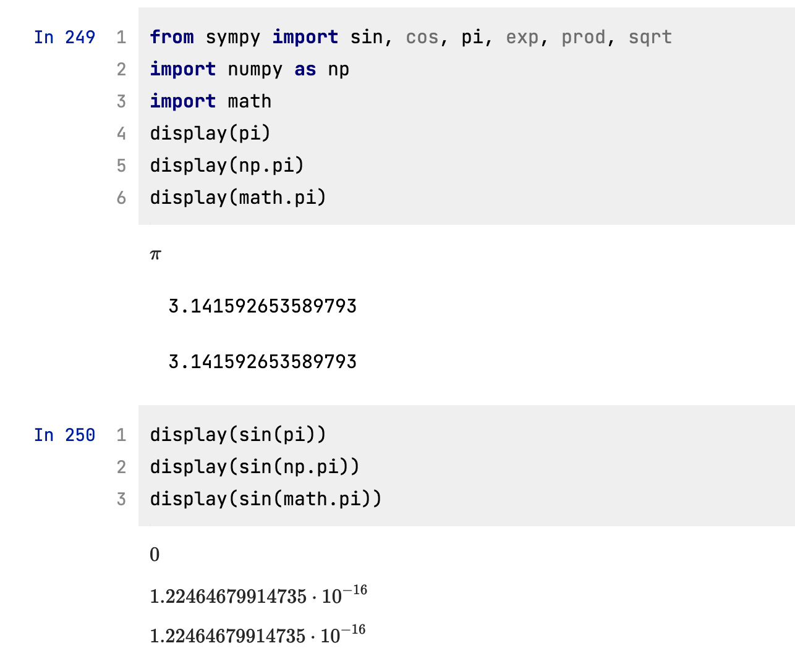
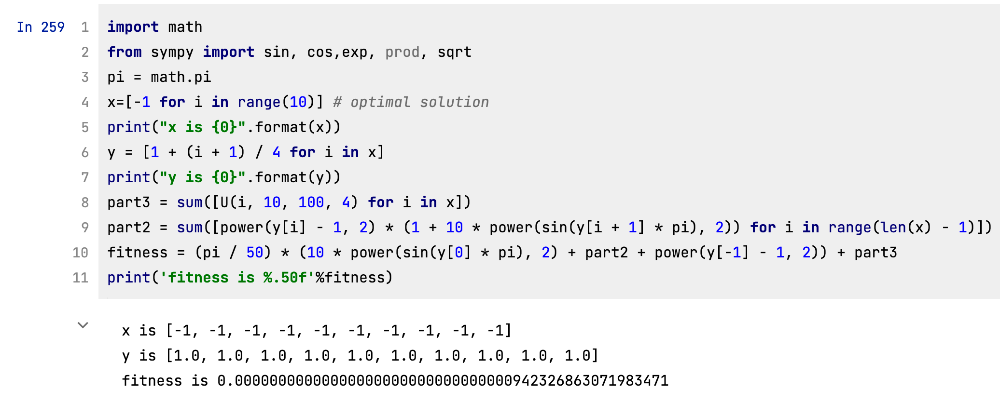
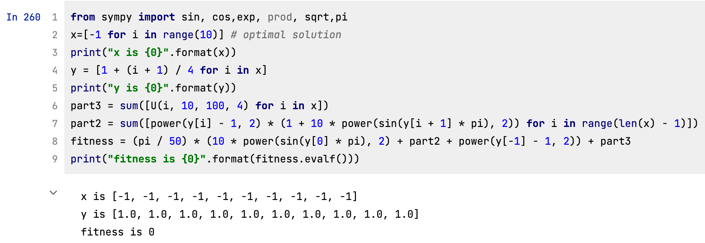
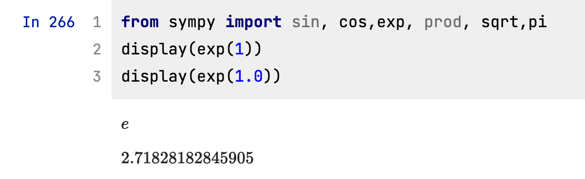
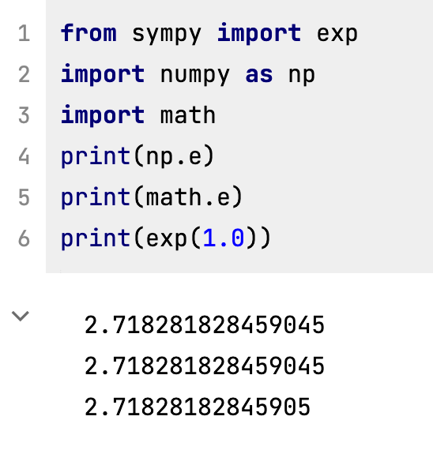
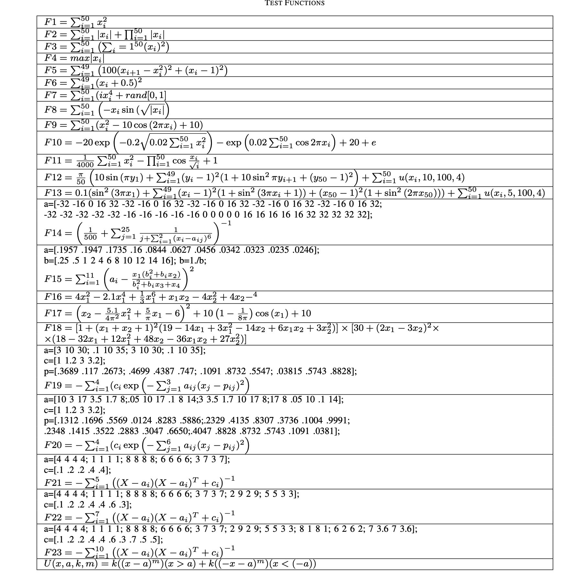
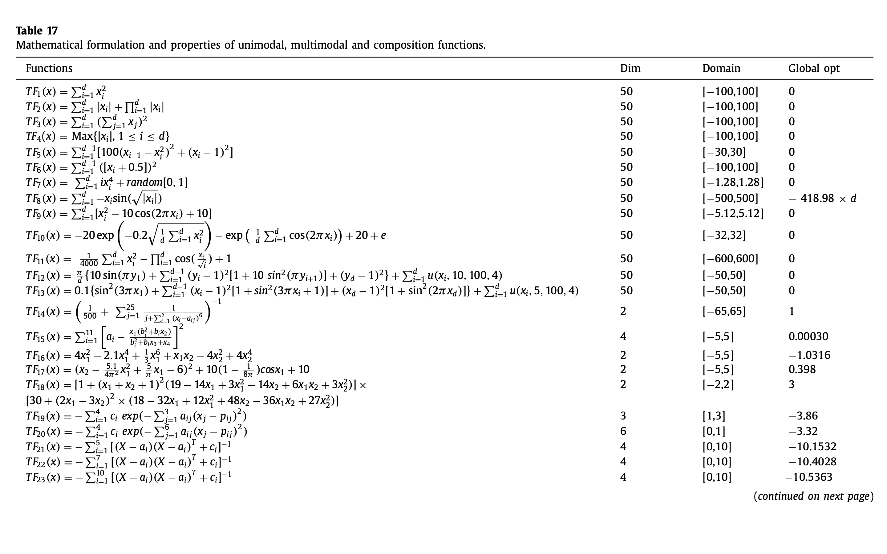
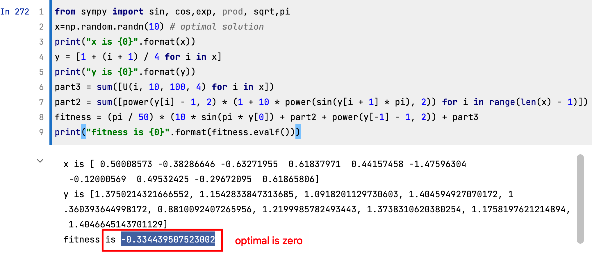
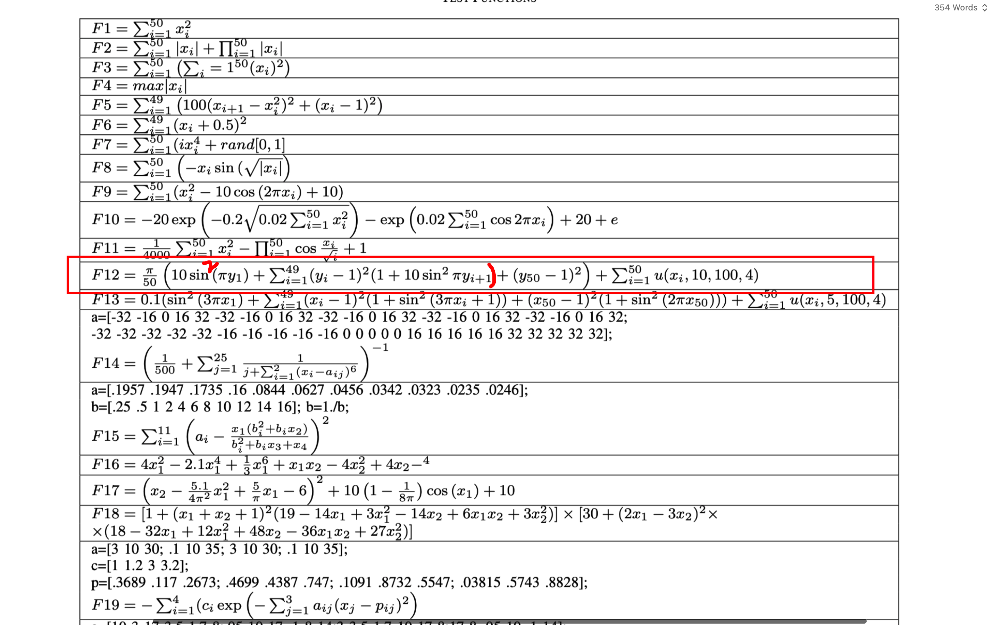
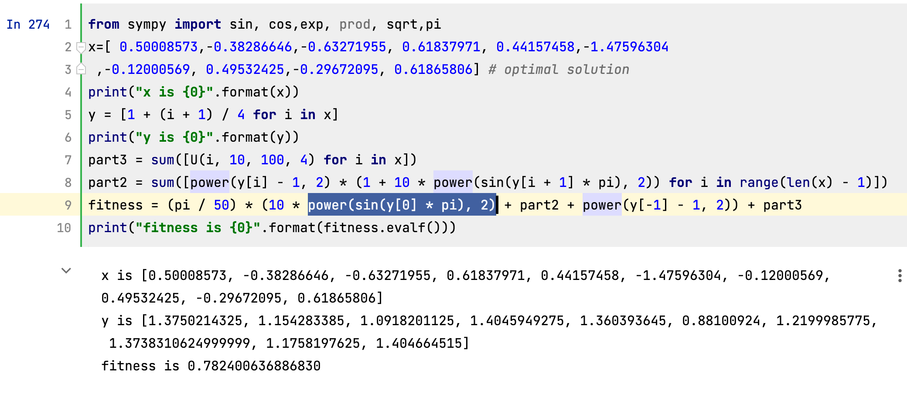

## problem with pi

### pi

==In the program which is running, i use the pi from numpy currently.==

- If we use pi built in sympy, then the calculations will be accurate, but slower.
- But if we use math.pi or np.pi, the results may not be as accurate, but they are of an acceptable accuracy and the speed of computation will be higher.

for example:(f12)
$$
\begin{aligned}
&f(x)=\frac{\pi}{D}\left\{\begin{array}{r}
10 \sin ^{2}\left(\pi y_{1}\right)+\sum_{i=1}^{D-1}\left(y_{i}\right. \\
-1)^{2}\left[1+10 \sin ^{2}\left(\pi y_{i+1}\right)\right] \\
\left.+\left(y_{D}-1\right)^{2}\right\}+\sum_{i=1}^{D} u_{i}
\end{array}\right. \\
&u_{i}=\left\{\begin{array}{cc}
k\left(x_{i}-a\right)^{m} & x_{i}>a \\
0 & a \leq x_{i} \leq a \\
k\left(-x_{i}-a\right)^{m} & x_{i}<-a
\end{array}\right. \\
&y=1+\left(x_{i}+1\right) / 4
\end{aligned}
$$
By using math.pi

Although the fitness is not zero, but the accuracy is acceptable.

By using pi from sympy:

### problem with e

==In the program which is running, i use exp(1) as e.==

First, there is a difference between 1 and 1.0: to be honest, I don't understand this difference.

Second, there is also a difference between the e from sympy, numpy and math.

again, the computation efficiency is  better if we use math.e or np.e and this can also produce an acceptable accuracy.

## problem with f12

### This table is from appendix A:

(CBMA_Darts_playing_robot A.pdf)

### This table is from the reference-2 of appendix A:

(Marine Predators Algorithm: A nature-inspired metaheuristic.pdf)

==the problem is that f12 is wrong.==

according to appendix A, f12 is wrong, because it forgets to calculate a square.

==The right version is the following==

==i found this mistake because i saw the formula in antoher paper.==

## problem with f18

as I mentioned before, f8 can find the global minima at 98/100 chance, but there were two values which are under the minima. 

==Here is the reason:==

each function has a domain, at first, we generate a group of individuals, okay.

and through crossover and mutation operations we generate the new individual.

the problem is, the range of each gene in the new individual may be ==out of domain range==.

the initial program does not check the domian for the new individual, and in most cases, it won't be out of the domian range since that the range for mutation is very narrow. (my fault)

==if one gene is out of the domian, then the global minima is no longer meaningful==

I already modified the program several days ago.

I added the code for ==checking the domian== after a new indivudal is generated.